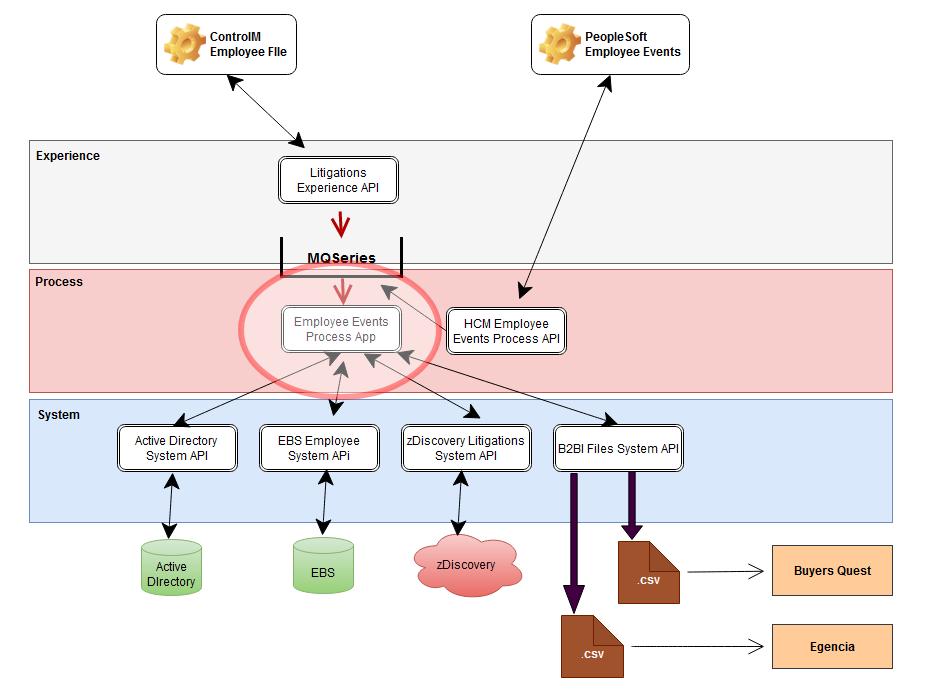
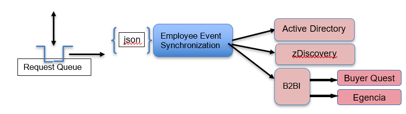
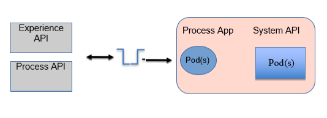
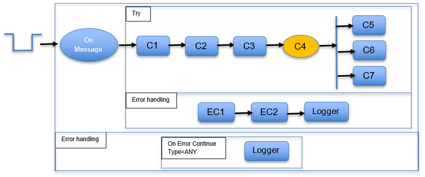

# History Of Changes

|  |  |  |  |
|----|----|----|----|
| **Version** | **Author** | **Reason for change** | **Date** |
| 1.0 | J Sack | Initial | 11/18/2022 |
| 1.1 |  | Add Egencia processing | 01/12/2023 |
| 1.2 |  | More Egencia processing | 01/25/2023 |
| 1.3 |  | Add division to travel group cross walk for teammates with noreply emails address | 02/01/2023 |
| 1.4 |  | Add Supervisor Sync processing | 03/08/2023 |
| 1.5 |  | Remove Supervisor Sync processing since Shiftboard created a new API | 08/01/2023 |
|  |  | Update to run in OpenShift | 08/01/2023 |
| 1.6 |  | Exterro processing changes | 11/14/2023 |
| 1.7 |  | Call the AD accounts system api to enhance termination event data and publish the enhanced termination event | 04/25/2024 |
| 1.8 |  | Add additional Workday full file data elements | 08/08/2024 |
|  |  | Add purchasingApprovalGroup and approvalLimitAmount from ad accounts system api response | 08/08/2024 |
|  |  | Add managerId and locationId from EBS employees system api response | 08/27/2024 |

# Purpose 

This document provides specifics that describes the application that is
to be used to orchestrate the processing of employee based events. This
application will receive a MQSeries message and use the payload of the
message to identify, and then orchestrate any API calls required to
facilitate the processing, and eventual consumption of the employee
event.

# Taxonomy

**zDirectory**: An application used to support claim hold triggered by
litigation.

**HCM**: Human Capital Management system which is PeopleSoft

**Active Directory**: System of record for employee account information

**Buyers Quest**: Enterprise corporate procurement application

**B2BI**: McLane’s application for handling bulk data

**Egencia**: McLane’s travel agency application

**Shiftboard**: Cloud application to support distribution center shift
management

# Solution Overview

## Process Context



## Logical Viewpoint



## Deployment Viewpoint



# Process

## Employee Event Synchronization

Employee events synchronization orchestration strives to make employee
events consumable by interested applications. This typically required
data enrichment, process step orchestration, format ,mediation, and
delivery over various protocols.

Initially, this application is to be built to support the following:

- Address book synchronization with the zDiscovery application used to
  support litigation claim holds.

- Terminated employees to Buyers Quest

- Employee synchronization with the Egencia travel agency application

- Employee synchronization with the Exterro for litigation support

## Functional Design

### Resources

#### Employee Event Synchronization

This application will be responsible for the orchestration of the
required processing, and mediation steps to insure that employee event
information is prepared, and presented to downstream applications for
their consumption. This processing will be triggered by details obtained
from the payload of a message from a MQSeries queue.

##### Project Names:

OAS Model Project: Does Not Apply

Development Project: employee-events-sync-prc-app

OpenShift Project: employee-events-dev, employee-events-test,
employee-events

##### Policies

- Not at this time

##### Resource Locators

- To receive unsolicited requests to synchronize employee information:

Input Queue: [\#IBM MQ Employee Events Sync On Message Queue
Configuration\|outline](#ibm-mq-employee-events-sync-message-queue-configuration)

- Type of Data Consumed: application/json

##### IBM MQ Connector Configuration***:*** 

[***IBM MQ Connector
Configuration***](#ibm-mq-connector-configuration-2)

##### Processing 

###### Processing Structure:

Right after the On New Message source component, wrap any “loose”
components on the palette in a try block and place any related special
error processing in the “Error handling“/“Catch” section. In our case,
we would like to log the error, but in the future, we may want to store
the original message in a queue for later use.

The main reason for doing this is to prevent a poison message situation
where upon failure, the message rolls back to the input queue, and then
picked up again for processing placing us in a loop.

The main “Error handling”/”Catch” section should contain an On Error
Continue component to catch ANY type of error and should simply just log
the error details as well as the payload. The key thing about this

In General the flow template should look like so:



###### Summary

- Receive the request via a MQ Message

- Validate the payload received from the message

- If eventAction=AddressbookSync

Prepare and make a call to the Active Directory system Api

Prepare and make a call to the zDiscovery system Api

Prepare and make a call to the EBS Employee system Api (Egencia)

- If eventAction=Termination

Prepare and make a call to the B2BI files system Api

- If eventAction=SupervisorSync

Prepare and make a call to the HCM Shift Management process Api

- Log the result/response from the API call

###### Receive the request

####### IBM MQ On New Message Component Configuration: 

[\#IBM MQ Employee Events Sync On Message Queue
Configuration\|outline](#ibm-mq-employee-events-sync-message-queue-configuration)

####### MQMD Parameters: Does Not Apply

|      |                        |         |
|------|------------------------|---------|
| Name | Assignment/Description | Example |
|      |                        |         |
|      |                        |         |

####### Request Payload: 

| Element Name                | Required | Notes                                                                 |
|-----------------------------|----------|-----------------------------------------------------------------------|
| correlationId               | N        | string<br>Ex. ae8c5b85-97e0-4f55-80e7-6161d67220ae                    |
| tracingId                   | N        | string<br>Ex. A19283745                                               |
| timeStamp                   | Y        | datetime, Ex. 2022-11-04T14:42:19.74Z                                  |
| eventAction                 | Y        | string<br><strong>Valid Values</strong>:<br>Addition<br>Termination<br>Promotion<br>Transfer<br>ContactInfo<br>Leave Of Absence<br>AddressBookSync<br>SupervisorSync<br>Ex. Termination |
| targetApplication           | N        | string<br>Ex. zdirectory                                              |
| employees                   | Y        | Collection of employee data                                           |
| employeeId                  | Y        | string<br>Ex. 000136214                                               |
| status                      | Y        | string<br>Ex. Active                                                  |
| employmentType              | N        | string<br>Ex. Full-time                                               |
| type                        | N        | string<br>Ex. Teammate                                                |
| employmentClass             | N        | string<br>Ex. Non-Exempt                                              |
| hireDate                    | N        | date<br>Ex. 2022-06-08                                                |
| isRehire                    | N        | boolean<br>Ex. false                                                  |
| startDate                   | N        | date<br>Ex. 2022-07-01                                                |
| terminationDate             | N        | date<br>Ex. 2023-12-31                                                |
| terminationReason           | N        | string<br>Ex. No Show                                                 |
| managerId                   | N        | string<br>Ex. 000028632                                               |
| distributionCenterDivisionId| N        | string<br>Ex. FS112                                                   |
| email                       | N        | string<br>Ex. zines@mclaneco.com                                       |
| managerName                 | N        | string<br>Ex. Susan Smith                                             |
| escalationEmail             | N        | string<br>Ex. ssmith@mclaneco.com                                      |
| division                    | N        | string<br>Ex. MBIS-Administration, Div Human Resources                |
| department                  | N        | string<br>Ex. Help Desk                                               |
| location                    | N        | string<br>Ex. GR150 DC Southern, IS970 HO MISD                         |
| title                       | N        | string<br>Ex. Engineer II, Windows                                    |
| tagLabel                    | N        | string<br>Ex. Do Not Email;Terminated                                  |
| workPhone                   | N        | string<br>Ex. 6037468008                                              |
| job                         | N        |                                                                       |
| code                        | N        | string<br>Ex. 3291                                                    |
| title                       | N        | string<br>Ex. Driver                                                  |
| driverType                  | N        | string<br>Ex. Driver                                                  |
| extendedTimeOff             | N        |                                                                       |
| startDate                   | N        | date<br>Ex. 2022-06-08                                                |
| endDate                     | N        | date<br>Ex. 2022-06-30                                                |
| name                        | N        | Object                                                                |
| first                       | Y        | string<br>Ex. Zachary                                                 |
| middle                      | N        | string<br>Ex. A                                                       |
| last                        | Y        | string<br>Ex. Hines                                                   |
| fullName                    | N        | string<br>Ex. Zachary Hines                                           |
| preferredFirstName          | N        | string<br>Ex. Zach                                                    |
| prefix                      | N        | string<br>Ex. Mr.                                                     |
| suffix                      | N        | string<br>Ex. III                                                     |

Example request:

```json
{
  "correlationId": "1ea52c41-98d5-11ec-9852-000c29356fc3",
  "tracingId": "A19283745",
  "timeStamp": "2022-11-04T14:42:19.74Z",
  "eventAction": "AddressBookSync",
  "targetApplication": "zdiscovery",
  "employees": [
    {
      "email": "zines@mclaneco.com",
      "employeeId": "000136214",
      "status": "Active",
      "type": "Teammate",
      "employmentType": "Full-time",
      "employmentClass": "Non-Exempt",
      "hireDate": "2022-06-08",
      "startDate": "2020-06-01",
      "isRehire": false,
      "terminationDate": null,
      "terminationReason": null,
      "managerId": "000028644",
      "managerName": "Susan Smith",
      "escalationEmail:": "Susan.Smith@mclaneco.com",
      "division": "MIS - Application Development - Software Integration",
      "department": "App Dev - Logistics",
      "tagLabel": "Do Not Email",
      "workPhone": "6037468111",
      "job": {
        "code": "1067",
        "title": "Stocker",
        "driverType": null
      },
      "extendedTimeOff": {
        "startDate": "2023-11-22",
        "ebdDate": "2024-01-01"
      },
      "name": {
        "first": "Zachary",
        "middle": "A",
        "last": "Hines",
        "fullName": "Zachary Hines",
        "preferredFirstName": "Zach",
        "prefix": "Mr",
        "suffix": "JR"
      }
    },
    {
      "email": "lfelzer@mclaneco.com",
      "employeeId": "000247325",
      "status": "Active",
      "type": "Teammate",
      "employmentType": "Full-time",
      "employmentClass": "Non-Exempt",
      "hireDate": "2022-01-18",
      "startDate": "1997-05-01",
      "isRehire": false,
      "terminationDate": null,
      "terminationReason": null,
      "managerId": "000028622",
      "managerName": "Susan Smith",
      "escalationEmail:": "Susan.Smith@mclaneco.com",
      "division": "Transportation Drivers",
      "department": "GR290 DC Ocala",
      "tagLabel": "Do Not Email",
      "workPhone": "6037468222",
      "job": {
        "code": "1102",
        "title": "Specialist, Reset",
        "driverType": null
      },
      "extendedTimeOff": {
        "startDate": "2024-08-22",
        "ebdDate": "2024-09-30"
      },
      "name": {
        "first": "Larry",
        "middle": "T",
        "last": "Felzer",
        "fullName": "Larry Felzer",
        "preferredFirstName": "Larry",
        "prefix": "Mr",
        "suffix": "II"
      }
    },
    {
      "email": "mshmidt@mclaneco.com",
      "employeeId": "000135270",
      "status": "Active",
      "type": "Teammate",
      "employmentType": "Full-time",
      "employmentClass": "Non-Exempt",
      "hireDate": "2021-03-11",
      "startDate": "1990-07-22",
      "isRehire": false,
      "terminationDate": null,
      "terminationReason": null,
      "managerId": "000038655",
      "managerName": "Susan Smith",
      "escalationEmail:": "Susan.Smith@mclaneco.com",
      "division": "MFD - CAR - Procurement",
      "department": "Division Purchasing",
      "tagLabel": "Do Not Email",
      "workPhone": "6037468008",
      "job": {
        "code": "1007",
        "title": "Forklift Operator",
        "driverType": null
      },
      "extendedTimeOff": {
        "startDate": "2023-11-22",
        "ebdDate": "2024-01-01"
      },
      "name": {
        "first": "Mary",
        "last": "Shmidt",
        "fullName": "Mary Shmidt",
        "preferredFirstName": "Missy",
        "prefix": "Mrs",
        "suffix": "III"
      }
    }
  ]
}
```

###### Validation

- The following fields are mandatory and should be checked to insure
  they are present on the request payload

<!-- -->

- employees – at least one item in the collection

- employees.employeeId must be present, and not null

- eventAction must be present, and not null

> If any of these fields are missing, log the standard status message
> with the following fields

status.code = “400”

status.messages.type=”Error”

status.messages.message = Required field {field} is missing from the
request

status.messages.context = app.name

###### eventAction = "AddressbookSync"

####### Step 1: Get employee account information from Active Directory

If eventAction=AddressbookSync and email does not contain "noreply" then
perform this step to enhance the incoming employee data with the one
drive url value from active directory

For each item in the employees collection

> If employees\[\*\].employeeId is present, and not null call the Active
> Directory system API to get the oneDriveURL for the employee

Call the Active Directory System API: [\#Get employee account
information from Active
Directory\|outline](#get-employee-account-information-from-active-directory)

Success: Proceed to the next step

Failure: Capture error context, write the error to the log, and continue
on to Step#2

####### Step 1a: Enhance the incoming request from the active directory response data:

-userId

-One drive url

-Single sign on id

-TravelGroup

-purchasingApprovalGroup

-approvalLimitAmount

Example Response from the Active directory system API

Add the above elements returned from the Active Directory system API
response to employee item of the incoming employees collection. If the
response from the Active Directory system API does not contain a value
for any of these elements, assign “” as a value when adding it the
employee item of the employees collection

**Special assignment for Travel group:**

For teammates with no McLane email (employee.email contains "noreply")
instead of assigning “”, use the crosswalk file to lookup the travel
group by division (Use the first five positions of the division element
value for the lookup) 

**Crosswalk file :**

Example of the resulting enhanced payload.

```json
{  
  "correlationId": "1ea52c41-98d5-11ec-9852-000c29356fc3",  
  "tracingId": "A19283745",  
  "timeStamp": "2022-11-04T14:42:19.74Z",  
  "eventAction": "AddressBookSync",  
  "targetApplication": "zdiscovery",  
  "employees": [  
    {  
      "email": "zines@mclaneco.com",  
      "employeeId": "000136214",  
      "singleSignOnId": "zhines@mclane.mclaneco.com",  
      "userId": "zhines",  
      "status": "Active",  
      "type": "Teammate",  
      "employmentType": "Full-time",  
      "employmentClass": "Non-Exempt",  
      "hireDate": "2022-06-08",  
      "startDate": "2020-06-01",  
      "isRehire": false,  
      "terminationDate": null,  
      "terminationReason": null,  
      "managerId": "000028644",  
      "managerName": "Susan Smith",  
      "escalationEmail:": "Susan.Smith@mclaneco.com",  
      "division": "MIS - Application Development - Software Integration",  
      "department": "App Dev - Logistics",  
      "tagLabel": "Do Not Email",  
      "travelerGroup": "APP TRAVEL CORP SOUTH CAMPUS 995",  
      "oneDriveURL": "https://mclaneco-my.sharepoint.com/personal/zhines_mclane_mclaneco_com",  
      "workPhone": "6037468111",  
      "purchasingApprovalGroup": "APP_BQ_PERM_APPROVER_T1",  
      "approvalLimitAmount": "1000",  
      "job": {  
        "code": "1067",  
        "title": "Stocker",  
        "driverType": null  
      },  
      "extendedTimeOff": {  
        "startDate": "2023-11-22",  
        "ebdDate": "2024-01-01"  
      },  
      "name": {  
        "first": "Zachary",  
        "middle": "A",  
        "last": "Hines",  
        "fullName": "Zachary Hines",  
        "preferredFirstName": "Zach",  
        "prefix": "Mr",  
        "suffix": "JR"  
      }  
    },  
    {  
      "email": "lfelzer@mclaneco.com",  
      "employeeId": "000247325",  
      "singleSignOnId": "lfelzer@mclane.mclaneco.com",  
      "userId": "lfelzer",  
      "status": "Active",  
      "type": "Teammate",  
      "employmentType": "Full-time",  
      "employmentClass": "Non-Exempt",  
      "hireDate": "2022-01-18",  
      "startDate": "1997-05-01",  
      "isRehire": false,  
      "terminationDate": null,  
      "terminationReason": null,  
      "managerId": "000028622",  
      "managerName": "Susan Smith",  
      "escalationEmail:": "Susan.Smith@mclaneco.com",  
      "division": "Transportation Drivers",  
      "department": "GR290 DC Ocala",  
      "tagLabel": "Do Not Email",  
      "travelerGroup": "APP TRAVEL FS CORP 801",  
      "oneDriveURL": "https://mclaneco-my.sharepoint.com/personal/lfelzer_mclane_mclaneco_com",  
      "workPhone": "6037468222",  
      "purchasingApprovalGroup": "APP_BQ_PERM_APPROVER_T2_GLOBAL",  
      "approvalLimitAmount": "5000",  
      "job": {  
        "code": "1102",  
        "title": "Specialist, Reset",  
        "driverType": null  
      },  
      "extendedTimeOff": {  
        "startDate": "2024-08-22",  
        "ebdDate": "2024-09-30"  
      },  
      "name": {  
        "first": "Larry",  
        "middle": "T",  
        "last": "Felzer",  
        "fullName": "Larry Felzer",  
        "preferredFirstName": "Larry",  
        "prefix": "Mr",  
        "suffix": "II"  
      }  
    },  
    {  
      "email": "mshmidt@mclaneco.com",  
      "employeeId": "000135270",  
      "singleSignOnId": "mshmidt@mclane.mclaneco.com",  
      "userId": "mshmidt",  
      "status": "Active",  
      "type": "Teammate",  
      "employmentType": "Full-time",  
      "employmentClass": "Non-Exempt",  
      "hireDate": "2021-03-11",  
      "startDate": "1990-07-22",  
      "isRehire": false,  
      "terminationDate": null,  
      "terminationReason": null,  
      "managerId": "000038655",  
      "managerName": "Susan Smith",  
      "escalationEmail:": "Susan.Smith@mclaneco.com",  
      "division": "MFD - CAR - Procurement",  
      "department": "Division Purchasing",  
      "tagLabel": "Do Not Email",  
      "travelerGroup": "APP TRAVEL MBIS 970",  
      "oneDriveURL": "https://mclaneco-my.sharepoint.com/personal/mshmidt_mclane_mclaneco_com",  
      "workPhone": "6037468008",  
      "purchasingApprovalGroup": "APP_BQ_PERM_GR_DIV_LEADERSHIP",  
      "approvalLimitAmount": "30000",  
      "job": {  
        "code": "1007",  
        "title": "Forklift Operator",  
        "driverType": null  
      },  
      "extendedTimeOff": {  
        "startDate": "2023-11-22",  
        "ebdDate": "2024-01-01"  
      },  
      "name": {  
        "first": "Mary",  
        "last": "Shmidt",  
        "fullName": "Mary Shmidt",  
        "preferredFirstName": "Missy",  
        "prefix": "Mrs",  
        "suffix": "III"  
      }  
    }  
  ]  
}
```

####### ~~Step 2: Upsert employee data in bulk into the zDiscovery address book~~

If eventAction=AddressbookSync then perform this step

######## Call the zDiscovery system API to post the address book data 

######### Resource Locators

- Upsert employees to Zdiscovery address book

PUT {BASE_URI}/v1/address-book/contacts

- Type of Data Consumed:

application/json

See OAS model project for interaction details:
zdiscovery-litigations-sys-api

######### Path Parameters: Does Not Apply

|      |                        |         |
|------|------------------------|---------|
| Name | Assignment/Description | Example |
|      |                        |         |

######### Query Parameters: 

|  |  |  |
|----|----|----|
| Name | Assignment/Description | Example |
| identifyingElementName | Name of the column/element containing the unique identifier | employeeId |
|  |  |  |

######### Http Header Parameters: 

|  |  |  |
|----|----|----|
| Name | Assignment/Description | Example |
| tracing_id | Optionally sent in on request | ASY7748901 |
| x-correlation-id | correlationId from the MQ message request | 1ea52c41-98d5-11ec-9852-000c29356fc3 |

######### Request Payload: 

|  |  |  |
|----|----|----|
| Element Name | Assignment/Description | Notes |
| employees | Collection of employees |  |
| employeeId | employees\[\*\].employeeId from the request | string, Ex. 000136214 |
| email | employees\[\*\].email from the request | string, Ex. lfelzer@mclaneco.com |
| status | employees\[\*\].status from the request | string, Ex. Active |
| hireDate | employees\[\*\].hireDate from the request | date, Ex. 2022-03-08 |
| managerName | employees\[\*\].managerName from the request | string, Ex. Carol Meyers |
| escalationEmail | employees\[\*\].escalationEmail from the request | string, Ex. Carol.Meyers@mclaneco.com |
| division | employees\[\*\].division from the request | string, Ex. Transportation |
| department | employees\[\*\].department from the request | string, Ex. Help Desk |
| oneDriveURL | employees\[\*\].oneDriveURL from the request | string, Ex. https://mclaneco-my.sharepoint.com/personal/lfelzer3_mclane_mclaneco_com |
| name |  |  |
| first | employees\[\*\].name.first from the request | string, Ex. Susan |
| last | employees\[\*\].name.last from the request | string, Ex. Smith |

######### Interact with the zDiscovery system API

- API:

PUT
https://\<server\>:\<port\>/v1/address-book/contacts?identifyingElementName=xxxxxx

**Example:**

PUT
https://\<server\>:\<port\>/zdiscovery-litigations/v1/address-book/contacts?identifyingElementName=employeeId

Example:

```json
{
  "employees": [
    {
      "email": "zines3@mclaneco.com",
      "employeeId": "000000046",
      "status": "Active",
      "hireDate": "2022-03-08",
      "managerName": "Susan Smith",
      "escalationEmail:": "Susan.Smith@mclaneco.com",
      "division": "MBIS-Administration, Div Human Resources",
      "department": "Help Desk",
      "location": "GR153 DC Southern, IS970 HO MISD",
      "title": "Engineer II, Windows3",
      "oneDriveURL": "https://mclaneco-my.sharepoint.com/personal/zhines3_mclane_mclaneco_com",
      "tagLabel": "Do Not Email;Hello",
      "name": {
        "first": "Zachary",
        "middle": "A",
        "last": "Hines3",
        "fullName": "Zachary Hines3"
      }
    },
    {
      "email": "lfelzer3@mclaneco.com",
      "employeeId": "000000071",
      "status": "Terminated",
      "hireDate": "2022-01-13",
      "managerName": "Carol Meyers",
      "escalationEmail:": "Carol.Meyers@mclaneco.com",
      "division": "Transportation Drivers",
      "department": "GR293 DC Ocala",
      "location": "GR293 DC Southern, IS970 HO MISD",
      "title": "Driver",
      "oneDriveURL": "https://mclaneco-my.sharepoint.com/personal/lfelzer3_mclane_mclaneco_com",
      "tagLabel": "Do Not Email;Terminated",
      "name": {
        "first": "Larry",
        "middle": "T",
        "last": "Felzer3",
        "fullName": "Larry Felzer3"
      }
    },
    {
      "email": "mshmidt3@mclaneco.com",
      "employeeId": "000000146",
      "status": "Active",
      "hireDate": "2021-03-31",
      "managerName": "Steve VanDamme",
      "escalationEmail:": "Steve.VanDamme@mclaneco.com",
      "division": "MBIS-Administration, Div Human Resources",
      "department": "Help Desk",
      "location": "GR130 DC Southern, IS970 HO MISD",
      "title": "Engineer II, Windows",
      "oneDriveURL": "https://mclaneco-my.sharepoint.com/personal/mshmidt3_mclane_mclaneco_com",
      "tagLabel": "Do Not Email;Hi There",
      "name": {
        "first": "Mary",
        "last": "Shmidt3",
        "fullName": "Mary Shmidt3"
      }
    }
  ]
}
```

***Request Connector Configuration**: (externalize into a property
file)*

- *Response Timeout(ms): 15000 (responseTimeOut)*

Success: Proceed to the next step

Failure*:* Capture error context, write the error to the log, and
continue on to Step#3

####### Step 3: Get employee data from EBS

If eventAction=AddressbookSync AND employee.costCenter is null, blank,
or is not on the request then perform this step

######## Call the EBS Employee system API to get employee data 

######### Resource Locators

- Get employee data for a given employee Identifier

GET {BASE_URI}/v1/employees/{employeeId}

- Type of Data Consumed:

application/json

See OAS model project for interaction details: ebs-employees-sys-api

######### Path Parameters: 

|            |                        |         |
|------------|------------------------|---------|
| Name       | Assignment/Description | Example |
| employeeId |                        |         |

######### Query Parameters: Does Not Apply

|      |                        |         |
|------|------------------------|---------|
| Name | Assignment/Description | Example |
|      |                        |         |

######### Http Header Parameters: 

|  |  |  |
|----|----|----|
| Name | Assignment/Description | Example |
| tracing_id | Optionally sent in on request | ASY7748901 |
| x-correlation-id | correlationId from the MQ message request | 1ea52c41-98d5-11ec-9852-000c29356fc3 |

######### Request Payload: Does Not Apply

|              |                        |       |
|--------------|------------------------|-------|
| Element Name | Assignment/Description | Notes |
|              |                        |       |

######### Interact with the EBS Employee system API

- API:

GET
https://\<server\>:\<port\>/ebs-employees-sys-api/v1/employees/XXXXXXXXX

**Example:**

GET
https://\<server\>:\<port\>/ebs-employees-sys-api/v1/employees/000135270

Example Response:

```json
{  
  "correlationId": "1ea52c41-98d5-11ec-9852-000c29356fc3",  
  "tracingId": "A19283745",  
  "id": 49831,  
  "employeeId": "000061149",  
  "hireDate": "2014-09-08",  
  "birthDate": "1987-11-25",  
  "isCurrentEmployee": true,  
  "email": "Mary.Eliassen@McLaneFS.com",  
  "costCenter": "20000",  
  "costCenterDescription": "TRANSPORTATION",  
  "lastUpdateDateTime": "2022-05-25T18:03:18.000",  
  "name": {  
    "first": "Mary",  
    "middle": "Sue",  
    "last": "Eliassen",  
    "fullName": "Eliassen, Mary Sue"  
  }  
}
```

***Request Connector Configuration**: (externalize into a property
file)*

- *Response Timeout(ms): 15000 (responseTimeOut)*

Success: Proceed to the next step

Failure: Capture error context, write the error to the log, and continue
on to Step#4

#######  Step 3a: Enhance the incoming request from a successful EBS Employee response data:

This step is applicable if the call to EBS employee system API was made
successfully

-Cost Center

If the incoming request does not contain the element
employees\[\*\].costCenter or the value for employees\[\*\].costCenter
is null or “” then assign costCenter from the EBS employees system api
response

-Manager Id

If the incoming request does not contain the element
employees\[\*\].managerId or the value for employees\[\*\].managerId is
null or “” then assign managerId from the EBS employees system api
response

-Location Id

If the incoming request does not contain the element
employees\[\*\].locationId or the value for employees\[\*\]. locationId
is null or “” then assign locationId from the EBS employees system api
response

**NOTE**: These values will be populated when Workday goes live as our
HCM system, so if these elements have values in them, we want to
preserve, and use those values.

Add the above element(s) returned from the EBS Employee system API
response to the employee item of the incoming employees collection. If
the response from the EBS Employee system API does not contain a value
for any of these elements, assign “” as a value when adding it the
employee item of the employees collection

Example of the resulting enhanced payload.

```json
{
  "correlationId": "1ea52c41-98d5-11ec-9852-000c29356fc3",
  "tracingId": "A19283745",
  "timeStamp": "2022-11-04T14:42:19.74Z",
  "eventAction": "AddressBookSync",
  "targetApplication": "zdiscovery",
  "employees": [
    {
      "email": "zines@mclaneco.com",
      "employeeId": "000136214",
      "singleSignOnId": "zhines@mclane.mclaneco.com",
      "userId": "zhines",
      "status": "Active",
      "type": "Teammate",
      "employmentType": "Full-time",
      "employmentClass": "Non-Exempt",
      "hireDate": "2022-06-08",
      "startDate": "2020-06-01",
      "isRehire": false,
      "terminationDate": null,
      "terminationReason": null,
      "locationId": "370",
      "managerId": "000028644",
      "managerName": "Susan Smith",
      "escalationEmail:": "Susan.Smith@mclaneco.com",
      "division": "MIS - Application Development - Software Integration",
      "department": "App Dev - Logistics",
      "costCenter": "20000",
      "tagLabel": "Do Not Email",
      "travelerGroup": "APP TRAVEL CORP SOUTH CAMPUS 995",
      "oneDriveURL": "https://mclaneco-my.sharepoint.com/personal/zhines_mclane_mclaneco_com",
      "workPhone": "6037468111",
      "purchasingApprovalGroup": "APP_BQ_PERM_APPROVER_T1",
      "approvalLimitAmount": "1000",
      "job": {
        "code": "1067",
        "title": "Stocker",
        "driverType": null
      },
      "extendedTimeOff": {
        "startDate": "2023-11-22",
        "ebdDate": "2024-01-01"
      },
      "name": {
        "first": "Zachary",
        "middle": "A",
        "last": "Hines",
        "fullName": "Zachary Hines",
        "preferredFirstName": "Zach",
        "prefix": "Mr",
        "suffix": "JR"
      }
    },
    {
      "email": "lfelzer@mclaneco.com",
      "employeeId": "000247325",
      "singleSignOnId": "lfelzer@mclane.mclaneco.com",
      "userId": "lfelzer",
      "status": "Active",
      "type": "Teammate",
      "employmentType": "Full-time",
      "employmentClass": "Non-Exempt",
      "hireDate": "2022-01-18",
      "startDate": "1997-05-01",
      "isRehire": false,
      "terminationDate": null,
      "terminationReason": null,
      "locationId": "370",
      "managerId": "000028622",
      "managerName": "Susan Smith",
      "escalationEmail:": "Susan.Smith@mclaneco.com",
      "division": "Transportation Drivers",
      "department": "GR290 DC Ocala",
      "costCenter": "30000",
      "tagLabel": "Do Not Email",
      "travelerGroup": "APP TRAVEL FS CORP 801",
      "oneDriveURL": "https://mclaneco-my.sharepoint.com/personal/lfelzer_mclane_mclaneco_com",
      "workPhone": "6037468222",
      "purchasingApprovalGroup": "APP_BQ_PERM_APPROVER_T2_GLOBAL",
      "approvalLimitAmount": "5000",
      "job": {
        "code": "1102",
        "title": "Specialist, Reset",
        "driverType": null
      },
      "extendedTimeOff": {
        "startDate": "2024-08-22",
        "ebdDate": "2024-09-30"
      },
      "name": {
        "first": "Larry",
        "middle": "T",
        "last": "Felzer",
        "fullName": "Larry Felzer",
        "preferredFirstName": "Larry",
        "prefix": "Mr",
        "suffix": "II"
      }
    },
    {
      "email": "mshmidt@mclaneco.com",
      "employeeId": "000135270",
      "singleSignOnId": "mshmidt@mclane.mclaneco.com",
      "userId": "mshmidt",
      "status": "Active",
      "type": "Teammate",
      "employmentType": "Full-time",
      "employmentClass": "Non-Exempt",
      "hireDate": "2021-03-11",
      "startDate": "1990-07-22",
      "isRehire": false,
      "terminationDate": null,
      "terminationReason": null,
      "locationId": "370",
      "managerId": "000038655",
      "managerName": "Susan Smith",
      "escalationEmail:": "Susan.Smith@mclaneco.com",
      "division": "MFD - CAR - Procurement",
      "department": "Division Purchasing",
      "costCenter": "50020",
      "tagLabel": "Do Not Email",
      "travelerGroup": "APP TRAVEL MBIS 970",
      "oneDriveURL": "https://mclaneco-my.sharepoint.com/personal/mshmidt_mclane_mclaneco_com",
      "workPhone": "6037468008",
      "purchasingApprovalGroup": "APP_BQ_PERM_GR_DIV_LEADERSHIP",
      "approvalLimitAmount": "30000",
      "job": {
        "code": "1007",
        "title": "Forklift Operator",
        "driverType": null
      },
      "extendedTimeOff": {
        "startDate": "2023-11-22",
        "ebdDate": "2024-01-01"
      },
      "name": {
        "first": "Mary",
        "last": "Shmidt",
        "fullName": "Mary Shmidt",
        "preferredFirstName": "Missy",
        "prefix": "Mrs",
        "suffix": "III"
      }
    }
  ]
}
```

####### Step 4: EgenciaTravel: Post groups of employee data to B2BI to be eventually sent to Egencia

If eventAction=AddressbookSync then perform this step

######## Call the B2BI Files system API to post the employee data 

######## Resource Locators

- Create employee records intended for Egencia

POST {BASE_URI}/v1/files/employees?

- Type of Data Consumed:

application/json

See OAS model project for interaction details: b2bi-files-sys-api

######## Path Parameters: Does Not Apply

|      |                        |         |
|------|------------------------|---------|
| Name | Assignment/Description | Example |
|      |                        |         |

######## Query Parameters: 

|  |  |  |
|----|----|----|
| Name | Assignment/Description | Example |
| targetApplication | Describes the application that is to consume the data | EgenciaTravel |

######## Http Header Parameters: 

|  |  |  |
|----|----|----|
| Name | Assignment/Description | Example |
| tracing_id | tracingId from the request | ASY7748901 |
| x-correlation-id | correlationId from the MQ message request | 1ea52c41-98d5-11ec-9852-000c29356fc3 |

######## Request Payload: 

| Element Name      | Assignment                              | Notes                                                                 |
|-------------------|-----------------------------------------|-----------------------------------------------------------------------|
| employees         |                                         | Collection of employee data                                           |
| employeeId        | employees[*].employeeId from the request| string, Ex. 000136214                                                 |
| singleSignOnId    | employees.[*].singleSignOnId from the request | string, Ex. zhines@mclane.mclaneco.com                                |
| userId            | employees[*].userId from the request    | string, Ex. zhines                                                    |
| status            | employees[*].status from the request    | string, Valid Values: ACTIVE, TERMINATED, UNPAID_LEAVE                |
| hireDate          | employees[*].hireDate from the request  | string, Ex. 2022-06-08                                                |
| managerName       | employees[*].managerName from the request| string, Ex. Susan Smith                                               |
| escalationEmail   | employees[*].escalationEmail from the request| string, Ex. Susan.Smith@mclaneco.com                                  |
| division          | employees.[*].division from the request | string, Ex. MBIS-Administration, Div Human Resources                  |
| department        | employees[*].department from the request| string, Ex. Help Desk                                                 |
| costCenter        | employees.[*].costCenter from the request| string Ex. 20000                                                      |
| location          | employees[*].location .employeeId from the request| string, Ex. GR150 DC Southern, IS970 HO MISD                          |
| title             | employees[*].title from the request     | string, Ex. Engineer II, Windows                                      |
| travelerGroup     | employees[*].travelerGroup from the request| string, Ex. APP TRAVEL MBIS 970                                       |
| oneDriveURL       | employees[*].oneDriveURL from the request| string, Ex. https://mclaneco-my.sharepoint.com/personal/zhinrs_mclane_mclaneco_com |
| email             | employees[*].email from the request     | string, Ex. zhines@mclaneco.com                                       |
| phoneNumber       | employees[*].phoneNumber from the request| string, Ex. 704-720-7053                                              |
| ipPhoneNumber     | employees[*].ipPhoneNumber from the request| string, Ex. 7047207053                                                |
| name              |                                         | Object that holds name information                                    |
| first             | employees[*].name.first from the request| string, Ex. Zachary                                                   |
| middle            | employees[*].name.middle from the request| string, Ex. Robert                                                    |
| last              | employees[*].name.last from the request | string, Ex. Hines                                                     |

######## Interact with the B2BI system API

- API:

POST
https://\<server\>:\<port\>/b2bi-files-sys-api/v1/files/employees?targetApplication=xxxxxx

**Example:**

POST
https://\<server\>:\<port\>/b2bi-files-sys-api/v1/files/employees?targetApplication=EgenciaTravel

Example Request:

```json
{
  "employees": [
    {
      "email": "zines@mclaneco.com",
      "employeeId": "000136214",
      "singleSignOnId": "zhines@mclane.mclaneco.com",
      "userId": "zhines",
      "status": "ACTIVE",
      "hireDate": "2022-06-08",
      "managerName": "Susan Smith",
      "escalationEmail": "Susan.Smith@mclaneco.com",
      "division": "IS970 HO MISD",
      "department": "App Dev - Logistics",
      "costCenter": "50320",
      "tagLabel": "Do Not Email",
      "travelerGroup": "APP TRAVEL CORP SOUTH CAMPUS 995",
      "oneDriveURL": "https://mclaneco-my.sharepoint.com/personal/zhines_mclane_mclaneco_com",
      "name": {
        "first": "Zachary",
        "middle": "A",
        "last": "Hines",
        "fullName": "Zachary Hines"
      }
    },
    {
      "email": "lfelzer@mclaneco.com",
      "employeeId": "000247325",
      "singleSignOnId": "lfelzer@mclane.mclaneco.com",
      "userId": "lfelzer",
      "status": "UNPAID_LEAVE",
      "hireDate": "2022-01-18",
      "managerName": "Charlie Brown",
      "escalationEmail": "Charlie.Brown@mclaneco.com",
      "division": "GR290 DC Ocala",
      "department": "Distribution Inventory Control",
      "costCenter": "20002",
      "tagLabel": "Do Not Email",
      "travelerGroup": "APP TRAVEL FS CORP 801",
      "oneDriveURL": "https://mclaneco-my.sharepoint.com/personal/lfelzer_mclane_mclaneco_com",
      "name": {
        "first": "Larry",
        "middle": "T",
        "last": "Felzer",
        "fullName": "Larry Felzer"
      }
    },
    {
      "email": "mshmidt@mclaneco.com",
      "employeeId": "000135270",
      "singleSignOnId": "mshmidt@mclane.mclaneco.com",
      "userId": "mshmidt",
      "status": "ACTIVE",
      "hireDate": "2021-03-11",
      "managerName": "Marty Wilson",
      "escalationEmail": "Marty.Wilson@mclaneco.com",
      "division": "FS800 SC Carrollton Suprt Cntr",
      "department": "Division Purchasing",
      "costCenter": "30001",
      "tagLabel": "Do Not Email",
      "travelerGroup": "APP TRAVEL MBIS 970",
      "oneDriveURL": "https://mclaneco-my.sharepoint.com/personal/mshmidt_mclane_mclaneco_com",
      "name": {
        "first": "Mary",
        "last": "Shmidt",
        "fullName": "Mary Shmidt"
      }
    }
  ]
}
```

***Request Connector Configuration**: (externalize into a property
file)*

- *Response Timeout(ms): 15000 (responseTimeOut)*

####### Step 5: ExterroLitigation: Post groups of employee data to B2BI to be eventually sent to Exterro

If eventAction=AddressbookSync then perform this step

######## Call the B2BI Files system API to post the employee data 

######## Resource Locators

- Create employee records intended for Exterro

POST {BASE_URI}/v1/files/employees?

- Type of Data Consumed:

application/json

See OAS model project for interaction details: b2bi-files-sys-api

######## Path Parameters: Does Not Apply

|      |                        |         |
|------|------------------------|---------|
| Name | Assignment/Description | Example |
|      |                        |         |

######## Query Parameters: 

|  |  |  |
|----|----|----|
| Name | Assignment/Description | Example |
| targetApplication | Describes the application that is to consume the data | ExterroLitigation |

######## Http Header Parameters: 

|  |  |  |
|----|----|----|
| Name | Assignment/Description | Example |
| tracing_id | tracingId from the request | ASY7748901 |
| x-correlation-id | correlationId from the MQ message request | 1ea52c41-98d5-11ec-9852-000c29356fc3 |

######## Request Payload: 

| Element Name     | Assignment                                | Notes                                                                 |
|------------------|-------------------------------------------|-----------------------------------------------------------------------|
| employees        |                                           | Collection of employee data                                           |
| employeeId       | employees[*].employeeId from the request  | string, Ex. 000136214                                                 |
| singleSignOnId   | employees.[*].singleSignOnId from the request | string, Ex. zhines@mclane.mclaneco.com                                |
| userId           | employees[*].userId from the request      | string, Ex. zhines                                                    |
| status           | employees[*].status from the request      | string, Valid Values: ACTIVE, TERMINATED, UNPAID_LEAVE                |
| hireDate         | employees[*].hireDate from the request    | string, Ex. 2022-06-08                                                |
| managerName      | employees[*].managerName from the request | string, Ex. Susan Smith                                               |
| escalationEmail  | employees[*].escalationEmail from the request | string, Ex. Susan.Smith@mclaneco.com                                  |
| division         | employees.[*].division from the request   | string, Ex. MBIS-Administration, Div Human Resources                  |
| department       | employees[*].department from the request  | string, Ex. Help Desk                                                 |
| costCenter       | employees.[*].costCenter from the request | string Ex. 20000                                                      |
| location         | employees[*].location .employeeId from the request | string, Ex. GR150 DC Southern, IS970 HO MISD                          |
| title            | employees[*].title from the request       | string, Ex. Engineer II, Windows                                      |
| travelerGroup    | employees[*].travelerGroup from the request | string, Ex. APP TRAVEL MBIS 970                                       |
| oneDriveURL      | employees[*].oneDriveURL from the request | string, Ex. https://mclaneco-my.sharepoint.com/personal/zhinrs_mclane_mclaneco_com |
| email            | employees[*].email from the request       | string, Ex. zhines@mclaneco.com                                       |
| phoneNumber      | employees[*].phoneNumber from the request | string, Ex. 704-720-7053                                              |
| ipPhoneNumber    | employees[*].ipPhoneNumber from the request | string, Ex. 7047207053                                                |
| supervisorId     | employees[*].managerId from the request   | string, Ex. 000172103                                                 |
| companyId        | employees[*].companyId from the request   | string, Ex. McLane                                                    |
| terminationDate  | employees[*].terminationDate from the request | string, Ex. 2023-10-30                                                |
| name             |                                           | Object that holds name information                                    |
| first            | employees[*].name.first from the request  | string, Ex. Zachary                                                   |
| middle           | employees[*].name.middle from the request | string, Ex. Robert                                                    |
| last             | employees[*].name.last from the request   | string, Ex. Hines                                                     |

######## Interact with the B2BI system API

- API:

POST
https://\<server\>:\<port\>/b2bi-files-sys-api/v1/files/employees?targetApplication=xxxxxx

**Example:**

POST
https://\<server\>:\<port\>/b2bi-files-sys-api/v1/files/employees?targetApplication=ExterroLitigation

Example Request:

```json
{
  "employees": [
    {
      "email": "zines@mclaneco.com",
      "employeeId": "000136214",
      "singleSignOnId": "zhines@mclane.mclaneco.com",
      "userId": "zhines",
      "status": "ACTIVE",
      "hireDate": "2022-06-08",
      "managerName": "Susan Smith",
      "escalationEmail": "Susan.Smith@mclaneco.com",
      "division": "IS970 HO MISD",
      "department": "App Dev - Logistics",
      "costCenter": "50320",
      "tagLabel": "Do Not Email",
      "travelerGroup": "APP TRAVEL CORP SOUTH CAMPUS 995",
      "supervisorId": "000135325",
      "companyId": "McLane",
      "oneDriveURL": "https://mclaneco-my.sharepoint.com/personal/zhines_mclane_mclaneco_com",
      "name": {
        "first": "Zachary",
        "middle": "A",
        "last": "Hines",
        "fullName": "Zachary Hines"
      }
    },
    {
      "email": "lfelzer@mclaneco.com",
      "employeeId": "000247325",
      "singleSignOnId": "lfelzer@mclane.mclaneco.com",
      "userId": "lfelzer",
      "status": "UNPAID_LEAVE",
      "hireDate": "2022-01-18",
      "managerName": "Charlie Brown",
      "escalationEmail": "Charlie.Brown@mclaneco.com",
      "division": "GR290 DC Ocala",
      "department": "Distribution Inventory Control",
      "costCenter": "20002",
      "tagLabel": "Do Not Email",
      "travelerGroup": "APP TRAVEL FS CORP 801",
      "supervisorId": "000147437",
      "companyId": "McLane",
      "oneDriveURL": "https://mclaneco-my.sharepoint.com/personal/lfelzer_mclane_mclaneco_com",
      "name": {
        "first": "Larry",
        "middle": "T",
        "last": "Felzer",
        "fullName": "Larry Felzer"
      }
    },
    {
      "email": "mshmidt@mclaneco.com",
      "employeeId": "000135270",
      "singleSignOnId": "mshmidt@mclane.mclaneco.com",
      "userId": "mshmidt",
      "status": "ACTIVE",
      "hireDate": "2021-03-11",
      "managerName": "Marty Wilson",
      "escalationEmail": "Marty.Wilson@mclaneco.com",
      "division": "FS800 SC Carrollton Suprt Cntr",
      "department": "Division Purchasing",
      "costCenter": "30001",
      "tagLabel": "Do Not Email",
      "travelerGroup": "APP TRAVEL MBIS 970",
      "supervisorId": "000172103",
      "companyId": "McLane",
      "oneDriveURL": "https://mclaneco-my.sharepoint.com/personal/mshmidt_mclane_mclaneco_com",
      "name": {
        "first": "Mary",
        "last": "Shmidt",
        "fullName": "Mary Shmidt"
      }
    }
  ]
}
```

***Request Connector Configuration**: (externalize into a property
file)*

- *Response Timeout(ms): 15000 (responseTimeOut)*

###### eventAction=Termination

####### Step 1: Get employee account information from Active Directory

If eventAction=Termination and email does not contain "noreply" then
perform this step to enhance the incoming employee data with values from
active directory

For each item in the employees collection

> If employees\[\*\].employeeId is present, and not null call the Active
> Directory system API to get the user account data for the employee

Call the Active Directory System API: [\#Get employee account
information from Active
Directory\|outline](#get-employee-account-information-from-active-directory)

Success: Proceed to the next step

Failure: Capture error context, write the error to the log, and continue
on to Step#2

####### Step 1a: Enhance the incoming request from the active directory response data:

-userId

-One drive url

-Single sign on id

-TravelGroup

Example Response from the Active directory system API

Add the above elements returned from the Active Directory system API
response to employee item of the incoming employees collection. If the
response from the Active Directory system API does not contain a value
for any of these elements, assign “” as a value when adding it the
employee item of the employees collection

**Special assignment for Travel group:**

For teammates with no McLane email (employee.email contains "noreply")
instead of assigning “”, use the crosswalk file to lookup the travel
group by division (Use the first five positions of the division element
value for the lookup) 

**Crosswalk file :**

```json
{  
  "correlationId": "4ee5f0c0-c046-11ee-8012-065dd30d59d5",  
  "timeStamp": "2024-01-31T14:37:49.951Z",  
  "eventAction": "Termination",  
  "targetApplication": "BuyerQuestTerm",  
  "employees": [  
    {  
      "employeeId": "000157077",  
      "singleSignOnId": "hnimaga@mclane.mclaneco.com",  
      "userId": "hnimaga",  
      "status": "Terminated",  
      "employmentType": "Full-time",  
      "terminationDate": "2024-01-30",  
      "terminationReason": "Vol-No Call No Show",  
      "distributionCenterDivisionId": "FB605",  
      "travelerGroup": "APP TRAVEL CORP SOUTH CAMPUS 995",  
      "oneDriveURL": "https://mclaneco-my.sharepoint.com/personal/hnimaga_mclane_mclaneco_com",  
      "job": {  
        "action": "Termination",  
        "workgroups": [  
          {  
            "id": "5189354",  
            "role": "Warehouse Speci"  
          }  
        ]  
      },  
      "name": {  
        "first": "Haji",  
        "middle": "",  
        "last": "Nimaga",  
        "fullName": "Haji Nimaga,Sr."  
      }  
    }  
  ]  
}
```

####### Step 2: Call the B2BI system API to post the employee data 

######## Resource Locators

- Create an employee termination record

POST {BASE_URI}/v1/files/employees?

- Type of Data Consumed:

application/json

See OAS model project for interaction details: b2bi-files-sys-api

######## Path Parameters: Does Not Apply

|      |                        |         |
|------|------------------------|---------|
| Name | Assignment/Description | Example |
|      |                        |         |

######## Query Parameters: 

|  |  |  |
|----|----|----|
| Name | Assignment/Description | Example |
| targetApplication | Describes the application that is to consume the data | BuyerQuestTerm |

######## Http Header Parameters: 

|  |  |  |
|----|----|----|
| Name | Assignment/Description | Example |
| tracing_id | tracingId from the request | ASY7748901 |
| x-correlation-id | correlationId from the MQ message request | 1ea52c41-98d5-11ec-9852-000c29356fc3 |

######## Request Payload: 

| Element Name    | Assignment                                | Notes                                                                 |
|-----------------|-------------------------------------------|-----------------------------------------------------------------------|
| employees       |                                           | Collection of employee data                                           |
| employeeId      | employees[*].employeeId from the request  | string, Ex. 000136214                                                 |
| userId          | employees[*].userId from the request      | string, Ex. zhines                                                    |
| status          | employees[*].status from the request      | string, Valid Values: Active, Terminated                              |
| hireDate        | employees[*].hireDate from the request    | string, Ex. 2022-06-08                                                |
| managerName     | employees[*].managerName from the request | string, Ex. Susan Smith                                               |
| escalationEmail | employees[*].escalationEmail from the request | string, Ex. Susan.Smith@mclaneco.com                                  |
| division        | employees.[*].division from the request   | string, Ex. MBIS-Administration, Div Human Resources                  |
| department      | employees[*].department from the request  | string, Ex. Help Desk                                                 |
| location        | employees[*].location .employeeId from the request | string, Ex. GR150 DC Southern, IS970 HO MISD                          |
| title           | employees[*].title from the request       | string, Ex. Engineer II, Windows                                      |
| oneDriveURL     | employees[*].oneDriveURL from the request | string, Ex. https://mclaneco-my.sharepoint.com/personal/zhinrs_mclane_mclaneco_com |
| email           | employees[*].email from the request       | string, Ex. zhines@mclaneco.com                                       |
| phoneNumber     | employees[*].phoneNumber from the request | string, Ex. 704-720-7053                                              |
| ipPhoneNumber   | employees[*].ipPhoneNumber from the request | string, Ex. 7047207053                                                |
| name            |                                           | Object that holds name information                                    |
| first           | employees[*].name.first from the request  | string, Ex. Zachary                                                   |
| middle          | employees[*].name.middle from the request | string, Ex. Robert                                                    |
| last            | employees[*].name.last from the request   | string, Ex. Hines                                                     |

######## Interact with the B2BI system API

- API:

POST
https://\<server\>:\<port\>/b2bi-files-sys-api/v1/files/employees?targetApplication=xxxxxx

**Example:**

POST
https://\<server\>:\<port\>/b2bi-files-sys-api/v1/files/employees?targetApplication=BuyerQuest

Example Request:

```json
{
  "employees": [
    {
      "email": "zines@mclaneco.com",
      "employeeId": "000136214",
      "status": "Active",
      "hireDate": "2022-06-08",
      "managerName": "Susan Smith",
      "escalationEmail": "Susan.Smith@mclaneco.com",
      "division": "MBIS-Administration, Div Human Resources",
      "department": "Help Desk",
      "tagLabel": "Do Not Email",
      "name": {
        "first": "Zachary",
        "middle": "A",
        "last": "Hines",
        "fullName": "Zachary Hines"
      }
    },
    {
      "email": "lfelzer@mclaneco.com",
      "employeeId": "000247325",
      "status": "Active",
      "hireDate": "2022-01-18",
      "managerName": "Susan Smith",
      "escalationEmail": "Susan.Smith@mclaneco.com",
      "division": "Transportation Drivers",
      "department": "GR290 DC Ocala",
      "name": {
        "first": "Larry",
        "middle": "T",
        "last": "Felzer",
        "fullName": "Larry Felzer"
      }
    },
    {
      "email": "mshmidt@mclaneco.com",
      "employeeId": "000213101",
      "status": "Active",
      "hireDate": "2021-03-11",
      "managerName": "Susan Smith",
      "escalationEmail": "Susan.Smith@mclaneco.com",
      "division": "MBIS-Administration, Div Human Resources",
      "department": "Help Desk",
      "name": {
        "first": "Mary",
        "last": "Shmidt",
        "fullName": "Mary Shmidt"
      }
    }
  ]
}
```

Example Response from the system API:

```json
{
  "correlationId": "1ea52c41-98d5-11ec-9852-000c29356fc3",
  "tracingId": "A19283745",
  "status": {
    "code": "200",
    "messages": [
      {
        "type": "Diagnostic",
        "message": "Data has been queued for processing",
        "timeStamp": "2022-10-30T15:27:49.274Z"
      }
    ]
  }
}
```

####### Step 3: Publish the enhanced termination message

######### IBM MQ Connector Configuration**:** 

[***IBM MQ Connector
Configuration***](#ibm-mq-connector-configuration-2)

######### Resource Locators

- To publish an enhanced employee event message:

If job.action: "Termination"

then Topic: [\#IBM MQ Enhanced Employee Termination Topic
Configuration\|outline](#ibm-mq-enhanced-employee-termination-topic-configuration)

###### ~~eventAction=SupervisorSync~~

####### ~~Call the HCM Process API post the supervisor employee data~~ 

######## ~~Resource Locators~~

- ~~Process an employee supervisor update~~

~~POST {BASE_URI}/v1/employees/supervisors~~

- ~~Type of Data Consumed:~~

~~application/json~~

~~See RAML project for interaction details: hcm-shift-mgmt-prc-api~~

######## ~~Path Parameters: Does Not Apply~~

|          |                            |             |
|----------|----------------------------|-------------|
| ~~Name~~ | ~~Assignment/Description~~ | ~~Example~~ |
|          |                            |             |

######## ~~Query Parameters: Does Not Apply~~

|          |                            |             |
|----------|----------------------------|-------------|
| ~~Name~~ | ~~Assignment/Description~~ | ~~Example~~ |
|          |                            |             |

######## ~~Http Header Parameters:~~ 

|  |  |  |
|----|----|----|
| ~~Name~~ | ~~Assignment/Description~~ | ~~Example~~ |
| ~~tracing_id~~ | ~~tracingId from the request~~ | ~~ASY7748901~~ |
| ~~x-correlation-id~~ | ~~correlationId from the MQ message request~~ | ~~1ea52c41-98d5-11ec-9852-000c29356fc3~~ |

######## ~~Request Payload:~~ 

| ~~Element Name~~ | ~~Assignment~~ | ~~Notes~~ |
|------------------|----------------|-----------|
| ~~supervisor~~ | ~~It will be the first item in the employees collection~~ | ~~Object that hold the Supervisor information~~ |
| ~~employeeId~~ | ~~employees[1].employeeId from the request~~ | ~~string, Ex. 000599214~~ |
| ~~status~~ | ~~employees[1].status from the request~~ | ~~string, Valid Values: Active, Terminated~~ |
| ~~employmentType~~ | ~~employees[1].employmentType from the request~~ | ~~string, Ex. Full-time~~ |
| ~~hireDate~~ | ~~employees[1].hireDate from the request~~ | ~~string, Ex. 2022-06-08~~ |
| ~~distributionCenterDivisionId~~ | ~~employees[1].distributionCenterDivisionId from the request~~ | ~~string, Ex. FS112~~ |
| ~~person~~ |  | ~~Object that holds person information~~ |
| ~~name~~ |  | ~~Object that holds name information~~ |
| ~~first~~ | ~~employees[1].name.first from the request~~ | ~~string, Ex. Zachary~~ |
| ~~middle~~ | ~~employees[1].name.middle from the request~~ | ~~string, Ex. Robert~~ |
| ~~lastName~~ | ~~employees[1].name.last from the request~~ | ~~string, Ex. Hines~~ |
| ~~teammates~~ | ~~Assign from all remaining employee items in the collection~~ | ~~Collection of employee data~~ |
| ~~employeeId~~ | ~~employees[*].employeeId from the request~~ | ~~string, Ex. 000136214~~ |
| ~~userId~~ | ~~employees[*].userId from the request~~ | ~~string, Ex. zhines~~ |
| ~~status~~ | ~~employees[*].status from the request~~ | ~~string, Valid Values: Active, Terminated~~ |
| ~~employmentType~~ | ~~employees[*].employmentType from the request~~ | ~~string, Ex. Full-time~~ |
| ~~hireDate~~ | ~~employees[*].hireDate from the request~~ | ~~string, Ex. 2022-06-08~~ |
| ~~managerName~~ | ~~employees[*].managerName from the request~~ | ~~string, Ex. Susan Smith~~ |
| ~~escalationEmail~~ | ~~employees[*].escalationEmail from the request~~ | ~~string, Ex. Susan.Smith@mclaneco.com~~ |
| ~~distributionCenterDivisionId~~ | ~~employees[*].distributionCenterDivisionId from the request~~ | ~~string, Ex. FS112~~ |
| ~~division~~ | ~~employees.[*].division from the request~~ | ~~string, Ex. MBIS-Administration, Div Human Resources~~ |
| ~~department~~ | ~~employees[*].department from the request~~ | ~~string, Ex. Help Desk~~ |
| ~~location~~ | ~~employees[*].location .employeeId from the request~~ | ~~string, Ex. GR150 DC Southern, IS970 HO MISD~~ |
| ~~title~~ | ~~employees[*].title from the request~~ | ~~string, Ex. Engineer II, Windows~~ |
| ~~oneDriveURL~~ | ~~employees[*].oneDriveURL from the request~~ | ~~string, Ex. https://mclaneco-my.sharepoint.com/personal/zhinrs_mclane_mclaneco_com~~ |
| ~~email~~ | ~~employees[*].email from the request~~ | ~~string, Ex. zhines@mclaneco.com~~ |
| ~~phoneNumber~~ | ~~employees[*].phoneNumber from the request~~ | ~~string, Ex. 704-720-7053~~ |
| ~~ipPhoneNumber~~ | ~~employees[*].ipPhoneNumber from the request~~ | ~~string, Ex. 7047207053~~ |
| ~~person~~ |  | ~~Object that holds person information~~ |
| ~~name~~ |  | ~~Object that holds name information~~ |
| ~~first~~ | ~~employees[*].name.first from the request~~ | ~~string, Ex. Zachary~~ |
| ~~middle~~ | ~~employees[*].name.middle from the request~~ | ~~string, Ex. Robert~~ |
| ~~lastName~~ | ~~employees[*].name.last from the request~~ | ~~string, Ex. Hines~~ |

######## ~~Interact with the HCM Shift Management Process API system API~~

- ~~API:~~

~~POST https://\<server\>:\<port\>/v1/employees/supervisors~~

**~~Example:~~**

~~POST
https://\<server\>:\<port\>/hcm-shift-mgmt/v1/employees/supervisors~~

~~Example Request:~~

~~{  
"supervisor": {  
"employeeId": "000049009",  
"status": "Active",  
"employmentType": "Full-time",  
"hireDate": "2005-08-15",  
"distributionCenterDivisionId": "FB616",  
"person": {  
"name": {  
"first": "Chip",  
"lastName": "Green"  
}  
}  
},  
"teammates": \[  
{  
"employeeId": "000049595",  
"status": "Active",  
"employmentType": "Full-time",  
"hireDate": "1996-07-17",  
"distributionCenterDivisionId": "FB616",  
"person": {  
"name": {  
"first": "Betty",  
"lastName": "Masteroni"  
}  
}  
},  
{  
"employeeId": "000049418",  
"status": "Active",  
"employmentType": "Full-time",  
"hireDate": "1989-10-13",  
"distributionCenterDivisionId": "FB616",  
"person": {  
"name": {  
"first": "Jerry",  
"lastName": "Farrow"  
}  
}  
},  
{  
"employeeId": "000049087",  
"status": "Active",  
"employmentType": "Full-time",  
"hireDate": "2004-01-26",  
"distributionCenterDivisionId": "FB616",  
"person": {  
"name": {  
"first": "Marty",  
"lastName": "Teller"  
}  
}  
}  
\]  
}~~

~~Example Response from the process API:~~

~~{~~

~~"correlationId": "1ea52c41-98d5-11ec-9852-000c29356fc3",~~

~~"tracingId": "A19283745",~~

~~}~~

###### Logging the API request, and response: 

####### Logging Payload:

We should log data prior to the API call, and after the api call. The
log message prior to the api call should contain the resource endpoint
being called, the request message payload if it applies, as well as the
standard log elements, and the log message after the api call should
contain the response.

At the end of the flow, we should log the results of the api call with
the following elements.

| Element Name  | Mapping                                      | Notes                                                   |
|---------------|----------------------------------------------|---------------------------------------------------------|
| correlationId | correlationId from the request message       | Ex. 233e4fd0-e81b-11ec-8245-06e260431b40                |
| tracingId     | tracingId from the request message           | Ex. abc12321                                            |
| eventAction   | eventAction from the message                 | Ex. Termination                                         |
| resourceUrl   | Url for calling the active directory system api | Ex. https://api-test.mclaneco.com/users?empoyeeId=000136214 |
| requestPayload| If http response from the API call starts with a 2, then null, else original payload of the message |                                                         |
| apiResponse   | If http response from the API call starts with a 2, then null, else original payload of the message |                                                         |
| statusCode    |                                              |                                                         |
| code          | http response from the API call              | Ex. 200                                                 |
| messages      |                                              |                                                         |
| type          | If http response from the API call starts with a 2, then Diagnostic, else Error | Ex. Diagnostic                                          |
| reasonCode    | error.errorType default null                 |                                                         |
| message       | If http response from the API call starts with a 2, then Success, else assign the error message |                                                         |
| context       | app.name                                     | Ex. mcl-addressbook-sync-app-tst-1                      |
| timestamp     | Current date & time                          | Ex. 2022-06-09T22:45:11.042Z                            |

**Example Message to Log:**

```json
{
  "correlationId": "c759dc47-c673-4d0c-ab9c-20ee52f6d145",
  "tracingId": "A5579098",
  "eventAction": "AddressBookSync",
  "retryResourceUrl": "https://api-test.mclaneco.com/ad-users/accounts?employeeId=000136214",
  "apiRetryResponse": null,
  "status": {
    "code": "200",
    "messages": [
      {
        "type": "Diagnostic",
        "reasonCode": "",
        "message": "Success",
        "context": "mcl-addressbook-sync-app-tst-1",
        "timestamp": "2022-11-09T22:45:11.042Z"
      }
    ]
  }
}
```

###### Error Processing

If an issue/error is encountered with this application, the specifics
related to the error are to be reported via logging which will be routed
over to splunk.

- if there are any issues/errors returned from this MQ call, the context
  of the error should be placed in the status section, and a response
  should be formatted and sent back to the caller.

-Set the following status elements in the response

status = 500

context.type = “Error”

> context.reasonCode = error.errorType
>
> context.message = error.exception.cause.linkedException
>
> default error.exception

###### Non Functional Requirements

####### Security

####### Data

- Masking elements: Does Not apply

####### Transport

- http

####### Availability

- *99.99% uptime 24x7*

####### Reliability

- High availability via multiple workers

####### Traceability

- Transaction tracing via log data to Splunk

- Specific Auditing requirements: Does Not Apply

####### Throughput

- Current Peak Metric:

  - xx Concurrent transactions per second

  - xx Minutes - specified duration(s)

  - M T W T F S S Note any applicable days in the week

- Seasonal dimension: Does Not Apply

- Estimated Peak metric over the next 9-12 months:

  - xx Concurrent transactions per second

  - xx minutes - specified duration(s)

  - M T W T F S S Note any applicable days in the week

####### Response Time

- Does Not Apply

# Appendix

## IBM MQ Connector Configuration

***IBM MQ Configuration**: (externalize into a property file)*

- ***Extension**: camel-quarkus-amqp - This extension leverages the
  Quarkus Qpid JMS extension. A ConnectionFactory bean is automatically
  created and wired into the AMQP component for you. The connection
  factory can be configured via the Quarkus Qpid JMS configuration
  options.*

***quarkus.qpid-jms.url=amqp://{host}:{port}***

***quarkus.qpid-jms.wrap=true** (setting can allow the Qpid JMS
extension to apply a ConnectionFactory wrapper supplied by another
extension to the injected ConnectionFactory. Setting this value to true
and adding an additional dependency on quarkus-pooled-jms to your
application allows quarkus-pooled-jms to provide pooling for the
injected ConnectionFactory*

- ***Extension**: quarkus-pooled-jms*

> ***quarkus.pooled-jms.pooling.enabled=true***
>
> ***quarkus.pooled-jms.max-connections=1***
>
> ***quarkus.pooled-jms.max-sessions-per-connection=10** (number of
> Sessions that the pooled Connection will loan out before either
> blocking)*
>
> ***quarkus.pooled-jms.block-if-session-pool-is-full=true** (block
> until another previously created and loaned out session is closed an
> thereby becomes available)*
>
> ***quarkus.pooled-jms.block-if-session-pool-is-full-timeout=-1**
> (block forever if configured to wait)*

|  |  |  |  |  |
|----|----|----|----|----|
| Environment | Host | Port | Queue Manager | QPID JMS URL |
| Development | ltdstmqapp01.mclaneco.com | 5672 | TTDCMQ01 | amqp://ltdstmqapp01.mclaneco.com:5672 |
| Test | ltdstmqapp01.mclaneco.com | 5672 | TTDCMQ01 | amqp://ltdstmqapp01.mclaneco.com:5672 |
| Production | lpdstmqapp01.mclaneco.com | 5672 | PTDCMQ01 | amqp://lpdstmqapp01.mclaneco.com:5672 |

- acknowledgementModeName=CLIENT_ACKNOWLEDGE

## IBM MQ Employee Events Sync Message Queue Configuration

To get a message and make a REST call based on the message payload

***IBM MQ Configuration**: (externalize into a property file)*

- ***Destination**: (externalize in a property file as inputQ)*

  - ***Development:** OSAPI.PRC.EMPLOYEE.EVENTS.SYNC.REQ.DEV*

  - ***Test:** OSAPI.PRC.EMPLOYEE.EVENTS.SYNC.REQ*

  - ***Production:** OSAPI.PRC.EMPLOYEE.EVENTS.SYNC.REQ*

- ***Destination type**: Queue*

- ***Content Type:** text/plain*

## IBM MQ Employee Events Sync Error Queue

*OSAPI.PRC.EMPLOYEE.EVENTS.SYNC.ERR*

## MQ Request Queue Configuration Information

Request Queue: OSAPI*.PRC.EMPLOYEE.EVENTS.SYNC.REQ*

|  |  |  |
|----|----|----|
| **Parameter Name** | **Parameter Value** | **Parameter Description** |
| BOTHRESH | 2 | Backout Threshold |
| BOQNAME | OSAPI.PRC.EMPLOYEE.EVENTS.SYNC.ERR | Backout Queue Name |

## IBM MQ Enhanced Employee Termination Topic Configuration

To publish an employee termination topic with enhanced data:

***IBM MQ Configuration**: (externalize into a property file)*

- ***Destination (topicString)**: enhanced/employee/terminations
  (externalized in a property file)*

- ***Destination type**: Topic*

- ***Content Type:** text/plain*

## IBM MQ Health Check Publish Configuration

To Send a message to B2BI

***IBM MQ Configuration**: (externalize into a property file)*

- ***Destination**: SYSTEM.DEFAULT.LOCAL.QUEUE*

- ***Destination type**: Queue*

- ***Content Type:** text/plain*

- ***Time To Live (Expiry):** 10000*

*Message Payload:*

### Request Payload: json formatted 

| Element Name | Assignment/Description            | Notes                      |
|--------------|-----------------------------------|----------------------------|
| message      | app.name + " health check message" | Ex. employee-mgmt-exp-api  |

Example:

```json
{
  "message": "employee-mgmt-exp-api health check message"
}
```

## Error Structure

| Element Name  | Assignment                                                                 | Notes                                                                 |
|---------------|----------------------------------------------------------------------------|-----------------------------------------------------------------------|
| correlationId | correlationId                                                              | string, Ex. d5f6fbf8-6774-4a95-9b59-15348943abd4                      |
| tracingId     | tracing_id from the system API request header, if present                  | string, Ex. A3345732                                                  |
| title         | If http status is: <br> 400=Bad Request <br> 401=Unauthorized <br> 403=Forbidden <br> 404=Resource Not Found <br> 405=Method Not Allowed <br> 406=Not Acceptable <br> 429=Too Many Requests <br> 3xx: Redirection <br> 5xx: Unexpected error | Short human-readable title of the error that occurred                 |
| status        | Http status code                                                           | holds processing status code                                          |
| instance      | The called url that experienced the issue                                  | Ex. https://apim.mclaneco.com/ebs-employees-sys-api/v1/employees/000134785 |
| requestId     | correlationId                                                              | Id that correlates original request to response and other events in the API |
| **context**   |                                                                            | Object that holds the collection of diagnostic information            |
| type          | “Error”                                                                    | string                                                                |
| severity      | Optional designation of the criticality of the error                       | 1=High <br> 2=Medium <br> 3=Low                                       |
| reasonCode    | Application return code if available                                       | string, Ex. 422                                                       |
| message       | Error message text                                                         | string                                                                |
| component     | Application name                                                           | string, Ex. trimble-shipments-sys-api                                 |
| timeStamp     | Current date & time                                                        | string                                                                |

```json
{
  "correlationId": "979f3d3b-a04a-43d7-b55f-8d5609b48783",
  "tracingId": "abc55247",
  "title": "Bad Data",
  "status": 400,
  "instance": "https://apim.mclaneco.com/prc/tracking-shipments/v1/shipments/MC0109MS20230731/positions",
  "requestId": "979f3d3b-a04a-43d7-b55f-8d5609b48783",
  "context": [
    {
      "type": "Error",
      "severity": "1",
      "reasonCode": "422",
      "component": "trimble-shipments-sys-api",
      "timeStamp": "2023-04-20T14:46:59.131Z",
      "message": "HTTP POST on resource 'https://apim.mclaneco.com:443/prc/tracking-shipments/v1/shipments/MC0109MS20230731/positions' failed: bad request (400)."
    }
  ]
}
```

## ~~Error Structure-Deprecated~~

| ~~Element Name~~ | ~~Assignment~~ | ~~Notes~~ |
|------------------|----------------|-----------|
| ~~correlationId~~ | ~~correlationId~~ | <p>~~string~~</p><p>~~Ex. d5f6fbf8-6774-4a95-9b59-15348943abd4~~</p> |
| ~~tracingId~~ | ~~tracing_id from the system API request header, if present~~ | <p>~~string~~</p><p>~~Ex. A3345732~~</p> |
| **~~status~~** |  | ~~Object that holds processing status context~~ |
| ~~code~~ | ~~Response code~~ |  |
| **~~messages~~** |  | ~~Object that holds the collection of diagnostic information~~ |
| ~~type~~ | ~~“Error”~~ | ~~string~~ |
| ~~severity~~ |  | ~~string~~ |
| ~~reasonCode~~ | ~~Application return code if available~~ | ~~string~~ |
| ~~message~~ | ~~Error message text~~ | ~~string~~ |
| ~~context~~ | ~~app.name~~ | ~~string~~ |
| ~~timeStamp~~ | ~~Current date & time~~ | ~~string~~ |

~~Example:~~

~~{~~
~~"correlationId": "d5f6fbf8-6774-4a95-9b59-15348943abd4",~~
~~"tracingId": "A19283745",~~
~~"status": {~~
~~"code": "500",~~
~~"messages": \[~~
~~{~~
~~"type": "Error",~~
~~"severity": "1",~~
~~"reasonCode": "40613",~~
~~"message": "Database mydb on server mydbserver is not currently available",~~
~~"context": "third-party-shipping-exp-api",~~
~~"timeStamp": "2021-09-30T15:27:49.274Z"~~
~~}~~
~~\]~~
~~}~~
~~}~~

## Log Event Structure

| Element Name  | Assignment                                           | Notes                                           |
|---------------|------------------------------------------------------|-------------------------------------------------|
| correlationId | correlationId                                        | string<br>Ex. d5f6fbf8-6774-4a95-9b59-15348943abd4 |
| tracingId     | tracing_id from the system API request header, if present | Ex. A3345732                                    |
| clientId      |                                                      | Ex. c9feb3160f0b4ea785875ad678e00c1c            |
| appName       |                                                      | Ex. mfdb2-sales-sys-api-1                       |
| flowName      |                                                      | Ex. mfdb2-sales-sys-api-main                    |
| flowStep      |                                                      | Ex. Flow End                                    |
| timestamp     | Current date & time                                  | Ex. 2023-04-25T03:06:16.405Z                    |
| environment   | DEV,TEST, PROD                                       | Based on the environment we are running in      |
| payload       | If log level is DEBUG add the payload                |                                                 |

**Example:**

```json
{
  "appName": "mcl-b2bi-files-sys-api-1",
  "clientId": "c9feb3160f0b4ea785875ad678e00c1c",
  "correlationId": "23d10540-e316-11ed-8a7a-0205dd115db9",
  "tracingId": "A23778-01",
  "flowName": "ebs-employees-sys-api-main",
  "flowStep": "Flow End",
  "timestamp": "2023-05-25T03:06:16.405Z",
  "environment": "PROD",
  "payload": {
    "correlationId": "23d10540-e316-11ed-8a7a-0205dd115db9",
    "tracingId": "",
    "status": {
      "code": "200",
      "messages": [
        {
          "type": "Diagnostic",
          "message": "BuyerQuestTerm Data has been queued for processing",
          "timeStamp": "2023-04-25T03:06:16.403Z"
        }
      ]
    }
  }
}
```

## Get employee account information from Active Directory

######## Resource Locators

- Get user account information

GET {BASE_URI}/v1/users

- Type of Data Consumed:

application/json

See OAS model project for interaction details: ad-accounts-sys-api

######## Path Parameters: Does Not Apply

|      |                        |         |
|------|------------------------|---------|
| Name | Assignment/Description | Example |
|      |                        |         |

######## Query Parameters: 

|            |                                          |           |
|------------|------------------------------------------|-----------|
| Name       | Assignment/Description                   | Example   |
| employeeId | employeeId from the employees collection | 000247325 |

######## Http Header Parameters: 

|  |  |  |
|----|----|----|
| Name | Assignment/Description | Example |
| tracing_id | Optionally sent in on request | 000031235 |
| x-correlation-id | correlationId from the MQ message request | 1ea52c41-98d5-11ec-9852-000c29356fc3 |

######## Request Payload: Does not apply

|              |          |       |
|--------------|----------|-------|
| Element Name | Required | Notes |
|              |          |       |

Example:

GET
https://\<server\>:\<port\>/ad-accounts-sys-api/v1/users?employeeId=000136214

Example request: Does Not Apply

Example successful response:

```json
{
  "correlationId": "1ea52c41-98d5-11ec-9852-000c29356fc3",
  "tracingId": "A19283745",
  "userId": "mxelias",
  "employeeId": "000031235",
  "singleSignOnId": "mxelias@mclane.mclaneco.com",
  "distinguishedName": "CN=mxelias,OU=Teammates,OU=End Users,OU=Internal Users,DC=mclane,DC=mclaneco,DC=com",
  "givenName": "Mary",
  "surname": "Eliassen",
  "name": "mxelias",
  "displayName": "Mary Eliassen",
  "division": "MIS - Information Technology - PC Systems",
  "department": "PC and Lan Support",
  "title": "Engineer II, Windows",
  "manager": "CN=lmhendr,OU=Teammates,OU=End Users,OU=Internal Users,DC=mclane,DC=mclaneco,DC=com",
  "email": "Mary.Eliassen@McLaneCo.com",
  "ipPhone": "2547717076",
  "telephoneNumber": "254-771-7076",
  "userPrincipalName": "mxelias@mclane.mclaneco.com",
  "oneDriveURL": "https://mclaneco-my.sharepoint.com/personal/mxelias_mclane_mclaneco_com",
  "travelerGroup": "APP TRAVEL CORP SOUTH CAMPUS 995"
}
```

***Request Connector Configuration**: (externalize into a property
file)*

- *Response Timeout(ms): 15000 (responseTimeOut)*

## Travel Group Crosswalk by Division Id:

***Get the travel group description by division id***

***travelGroupByDivision:***

***"FB601": "APP TRAVEL RM 601"***

***"FB602": "APP TRAVEL OKC 602"***

***"FB604": "APP TRAVEL INLAND 604"***

***"FB605": "APP TRAVEL COLUMBUS 605"***

***"FB606": "APP TRAVEL LAKELAND 606"***

***"FB607": "APP TRAVEL RM 607"***

***"FB608": "APP TRAVEL LEWISVILLE 608"***

***"FB613": "APP TRAVEL LAGRANGE 613"***

***"FB614": "APP TRAVEL ELKHORN 614"***

***"FB615": "APP TRAVEL SALISBURY 615"***

***"FB616": "APP TRAVEL TAYLORVILLE 616"***

***"FB619": "APP TRAVEL MASON CITY 619"***

***"FB620": "APP TRAVEL MASON 620"***

***"FB623": "APP TRAVEL FRANKFORT 623"***

***"FB627": "APP TRAVEL ABERDEEN 627"***

***"FB631": "APP TRAVEL MANTECA 631"***

***"FB632": "APP TRAVEL BP 632"***

***"FB635": "APP TRAVEL DALLAS 635"***

***"FB637": "APP TRAVEL AUSTELL 637"***

***"FB655": "APP TRAVEL ORLANDO 655"***

***"FB657": "APP TRAVEL SUMNER 657"***

***"FB661": "APP TRAVEL RC 661"***

***"FB663": "APP TRAVEL Fort Worth 663"***

***"FB671": "APP TRAVEL CORDELE 671"***

***"FB674": "APP TRAVEL SYC 674"***

***"FB675": "APP TRAVEL LOCKBOURNE 675"***

***"FB676": "APP TRAVEL HC 676"***

***"FB678": "APP TRAVEL NEWNAN 678"***

***"FB694": "APP TRAVEL KINEXO 694"***

***"FB699": "APP TRAVEL RM CORP 699"***

***"FS101": "APP TRAVEL POR 101"***

***"FS102": "APP TRAVEL TRA 102"***

***"FS103": "APP TRAVEL RIV 103"***

***"FS112": "APP TRAVEL PHO 112"***

***"FS121": "APP TRAVEL DEN 121"***

***"FS128": "APP TRAVEL SA 128"***

***"FS129": "APP TRAVEL HOU 129"***

***"FS132": "APP TRAVEL SHA 132"***

***"FS135": "APP TRAVEL ARL 135"***

***"FS141": "APP TRAVEL MIL 141"***

***"FS142": "APP TRAVEL MEM 142"***

***"FS149": "APP TRAVEL PLY 149"***

***"FS153": "APP TRAVEL CIN 153"***

***"FS159": "APP TRAVEL BUR 159"***

***"FS160": "APP TRAVEL ALB 161"***

***"FS162": "APP TRAVEL MAN 162"***

***"FS164": "APP TRAVEL CHA 164"***

***"FS166": "APP TRAVEL ATL 166"***

***"FS170": "APP TRAVEL ORL 170"***

***"FS800": "APP TRAVEL FS CORP 801"***

***"GR100": "APP TRAVEL SW 100"***

***"GR150": "APP TRAVEL SO 150"***

***"GR160": "APP TRAVEL MD 160"***

***"GR200": "APP TRAVEL MW 200"***

***"GR250": "APP TRAVEL ME 250"***

***"GR260": "APP TRAVEL MY 260"***

***"GR270": "APP TRAVEL PA 270"***

***"GR280": "APP TRAVEL NT 280"***

***"GR290": "APP TRAVEL FE 290"***

***"GR300": "APP TRAVEL NW 300"***

***"GR350": "APP TRAVEL MI 350"***

***"GR360": "APP TRAVEL MK 360"***

***"GR370": "APP TRAVEL MO 370"***

***"GR400": "APP TRAVEL SE 400"***

***"GR450": "APP TRAVEL MZ 450"***

***"GR460": "APP TRAVEL MN 460"***

***"GR470": "APP TRAVEL MG 470"***

***"GR500": "APP TRAVEL MP 500"***

***"GR550": "APP TRAVEL SZ 550"***

***"GR600": "APP TRAVEL HP 600"***

***"GR710": "APP TRAVEL WJ 710"***

***"GR800": "APP TRAVEL NE 800"***

***"GR850": "APP TRAVEL MS 850"***

***"GR988": "APP TRAVEL NC 988"***

***"GR995": "APP TRAVEL CORP SOUTH CAMPUS 995"***

***"IS970": "APP TRAVEL MBIS 970"***

***"MC982": "APP TRAVEL CLAIMS 982"***

***"MC999": "APP TRAVEL CORP HOME OFFICE 999"***
