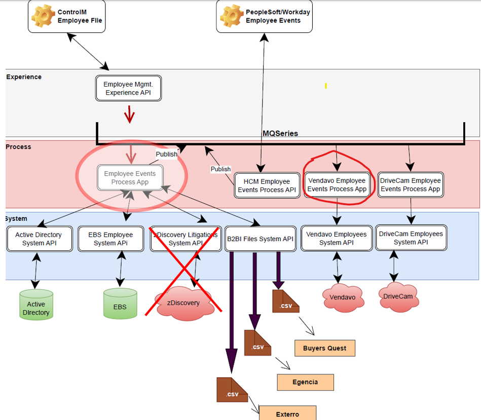
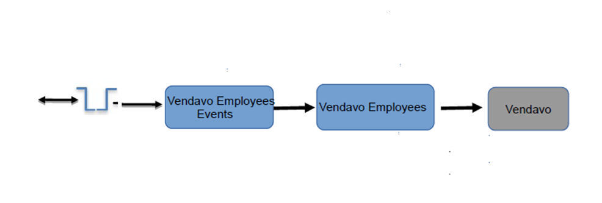
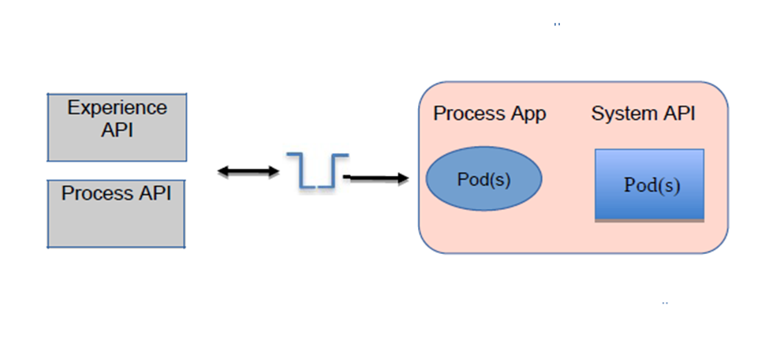

# History Of Changes

|             |            |                       |            |
|-------------|------------|-----------------------|------------|
| **Version** | **Author** | **Reason for change** | **Date**   |
| 1.0         | J Sack     | Initial               | 04/26/2024 |
|             |            |                       |            |
|             |            |                       |            |
|             |            |                       |            |
|             |            |                       |            |
|             |            |                       |            |
|             |            |                       |            |
|             |            |                       |            |
|             |            |                       |            |

# Purpose 

This document provides specifics that describes the application that is
to be used to orchestrate the processing of employee based events. This
application will receive a MQSeries message and use the payload of the
message to identify, and then orchestrate any API calls required to
facilitate the processing, and eventual consumption of the employee
event in the Vendavo application.

# Taxonomy

**Vendavo:** A cloud-based solution providing software for margin and
profit optimization to help drive corporate performance through big data
analytics.

# Solution Overview

## Process Context



## Logical Viewpoint



## Deployment Viewpoint



# Process

## Vendavo Employee Event Synchronization

Employee events synchronization orchestration strives to make employee
events consumable by interested applications. The messages received are
enhanced with data from applications or data stores to provide the data
elements required for Vendavo to successfully process the message.

Initially, this application is to be built to support the following:

- Terminated employees

## Functional Design

### Resources

#### Employee Event Synchronization

This application will be responsible for the orchestration of the
required processing, and mediation steps to insure that employee event
information is prepared, and presented to the Vendavo application for
consumption. This processing will be triggered by details obtained from
the payload of a message from a MQSeries queue.

##### Project Names:

OAS Model Project: Does Not Apply

Development Project: vendavo-employee-events-prc-app

OpenShift Project: employee-events-dev, employee-events-test,
employee-events

##### Policies

- Not at this time

##### Resource Locators

- To receive unsolicited requests to synchronize employee information:

Input Queue: [\#IBM MQ Employee Events Message Queue
Configuration\|outline](#ibm-mq-employee-events-message-queue-configuration)

- Type of Data Consumed: application/json

##### IBM MQ Connector Configuration***:*** 

[***\#IBM MQ Connector
Configuration\|outline***](#ibm-mq-connector-configuration-1)

##### Processing 

###### Processing Structure:

Right after the On New Message source component, wrap any “loose”
components on the palette in a try block and place any related special
error processing in the “Error handling“/“Catch” section. In our case,
we would like to log the error, but in the future, we may want to store
the original message in a queue for later use.

The main reason for doing this is to prevent a poison message situation
where upon failure, the message rolls back to the input queue, and then
picked up again for processing placing us in a loop.

The main “Error handling”/”Catch” section should contain an On Error
Continue component to catch ANY type of error and should simply just log
the error details as well as the payload. The key thing about this

In General the flow template should look like so:


###### Summary

- Receive the request via a MQ Message

- Validate the payload received from the message

- If eventAction=Termination

Prepare and make a call to the Vendavo Employee system Api

- Prepare the response

###### Receive the request

####### IBM MQ On New Message Component Configuration: 

[\#IBM MQ Employee Events Message Queue
Configuration\|outline](#ibm-mq-employee-events-message-queue-configuration)

####### MQMD Parameters: Does Not Apply

|      |                        |         |
|------|------------------------|---------|
| Name | Assignment/Description | Example |
|      |                        |         |
|      |                        |         |

####### Request Payload: 

| Element Name               | Required | Notes                                                                 |
|----------------------------|----------|-----------------------------------------------------------------------|
| correlationId              | N        | string<br>Ex. ae8c5b85-97e0-4f55-80e7-6161d67220ae                    |
| tracingId                  | N        | string<br>Ex. A19283745                                               |
| timeStamp                  | Y        | datetime, Ex. 2022-11-04T14:42:19.74Z                                  |
| eventAction                | Y        | string<br><strong>Valid Values</strong>:<br>Termination<br>Ex. Termination |
| employees                  | Y        | Collection of employee data                                           |
| employeeId                 | Y        | string<br>Ex. 000136214                                               |
| singleSignOnId             | N        | string<br>Ex. psmith@mclane.mclaneco.com                              |
| userId                     | Y        | string<br>Ex. psmith                                                  |
| status                     | Y        | string<br>Ex. Active                                                  |
| employmentType             | N        | string<br>Ex. Full-time                                               |
| employmentClass            | N        | string<br>Ex. Non-Exempt                                              |
| terminationDate            | Y        | date<br>Ex. 2022-06-08                                                |
| terminationReason          | N        | string<br>Ex. Vol-No Call No Show                                     |
| distributionCenterDivisionId | N      | string<br>Ex. FS112                                                   |
| travelerGroup              | N        | string<br>Ex. APP TRAVEL CORP SOUTH CAMPUS 995                        |
| oneDriveURL                | N        | string<br>Ex. https://mclaneco-my.sharepoint.com/personal/hnimaga_mclane_mclaneco_com |
| escalationEmail            | N        | string<br>Ex. ssmith@mclaneco.com                                     |
| division                   | N        | string<br>Ex. MBIS-Administration, Div Human Resources                |
| department                 | N        | string<br>Ex. Help Desk                                               |
| name                       | N        | Object                                                                |
| first                      | Y        | string<br>Ex. Zachary                                                 |
| preferredFirstname         | N        | string<br>Ex. Zach                                                    |
| middle                     | N        | string<br>Ex. A                                                       |
| last                       | Y        | string<br>Ex. Hines                                                   |
| fullName                   | N        | string<br>Ex. Zachary Hines                                           |

Example request:

```json
{  
  "correlationId": "4ee5f0c0-c046-11ee-8012-065dd30d59d5",  
  "timeStamp": "2024-01-31T14:37:49.951Z",  
  "eventAction": "Termination",  
  "targetApplication": "BuyerQuestTerm",  
  "employees": [  
    {  
      "employeeId": "000157077",  
      "singleSignOnId": "hnimaga@mclane.mclaneco.com",  
      "userId": "hnimaga",  
      "status": "Terminated",  
      "employmentType": "Full-time",  
      "employmentClass": "Non-Exempt",  
      "terminationDate": "2024-01-30",  
      "terminationReason": "Vol-No Call No Show",  
      "distributionCenterDivisionId": "FB605",  
      "travelerGroup": "APP TRAVEL CORP SOUTH CAMPUS 995",  
      "oneDriveURL": "https://mclaneco-my.sharepoint.com/personal/hnimaga_mclane_mclaneco_com",  
      "job": {  
        "action": "Termination",  
        "workgroups": [  
          {  
            "id": "5189354",  
            "role": "Warehouse Special"  
          }  
        ]  
      },  
      "name": {  
        "first": "Haji",  
        "middle": "",  
        "last": "Nimaga",  
        "preferredFirstname": "Harry",  
        "fullName": "Haji Nimaga,Sr."  
      }  
    }  
  ]  
}
```

###### Validation

- The following fields are mandatory and should be checked to insure
  they are present on the request payload

- employees – at least one item in the collection

- employees.employeeId must be present, and not null

- eventAction must be present, and not null

> If any of these fields are missing, log the standard status message
> with the following fields

code = “400”

context.type=”Error”

context.message = Required field {field} is missing from the request

context.context = app.name

###### eventAction=Termination

####### Step 1: Call the Vendavo users system API to update the user data 

######## Resource Locators

- Create an employee termination record

POST {BASE_URI}/v1/users/{userId}

- Type of Data Consumed:

application/json

See OAS model project for interaction details: vendavo-users-sys-api

######## Path Parameters: 

|        |                        |         |
|--------|------------------------|---------|
| Name   | Assignment/Description | Example |
| userId | Employee user Id       | psmith  |

######## Query Parameters: Does Not Apply

|      |                        |         |
|------|------------------------|---------|
| Name | Assignment/Description | Example |
|      |                        |         |

######## Http Header Parameters: 

|  |  |  |
|----|----|----|
| Name | Assignment/Description | Example |
| tracing_id | tracingId from the request | ASY7748901 |
| x-correlation-id | correlationId from the MQ message request | 1ea52c41-98d5-11ec-9852-000c29356fc3 |

######## Request Payload: 

|  |  |  |
|----|----|----|
| Element Name | Assignment | Notes |
| employeeId | employees\[\*\].employeeId from the request | string, Ex. 000157077 |
| terminationDate | employees\[\*\].terminationDate from the request | string, Ex. 2022-06-08 |
|  |  |  |

######## Interact with the Vendavo system API

- API:

POST https://\<server\>:\<port\>/vendavo-users-sys-api/v1/users/msmith

**Example:**

POST
https://\<server\>:\<port\>/b2bi-files-sys-api/v1/files/employees?targetApplication=BuyerQuest

Example Request:

```json
{  
  "employeeId": "000157077",
  "terminationDate": "2023-04-25"  
}
```

Example Response from the system API:

```json
{
  "correlationId": "1ea52c41-98d5-11ec-9852-000c29356fc3",
  "tracingId": "A19283745"
}
```

###### Logging the API request, and response: 

####### Logging Payload:

We should log data prior to the API call, and after the api call. The
log message prior to the api call should contain the resource endpoint
being called, the request message payload if it applies, as well as the
standard log elements, and the log message after the api call should
contain the response.

At the end of the flow, we should log the results of the api call with
the following elements.

| Element Name | Mapping | Notes |
|--------------|---------|-------|
| correlationId | correlationId from the request message | Ex. 233e4fd0-e81b-11ec-8245-06e260431b40 |
| tracingId | tracingId from the request message | Ex. abc12321 |
| eventAction | eventAction from the message | Ex. Termination |
| resourceUrl | Url for calling the active directory system api | Ex. https://apim-test.mclaneco.com/vendavo-users-sys-api/v1/users/msmith |
| requestPayload | If http response from the API call starts with a 2, Then null Else original payload of the message | |
| apiResponse | If http response from the API call starts with a 2, Then null Else original payload of the message | |
| statusCode | | |
| code | http response from the API call | Ex. 200 |
| messages | | |
| type | If http response from the API call starts with a 2, then Diagnostic else Error | Ex. Diagnostic |
| reasonCode | error.errorType default null | |
| message | If http response from the API call starts with a 2 then Success else assign the error message | |
| context | app.name | Ex. mcl-addressbook-sync-app-tst-1 |
| timestamp | Current date & time | Ex. 2022-06-09T22:45:11.042Z |

**Example Message to Log:**

```json
{
  "correlationId": "c759dc47-c673-4d0c-ab9c-20ee52f6d145",
  "tracingId": "A5579098",
  "eventAction": "Termination",
  "retryResourceUrl": "https://apim-test.mclaneco.com/vendavp-users-sys-api/v1/users/msmith",
  "apiRetryResponse": null,
  "status": {
    "code": "200",
    "messages": [
      {
        "type": "Diagnostic",
        "reasonCode": "",
        "message": "Success",
        "context": "vendavo-users-sys-api",
        "timestamp": "2022-11-09T22:45:11.042Z"
      }
    ]
  }
}
```

###### Error Processing

If an issue/error is encountered with this application, the specifics
related to the error are to be reported via logging which will be routed
over to splunk.

- if there are any issues/errors returned from this MQ call, the context
  of the error should be placed in the status section, and a response
  should be formatted and sent back to the caller.

-Set the following status elements in the response

status = 500

context.type = “Error”

> context.reasonCode = error.errorType
>
> context.message = error.exception.cause.linkedException
>
> default error.exception

###### Non Functional Requirements

####### Security

####### Data

- Masking elements: Does Not apply

####### Transport

- http

####### Availability

- *99.99% uptime 24x7*

####### Reliability

- High availability via multiple workers

####### Traceability

- Transaction tracing via log data to Splunk

- Specific Auditing requirements: Does Not Apply

####### Throughput

- Current Peak Metric:

  - xx Concurrent transactions per second

  - xx Minutes - specified duration(s)

  - M T W T F S S Note any applicable days in the week

- Seasonal dimension: Does Not Apply

- Estimated Peak metric over the next 9-12 months:

  - xx Concurrent transactions per second

  - xx minutes - specified duration(s)

  - M T W T F S S Note any applicable days in the week

####### Response Time

- Does Not Apply

# 

# Appendix

## IBM MQ Connector Configuration

***IBM MQ Configuration**: (externalize into a property file)*

- ***Extension**: com.ibm.mq.jakarta.client: IBM MQ classes for Jakarta
  Messaging is a Jakarta Messaging provider that implements the Jakarta
  Messaging interfaces for IBM MQ as the messaging system.*

- ***Extension:** camel-quarkus-jms: This extension allows us to
  interact with the messaging software using JMS.*

- ***Extension**: quarkus-pooled-jms*

> ***quarkus.pooled-jms.pooling.enabled=true***
>
> ***quarkus.pooled-jms.max-connections=1***
>
> ***quarkus.pooled-jms.max-sessions-per-connection=10** (number of
> Sessions that the pooled Connection will loan out before either
> blocking)*
>
> ***quarkus.pooled-jms.block-if-session-pool-is-full=true** (block
> until another previously created and loaned out session is closed an
> thereby becomes available)*
>
> ***quarkus.pooled-jms.block-if-session-pool-is-full-timeout=-1**
> (block forever if configured to wait)*

|             |                           |      |               |               |
|-------------|---------------------------|------|---------------|---------------|
| Environment | Host                      | Port | Queue Manager | Channel       |
| Development | ltdstmqapp01.mclaneco.com | 1415 | TTDCMQ01      | MSOFT.SVRCONN |
| Test        | ltdstmqapp01.mclaneco.com | 1415 | TTDCMQ01      | MSOFT.SVRCONN |
| Production  | lpdstmqapp01.mclaneco.com | 1414 | PTDCMQ01      | MSOFT.SVRCONN |

- acknowledgementModeName=CLIENT_ACKNOWLEDGE

## IBM MQ Employee Events Message Queue Configuration

To get a message and make a REST call based on the message payload

***IBM MQ Configuration**: (externalize into a property file)*

- ***Destination**: (externalize in a property file as inputQ)*

  - ***Development:** OSAPI.PRC.VENDAVO.EMPLOYEE.EVENTS.REQ.DEV*

  - ***Test:** OSAPI**.**PRC.VENDAVO.EMPLOYEE.EVENTS.REQ*

  - ***Production:** OSAPI.PRC.VENDAVO.EMPLOYEE.EVENTS.REQ*

- ***Destination type**: Queue*

- ***Content Type:** text/plain*

## IBM MQ Employee Events Error Queue

*OSAPI.PRC.VENDAVO.EMPLOYEE.EVENTS.ERR*

## MQ Request Queue Configuration Information

Request Queue: *OSAPI.PRC.VENDAVO.EMPLOYEE.EVENTS.REQ*

|  |  |  |
|----|----|----|
| **Parameter Name** | **Parameter Value** | **Parameter Description** |
| BOTHRESH | 2 | Backout Threshold |
| BOQNAME | *OSAPI.PRC.VENDAVO.EMPLOYEE.EVENTS*.ERR | Backout Queue Name |

## IBM MQ Health Check Publish Configuration

To Send a message to B2BI

***IBM MQ Configuration**: (externalize into a property file)*

- ***Destination**: SYSTEM.DEFAULT.LOCAL.QUEUE*

- ***Destination type**: Queue*

- ***Content Type:** text/plain*

- ***Time To Live (Expiry):** 10000*

*Message Payload:*

### Request Payload: json formatted 

| Element Name | Assignment/Description         | Notes                     |
|--------------|--------------------------------|---------------------------|
| message      | app.name + “health check message” | Ex. employee-mgmt-exp-api |

Example:

```json
{
  "message": "vendavo-employee-events-prc-api health check message"
}
```

## Error Structure

| Element Name | Assignment | Notes |
|--------------|------------|-------|
| correlationId | correlationId | string<br>Ex. d5f6fbf8-6774-4a95-9b59-15348943abd4 |
| tracingId | tracing_id from the system API request header, if present | string<br>Ex. A3345732 |
| title | If http status is:<br>400=Bad Request<br>401=Unauthorized<br>403=Forbidden<br>404=Resource Not Found<br>405=Method Not Allowed<br>406=Not Acceptable<br>429=Too Many Requests<br>3xx: Redirection<br>5xx: Unexpected error | Short human-readable title of the error that occurred |
| status | Http status code | holds processing status code |
| instance | The called url that experienced the issue | Ex. https://apim.mclaneco.com/ebs-employees-sys-api/v1/employees/000134785 |
| requestId | correlationId | Id that correlates original request to response and other events in the API |
| **context** | | Object that holds the collection of diagnostic information |
| type | “Error” | string |
| severity | Optional designation of the criticality of the error | 1=High<br>2=Medium<br>3=Low |
| reasonCode | Application return code if available | string, Ex. 422 |
| message | Error message text | string |
| component | Application name | string, Ex. trimble-shipments-sys-api |
| timeStamp | Current date & time | string |

Example:

```json
{  
  "correlationId": "979f3d3b-a04a-43d7-b55f-8d5609b48783",  
  "tracingId": "abc55247",  
  "title": "Bad Data",  
  "status": 400,  
  "instance": "https://apim.mclaneco.com/prc/tracking-shipments/v1/shipments/MC0109MS20230731/positions",  
  "requestId": "979f3d3b-a04a-43d7-b55f-8d5609b48783",  
  "context": [  
    {  
      "type": "Error",  
      "severity": "1",  
      "reasonCode": "422",  
      "component": "trimble-shipments-sys-api",  
      "timeStamp": "2023-04-20T14:46:59.131Z",  
      "message": "HTTP POST on resource 'https://apim.mclaneco.com:443/prc/tracking-shipments/v1/shipments/MC0109MS20230731/positions' failed: bad request (400)."  
    }  
  ]  
}
```

## ~~Error Structure-Deprecated~~

| ~~Element Name~~ | ~~Assignment~~ | ~~Notes~~ |
|------------------|----------------|-----------|
| ~~correlationId~~ | ~~correlationId~~ | ~~string~~<br>~~Ex. d5f6fbf8-6774-4a95-9b59-15348943abd4~~ |
| ~~tracingId~~ | ~~tracing_id from the system API request header, if present~~ | ~~string~~<br>~~Ex. A3345732~~ |
| **~~status~~** | | ~~Object that holds processing status context~~ |
| ~~code~~ | ~~Response code~~ | |
| **~~messages~~** | | ~~Object that holds the collection of diagnostic information~~ |
| ~~type~~ | ~~“Error”~~ | ~~string~~ |
| ~~severity~~ | | ~~string~~ |
| ~~reasonCode~~ | ~~Application return code if available~~ | ~~string~~ |
| ~~message~~ | ~~Error message text~~ | ~~string~~ |
| ~~context~~ | ~~app.name~~ | ~~string~~ |
| ~~timeStamp~~ | ~~Current date & time~~ | ~~string~~ |

~~Example:~~

~~{
  ~~"correlationId":~~ ~~"d5f6fbf8-6774-4a95-9b59-15348943abd4",~~
  ~~"tracingId": "A19283745",~~
  ~~"status": {~~
    ~~"code": "500",~~
    ~~"messages": [~~
      ~~{~~
        ~~"type": "Error",~~
        ~~"severity": "1",~~
        ~~"reasonCode": "40613",~~
        ~~"message": "Database mydb on server mydbserver is not currently available",~~
        ~~"context": "third-party-shipping-exp-api",~~
        ~~"timeStamp": "2021-09-30T15:27:49.274Z"~~
      ~~}~~
    ~~]~~
  ~~}~~
~~}~~

## Log Event Structure

| Element Name  | Assignment                                            | Notes                                               |
|---------------|-------------------------------------------------------|-----------------------------------------------------|
| correlationId | correlationId                                         | string<br>Ex. d5f6fbf8-6774-4a95-9b59-15348943abd4  |
| tracingId     | tracing_id from the system API request header, if present | Ex. A3345732                                        |
| clientId      |                                                       | Ex. c9feb3160f0b4ea785875ad678e00c1c                |
| appName       |                                                       | Ex. mfdb2-sales-sys-api-1                           |
| flowName      |                                                       | Ex. mfdb2-sales-sys-api-main                        |
| flowStep      |                                                       | Ex. Flow End                                        |
| timestamp     | Current date & time                                   | Ex. 2023-04-25T03:06:16.405Z                        |
| environment   | DEV, TEST, PROD                                       | Based on the environment we are running in          |
| payload       | If log level is DEBUG add the payload                 |                                                     |

Example:

```json
{  
  "appName": "mcl-b2bi-files-sys-api-1",  
  "clientId": "c9feb3160f0b4ea785875ad678e00c1c",  
  "correlationId": "23d10540-e316-11ed-8a7a-0205dd115db9",  
  "tracingId": "A23778-01",  
  "flowName": "ebs-employees-sys-api-main",  
  "flowStep": "Flow End",  
  "timestamp": "2023-05-25T03:06:16.405Z",  
  "environment": "PROD",  
  "payload": {  
    "correlationId": "23d10540-e316-11ed-8a7a-0205dd115db9",  
    "tracingId": "",  
    "status": {  
      "code": "200",  
      "messages": [  
        {  
          "type": "Diagnostic",  
          "message": "BuyerQuestTerm Data has been queued for processing",  
          "timeStamp": "2023-04-25T03:06:16.403Z"  
        }  
      ]  
    }  
  }  
}
```
