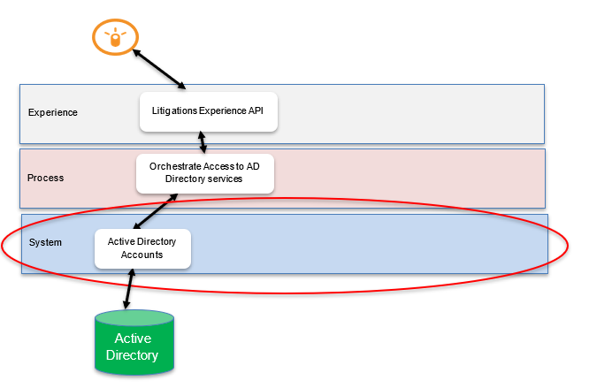
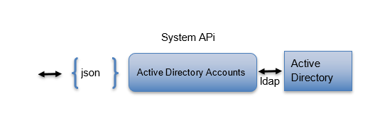
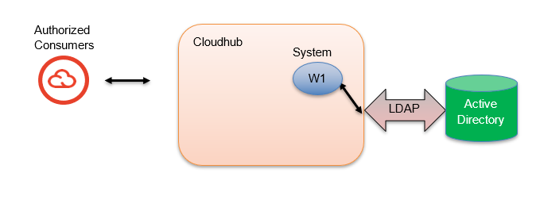

# History Of Changes:

| **Version** | **Author** | **Reason for change** | **Date** |
|----|----|----|----|
| 1.0 | J Sack | Initial | 10/27/2022 |
| 1.1 |  | Add travelGroup and singleSignOnId and change sAMAccountName to userId on the response | 01/09/2023 |
|  |  | OpenShift Migration | 05/15/2023 |
|  |  | New Error structure | 08/28/2023 |
| 1.2 |  | Add purchasingApprovalGroup and approvalLimitAmount to the response | 08/05/2024 |


# Purpose 

This document provides specifics that describes the API application that
is to support interactions with the Active Directory LDAP services.

# Taxonomy

**LDAP**: A product-agnostic protocol used to access directory servers
which store, update and retrieve data from a directory structure.

**Active Directory**: A Microsoft product used to organize, and store
assets like users, computers, and printers.

# Solution Overview

The corporate user directory stores a great deal of important and
relevant data especially as it relates to users. McLane uses Active
Directory to support is directory services, and this application will
use the LDAP protocol in interact with it.

## Process Context



## Logical Viewpoint



## Deployment Viewpoint



# System API

## Active Directory

AD stores user and account information in an organized way. Access to
this single source of truth for user account information is via LDAP.

This system API will focus on the specific nuances associated with the
LDAP based protocol interactions with Active Directory services.

## Functional Design

### Resources

#### Accounts

A user is person who is known to Mclane and requires authenticated
access to authorized resources. Other context about the user is stored
in the account for that person.

This application will focus on obtaining, creating, and updating user
information in the corporate directory.

##### Project Names:

OAS Model Project: ad-accounts-sys-api

Development Project: ad-accounts-sys-api

OpenShift Project: employee-events-dev, employee-events-test,
employee-events

##### Policies

- Client Id Enforcement

##### Get user information

###### Resource Locators

- Get user information

GET {BASE_URI}/v1/ad-accounts/users

- Type of Data Consumed:

application/json

###### Path Parameters: Does Not Apply

| Name                       | Assignment/Description     | Example |
|:---------------------------|:---------------------------|:--------|
| <span class="mark"></span> | <span class="mark"></span> |         |

###### Query Parameters: 

| Name       | Assignment/Description | Example |
|:-----------|:-----------------------|:--------|
| employeeId | Employee id            |         |

###### Http Header Parameters: 

| Name | Assignment/Description | Example |
|:---|:---|:---|
| tracing_id | Optionally sent in on request | 000031235 |
| x-correlation-id | Optional, if present use as correlationId | 1ea52c41-98d5-11ec-9852-000c29356fc3 |

###### Request Payload: Does not apply

| Element Name | Required | Notes |
|:-------------|:--------:|:------|
|              |          |       |

Example:

GET
https://\<server\>:\<port\>/ad-accounts-sys-api/v1/users?employeeId=000136214

Example request: Does Not Apply

###### Processing Summary

- Validate the input request

<!-- -->

- Interact with Active Directory via the LDAP protocol to get user data
  via an employee Id a shipment

- Prepare Response

####### Validation

- Validation handled by the API model

####### Get user account information in Active Directory 

Use the MuleSoft Anypoint LDAP connector SearchOne Operation

Global Configuration: [Global Connector
Configuration](#_Global_Connector_Configuration)

Search One Operation Configuration: [SearchOne Operation
Configuration](#searchone-operation-configuration)

######## Search One assignments:

| Name   | Assignment/Description                                                                                                                                                                                                 | Example                       |
|--------|-------------------------------------------------------------------------------------------------------------------------------------------------------------------------------------------------------------------------|-------------------------------|
| Filter | mcLaneUSRPSBadgeID={employeeId} <br> Assign employeeId from the employeeId query parameter from the request <br> The employeeId value used in the filter statement should be numeric, and any leading zero’s preserved. The employeeId should always contain 9 digits | mcLaneUSRPSBadgeID=000332641  |

**Example successful LDAP Response:**

```json
{
  "ipPhone": "2547717182",
  "telephoneNumber": "254-771-7777",
  "manager": "CN=lmhendr,OU=Teammates,OU=End Users,OU=Internal Users,DC=mclane,DC=mclaneco,DC=com",
  "mail": "Mary.Eliassen@McLaneCo.com",
  "sAMAccountName": "mxelias",
  "displayName": "Mary Eliassen",
  "givenName": "Mary",
  "distinguishedName": "CN=mxelias,OU=Teammates,OU=End Users,OU=Internal Users,DC=mclane,DC=mclaneco,DC=com",
  "description": "MIS - Information Technology - PC Systems",
  "title": "Engineer II, Windows",
  "mcLaneUSRPSBadgeID": "000243752",
  "name": "mxelias",
  "sn": "Eliasen",
  "department": "PC and Lan Support",
  "userPrincipalName": "mxelias@mclane.mclaneco.com"
}
```

***Request Connector Configuration**: (externalize into a property
file)*

- *Response Timeout(ms): 15000 (responseTimeOut)*

###### Prepare Response 

**Example successful LDAP response:**

```json
{  
  "ipPhone": "2547717182",  
  "telephoneNumber": "254-771-7777",  
  "manager": "CN=lmhendr,OU=Teammates,OU=End Users,OU=Internal Users,DC=mclane,DC=mclaneco,DC=com",  
  "mail": "Mary.Eliassen@McLaneCo.com",  
  "sAMAccountName": "mxelias",  
  "displayName": "Mary Eliassen",  
  "givenName": "Mary",  
  "distinguishedName": "CN=mxelias,OU=Teammates,OU=End Users,OU=Internal Users,DC=mclane,DC=mclaneco,DC=com",  
  "description": "MIS - Information Technology - PC Systems",  
  "title": "Engineer II, Windows",  
  "mcLaneUSRPSBadgeID": "000243752",  
  "name": "mxelias",  
  "sn": "Eliasen",  
  "department": "PC and Lan Support",  
  "userPrincipalName": "mxelias@mclane.mclaneco.com",  
  "memberOf": [  
    "CN=APP TRAVEL SE 400,OU=Unconstrained,OU=Groups,OU=Internal Users,DC=mclane,DC=mclaneco,DC=com",  
    "CN=SEC_RK_MYMCLANE_QUICKLINK,CN=Users,DC=mclane,DC=mclaneco,DC=com",  
    "CN=SEC_INTERNET_USERS,CN=Users,DC=mclane,DC=mclaneco,DC=com",  
    "CN=SVC_SW_PULSE_VPN,CN=Users,DC=mclane,DC=mclaneco,DC=com"  
  ]  
}
```

####### Response Payload: 

\*\*See OAS model for more details

| Element Name            | Assignment                                                                 | Notes                                                                                              |
|-------------------------|-----------------------------------------------------------------------------|----------------------------------------------------------------------------------------------------|
| correlationId           | correlationId from the request                                              | string <br> Ex. ae8c5b85-97e0-4f55-80e7-6161d67220ae                                               |
| tracingId               | tracingId from the request, if present                                      | string <br> Ex. A19283745                                                                          |
| userId                  | sAMAccountName from the LDAP response                                       | string <br> Ex. mxelias                                                                            |
| employeeId              | McLaneUSRPSBadgeID from the LDAP response                                   | string <br> Ex. 000058610                                                                          |
| singleSignOnId          | sAMAccountName from the LDAP response + “@mclane.mclaneco.com”              | string <br> Ex. zhines@mclane.mclaneco.com                                                         |
| distinguishedName       | distinguishedName from the LDAP response                                    | string <br> Ex. CN=mxelias,OU=Teammates,OU=End Users,OU=Internal Users,DC=mclane,DC=mclaneco,DC=com |
| givenName               | givenName from the LDAP response                                            | string <br> Ex. Mary                                                                               |
| surname                 | sn from the LDAP response                                                   | string <br> Ex. Eliassen                                                                           |
| name                    | name from the LDAP response                                                 | string <br> Ex. mxelias                                                                            |
| displayName             | displayName from the LDAP response                                          | string <br> Ex. Mary Eliassen                                                                      |
| division                | description from the LDAP response                                          | string <br> Ex. MIS - Information Technology - PC Systems                                          |
| department              | department from the LDAP response                                           | string <br> Ex. PC and Lan Support                                                                 |
| title                   | title from the LDAP response                                                | string <br> Ex. Engineer II, Windows                                                               |
| manager                 | manager from the LDAP response                                              | string <br> Ex. CN=lmhendr,OU=Teammates,OU=End Users,OU=Internal Users,DC=mclane,DC=mclaneco,DC=com |
| email                   | mail from the LDAP response                                                 | string <br> Ex. Mary.Eliassen@McLaneCo.com                                                         |
| ipPhoneNumber           | ipPhone from the LDAP response                                              | string <br> Ex. 2547715323                                                                         |
| telephoneNumber         | telephoneNumber from the LDAP response                                      | string <br> Ex. 2547718187                                                                         |
| userPrincipalName       | userPrincipalName from the LDAP response                                    | string <br> Ex. mxelias@mclane.mclaneco.com                                                        |
| travelerGroup           | If any of the items in the memberOf collection start with “APP TRAVEL” assign that value to the travelerGroup | string <br> Ex. APP TRAVEL ABERDEEN 627                                                            |
| purchasingApprovalGroup | If any of the items in the memberOf collection start with “APP_BQ_PERM” assign that value to the purchasingApprovalGroup | string <br> Ex. APP_BQ_PERM_APPROVER_T1                                                            |
| approvalLimitAmount     | Use the purchasingApprovalGroup value and the crosswalk table to determine the approvalLimitAmount value | number <br> Ex. 1000                                                                               |
| oneDriveURL             | sAMAccountName from the LDAP response <br> [https://mclaneco-my.sharepoint.com/personal/](https://mclaneco-my.sharepoint.com/personal/) + sAMAccountName + _mclane_mclaneco_com | string <br> Ex. [https://mclaneco-my.sharepoint.com/personal/mxelias_mclane_mclaneco_com](https://mclaneco-my.sharepoint.com/personal/mxelias_mclane_mclaneco_com) |

**Example Response:**

```json
{
  "correlationId": "1ea52c41-98d5-11ec-9852-000c29356fc3",
  "tracingId": "A19283745",
  "userId": "mxelias",
  "employeeId": "000031235",
  "singleSignOnId": "mxelias@mclane.mclaneco.com",
  "distinguishedName": "CN=mxelias,OU=Teammates,OU=End Users,OU=Internal Users,DC=mclane,DC=mclaneco,DC=com",
  "givenName": "Mary",
  "surname": "Eliasen",
  "name": "mxelias",
  "displayName": "Mary Eliasen",
  "division": "MIS - Information Technology - PC Systems",
  "department": "PC and Lan Support",
  "title": "Engineer II, Windows",
  "manager": "CN=lmhendr,OU=Teammates,OU=End Users,OU=Internal Users,DC=mclane,DC=mclaneco,DC=com",
  "email": "Mary.Eliassen@McLaneCo.com",
  "ipPhone": "2547717076",
  "telephoneNumber": "254-771-7076",
  "userPrincipalName": "mxelias@mclane.mclaneco.com",
  "travelGroup": "APP TRAVEL ABERDEEN 627",
  "purchasingApprovalGroup": "APP_BQ_PERM_APPROVER_T1",
  "approvalLimitAmount": 1000,
  "oneDriveURL": "https://mclaneco-my.sharepoint.com/personal/mxelias_mclane_mclaneco_com"
}
```

###### Error Processing

If an issue/error is encountered, the specifics related to the error are
to be reported back on the response via our common error structure along
with the correlation Id and the tracing Id if provided.

if the Active Directory LDAP response is a null then create an error
response and sent back to the caller.

-Set the following status elements in the response

status = 400

context.type = “Error”

> context.reasonCode =
>
> context.message = User not found for employee Id = {employeeId} from
> the query parameter}

Example:

```json
{  
  "correlationId": "979f3d3b-a04a-43d7-b55f-8d5609b48783",  
  "tracingId": "abc55247",  
  "title": "Bad Request",  
  "status": 400,  
  "instance": "https://apim.mclaneco.com/ad-accounts-sys-api/v1/ausers?employeeId=000136214",  
  "requestId": "979f3d3b-a04a-43d7-b55f-8d5609b48783",  
  "context": [  
    {  
      "type": "Error",  
      "severity": "1",  
      "reasonCode": "1",  
      "component": "ad-accounts-sys-api",  
      "timeStamp": "2023-04-20T14:46:59.131Z",  
      "message": "User not found for employee Id = 000136214"  
    }  
  ]  
}
```

###### Non Functional Requirements

####### Security

####### Data

- System client id and secret

- Masking elements: Does Not apply

####### Transport

- https

####### Availability

- *99.99% uptime 24x7*

####### Reliability

- High availability via multiple workers

####### Traceability

- Transaction tracing via log data to Splunk

- Specific Auditing requirements: Does Not Apply

####### Throughput

- Current Peak Metric:

  - <span class="mark">xx</span> Concurrent transactions per second

  - <span class="mark">xx</span> Minutes - specified duration(s)

  - M T W T F S S Note any applicable days in the week

- Seasonal dimension: Does Not Apply

- Estimated Peak metric over the next 9-12 months:

  - <span class="mark">xx</span> Concurrent transactions per second

  - <span class="mark">xx</span> minutes - specified duration(s)

  - M T W T F S S Note any applicable days in the week

####### Response Time

- Target times for average or maximum response times, expressed as a
  percentile: 95% within 2 second(s).

##### Active Directory Health Check 

This endpoint enables a health check ping to ensure the application, and
the dependent API is up and running

###### Resource Locators

1)  To get a heartbeat response

GET {BASE_URI}/v1/health

2)  Type of Data Consumed:

###### Path Parameters: Does Not Apply

| Name | Assignment/Description | Example |
|:-----|:-----------------------|:--------|
|      |                        |         |

###### Query Parameters: Does Not Apply

| Name | Assignment/Description | Example |
|:-----|:-----------------------|:--------|
|      |                        |         |

###### Http Request Parameters: 

| Name       | Assignment/Description | Example    |
|:-----------|:-----------------------|:-----------|
| tracing_id | Optional               | Z987yy54r3 |

###### Request Payload: Does Not Apply

| Element Name | Assignment | Notes |     |
|:-------------|:-----------|:------|:----|
|              |            |       |     |

Example:

GET /ad-accounts-sys-api/v1/health

###### Processing 

To check that Active Directory is available, make the following API
call:

Use the MuleSoft Anypoint LDAP connector Exists Operation

Global Configuration: [Global Connector
Configuration](#_Global_Connector_Configuration)

Exists Operation Configuration: [Exists Operation
Configuration](#exists-operation-configuration)

####### Exists assignments:

| Name | Assignment/Description | Example |
|:---|:---|:---|
| DN | CN=SVC_LDAP_MULESOFT,OU=Infrastructure,OU=Servers,DC=mclane,DC=mclaneco,DC=com |  |

**Example successful LDAP Response:**

This Operation will return true if successful

***Request Connector Configuration**: (externalize into a property
file)*

- *Response Timeout(ms): 15000 (responseTimeOut)*

- *Reconnection Strategy: Frequency(ms): 2000
  (reconnectionFrequencyInMS),*

*Attempts: 2 (reconnectionMaxAttempts)*

-Return a 200 upon successful completion with payload if the LDAP
response returns true

####### Response Payload: For Successful responses

| Element Name  | Assignment                                                                 | Notes                                                                                          |
|---------------|----------------------------------------------------------------------------|------------------------------------------------------------------------------------------------|
| correlationId | correlationId                                                              | string <br> Ex. d5f6fbf8-6774-4a95-9b59-15348943abd4                                           |
| tracingId     | Optional tracing_id from the system API request header, if present         | string <br> Ex. A3345732                                                                       |
| status        | Constant “OK”                                                              | string <br> Ex. OK                                                                             |
| apiName       | app.name                                                                   | string <br> Ex. ad-accounts-sys-api                                                            |
| apiVersion    |                                                                            | string <br> Ex. v1                                                                             |
| timestamp     | now                                                                        | string <br> Ex. 2021-07-18T16:55:46.678-05:00                                                  |
| dependencies  | Object that contains the status                                            |                                                                                                |
| name          | Assign the constant “Active Directory Users”                               | string <br> Ex. Active Directory Accounts                                                      |
| status        | If successful assign the constant “UP”                                     | string <br> Ex. UP                                                                             |

Example:

```json
{
  "correlationId": "d5f6fbf8-6774-4a95-9b59-15348943abd4",
  "tracingId": "A3345732",
  "status": "OK",
  "apiName": "mcl-ad-accounts-sys-api-tst-1",
  "apiVersion": "v1",
  "timestamp": "2022-03-18T16:55:46.678-05:00",
  "dependencies": [
    {
      "name": "Active Directory Accounts",
      "status": "UP"
    }
  ]
}
```

-Return a 500 if any issue(s) are encountered returning the status
object outlining the context of the issue

####### Response Payload: For failures only

| Element Name  | Assignment                                           | Notes                                                                                          |
|---------------|------------------------------------------------------|------------------------------------------------------------------------------------------------|
| correlationId | correlationId                                        | string <br> Ex. d5f6fbf8-6774-4a95-9b59-15348943abd4                                           |
| tracingId     | tracing_id from the system API request header, if present | string <br> Ex. A3345732                                                                       |
| **status**    |                                                      | Object that holds processing status context                                                    |
| code          | Response code                                        |                                                                                                |
| **messages**  |                                                      | Object that holds the collection of diagnostic information                                     |
| type          | “Error”                                              | string                                                                                         |
| severity      |                                                      | string                                                                                         |
| reasonCode    | Sql code if available                                | string                                                                                         |
| Message       | Error message text                                   | string                                                                                         |
| Context       | app.name                                             | string                                                                                         |
| timestamp     | Current date & time                                  | string                                                                                         |

Example:

```json
{
  "correlationId": "d5f6fbf8-6774-4a95-9b59-15348943abd4",
  "tracingId": "A19283745",
  "status": {
    "code": "500",
    "messages": [
      {
        "type": "Error",
        "severity": "1",
        "reasonCode": "40613",
        "message": "Database mydb on server mydbserver is not currently available",
        "context": "trimble-shipments-sys-api",
        "timeStamp": "2021-09-30T15:27:49.274Z"
      }
    ]
  }
}
```

####### HTTP Status Codes

Possible HTTP status codes for the response include:

- 200 Request accepted

- 401 Unauthorized - for errors in API authentication

- 403 Forbidden - for errors in API authorization

- 500 Internal Server Error - for unexpected failures

# Appendix

## Error Structure

| Element Name | Assignment | Notes |
|--------------|------------|-------|
| correlationId | correlationId | string <br> Ex. d5f6fbf8-6774-4a95-9b59-15348943abd4 |
| tracingId | tracing_id from the system API request header, if present | string <br> Ex. A3345732 |
| title | If http status is: <br> 400=Bad Request <br> 401=Unauthorized <br> 403=Forbidden <br> 404=Resource Not Found <br> 405=Method Not Allowed <br> 406=Not Acceptable <br> 429=Too Many Requests <br> 3xx: Redirection <br> 5xx: Unexpected error | Short human-readable title of the error that occurred |
| status | Http status code | holds processing status code |
| instance | | |
| requestId | correlationId | Id that correlates original request to response and other events in the API |
| **context** | | Object that holds the collection of diagnostic information |
| type | “Error” | string |
| severity | Optional designation of the criticality of the error <br> 1=High <br> 2=Medium <br> 3=Low | |
| reasonCode | Application return code if available | string, Ex. 422 |
| message | Error message text | string |
| component | Application name | string, Ex. trimble-shipments-sys-api |
| timeStamp | Current date & time | string |

Example:

```json
{  
  "correlationId": "979f3d3b-a04a-43d7-b55f-8d5609b48783",  
  "tracingId": "abc55247",  
  "title": "Bad Data",  
  "status": 400,  
  "instance": "https://apim.mclaneco.com/prc/tracking-shipments/v1/shipments/MC0109MS20230731/positions",  
  "requestId": "979f3d3b-a04a-43d7-b55f-8d5609b48783",  
  "context": [  
    {  
      "type": "Error",  
      "severity": "1",  
      "reasonCode": "422",  
      "component": "trimble-shipments-sys-api",  
      "timeStamp": "2023-04-20T14:46:59.131Z",  
      "message": "HTTP POST on resource 'https://apim.mclaneco.com/prc/tracking-shipments/v1/shipments/MC0109MS20230731/positions' failed: bad request (400)."  
    }  
  ]  
}
```

## ~~Error Structure-Deprecated~~

| ~~Element Name~~ | ~~Assignment~~ | ~~Notes~~ |
| -------------- | ------------ | ------- |
| ~~correlationId~~ | ~~correlationId~~ | ~~string <br> Ex. d5f6fbf8-6774-4a95-9b59-15348943abd4~~ |
| ~~tracingId~~ | ~~tracing_id from the system API request header, if present~~ | ~~string <br> Ex. A3345732~~ |
| ~~**status**~~ |  | ~~Object that holds processing status context~~ |
| ~~code~~ | ~~Response code~~ |  |
| ~~**messages**~~ |  | ~~Object that holds the collection of diagnostic information~~ |
| ~~type~~ | ~~“Error”~~ | ~~string~~ |
| ~~severity~~ |  | ~~string~~ |
| ~~reasonCode~~ | ~~Application return code if available~~ | ~~string~~ |
| ~~message~~ | ~~Error message text~~ | ~~string~~ |
| ~~context~~ | ~~app.name~~ | ~~string~~ |
| ~~timeStamp~~ | ~~Current date & time~~ | ~~string~~ |

~~Example:~~

~~{~~  
~~"correlationId": "d5f6fbf8-6774-4a95-9b59-15348943abd4",~~  
~~"tracingId": "A19283745",~~  
~~"status": {~~  
~~"code": "500",~~  
~~"messages": [~~  
~~{~~  
~~"type": "Error",~~  
~~"severity": "1",~~  
~~"reasonCode": "40613",~~  
~~"message": "Database mydb on server mydbserver is not currently available",~~  
~~"context": "ad-accounts-sys-api",~~  
~~"timeStamp": "2022-03-30T15:27:49.274Z"~~  
~~}~~  
~~]~~  
~~}~~  
~~}~~

## Log Event Structure

| Element Name | Assignment | Notes |
|--------------|------------|-------|
| correlationId | correlationId | string <br> Ex. d5f6fbf8-6774-4a95-9b59-15348943abd4 |
| tracingId | tracing_id from the system API request header, if present | Ex. A3345732 |
| clientId |  | Ex. c9feb3160f0b4ea785875ad678e00c1c |
| appName |  | Ex. mfdb2-sales-sys-api-1 |
| flowName |  | Ex. mfdb2-sales-sys-api-main |
| flowStep |  | Ex. Flow End |
| timestamp | Current date & time | Ex. 2023-04-25T03:06:16.405Z |
| environment | DEV,TEST, PROD | Based on the environment we are running in |
| payload | If log level is DEBUG add the payload |  |

Example:

```json
{
  "appName": "mcl-b2bi-files-sys-api-1",
  "clientId": "c9feb3160f0b4ea785875ad678e00c1c",
  "correlationId": "23d10540-e316-11ed-8a7a-0205dd115db9",
  "tracingId": "A23778-01",
  "flowName": "ebs-employees-sys-api-main",
  "flowStep": "Flow End",
  "timestamp": "2023-05-25T03:06:16.405Z",
  "environment": "PROD",
  "payload": {
    "correlationId": "23d10540-e316-11ed-8a7a-0205dd115db9",
    "tracingId": "",
    "status": {
      "code": "200",
      "messages": [
        {
          "type": "Diagnostic",
          "message": "BuyerQuestTerm Data has been queued for processing",
          "timeStamp": "2023-04-25T03:06:16.403Z"
        }
      ]
    }
  }
}
```

## Active Directory Environments:

| Environment | Host              | Port     |
|:------------|:------------------|:---------|
| Test        | ldap.mclaneco.com | **3269** |
| Production  | ldap.mclaneco.com | **3269** |

## Crosswalks:

### Employee Approval Limits:

| **Purchasing Group**            | **Approval Limit Amount** |
|:--------------------------------|:--------------------------|
| APP_BQ_PERM_APPROVER_REVIEWER   | 0.01                      |
| APP_BQ_PERM_APPROVER_T1         | 1000                      |
| APP_BQ_PERM_APPROVER_T1_GLOBAL  | 1000                      |
| APP_BQ_PERM_APPROVER_T2         | 5000                      |
| APP_BQ_PERM_APPROVER_T2_GLOBAL  | 5000                      |
| APP_BQ_PERM_GR_DIV_LEADERSHIP   | 30000                     |
| APP_BQ_PERM_FS_DIV_LEADERSHIP   | 30000                     |
| APP_BQ_PERM_MBIS_DIV_LEADERSHIP | 30000                     |
| APP_BQ_PERM_SENIOREXECS         | 500000                    |
| Default                         | 0                         |

## Camel Quarkus LDAP extension:

### Documentation: https://camel.apache.org/camel-quarkus/2.14.x/reference/extensions/ldap.html

### Extension: https://quarkus.io/extensions/org.apache.camel.quarkus/camel-quarkus-ldap

### Connection:

- **URL:** ldaps://ldap.mclaneco.com:3269 (ldapURL) -*externalize into a
  property file or config map*

- *Query Parameters:*

  *base: The base DN for searches*

  ou=teammates,ou=end users,ou=internal
  users,dc=mclane,dc=mclaneco,dc=com

  Ex. ?base='ou=teammates,ou=end users,ou=internal
  users,dc=mclane,dc=mclaneco,dc=com'

### Security:

- **TrustStore Path: /opt/certs/truststore.jks**

- **TrustStore Password: \*\*\*\*\***

  If we mount it to the cluster, then use jvm properties

-Djavax.net.ssl.trustStore=/opt/certs/truststore.jks

-Djavax.net.ssl.trustStorePassword=password

#### 

### SearchOne Operation Configuration

***Base DN:** (searchOneBaseDN) - externalize into a property file*

OU=Teammates,OU=End Users,OU=Internal Users,DC=mclane,DC=mclaneco,DC=com

**Attributes:** *(searchOneResponseAttributes) - externalize into a
property file*

- sAMAccountName

- mcLaneUSRPSBadgeID

- name

- givenName

- sn

- displayName

- distinguishedName

- userPrincipalName

- description

- department

- title

- manager

- mail

- telephoneNumber

- ipPhone

- memberOf

### Exists Operation Configuration

***DN:**
CN=SVC_LDAP_MULESOFT,OU=Infrastructure,OU=Servers,DC=mclane,DC=mclaneco,DC=com
(existsDN) - externalize into a property file*
