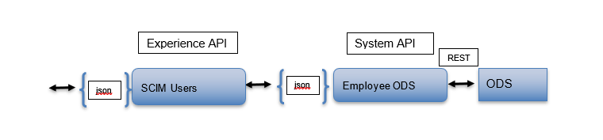

# History Of Changes

| **Version** | **Author** | **Reason for change** | **Date** |
|-------------|------------|-----------------------|----------|
| 1.0         | J Sack     | Initial               | 06/07/2024 |
|             |            | Add the Get by id endpoint | 06/11/2024 |
|             |            | Add the Put by id endpoint | 06/17/2024 |
|             |            | Add the Patch by id endpoint | 06/18/2024 |
|             |            | Add the Post user endpoint | 06/20/2024 |
|             |            | Add the Get users endpoint | 07/14/2024 |
| 1.1         |            | Add the Service Configuration endpoint | 07/16/2024 |
|             |            | Updated SCIM User response definition | 07/16/2024 |
|             |            | Updated SCIM User request definition for Post & Put | 07/17/2024 |
|             |            | Update endpoints to Users<br>change flsaRegionalCode to flsaCode<br>change status to employmentStatusCode | 07/23/2024 |
|             |            | Update incoming requests and responses based on where OKTA expects the middleName element | 08/29/2024 |

# Purpose 

This document provides specifics that describes the API application that
is to be built to support the interactions related to supporting McLane
users managed and the synchronization of that data via OKTA.

# Taxonomy

**OKTA**: An application that distributes updated employee data

**Workday**: McLane’s HCM system of record

**SCIM**: Standard protocol for provisioning and managing users identity
data 

# Solution Overview

People that work for McLane are are managed in the enterprise HCM
system. Many other enterprise systems require some portion of the data
related to those workers. The cloud application from OKTA will assist
McLane in disseminating employee related information in a consistent
manner. OKTA will essentially assist in the synchronizing of this data
for use in peripheral systems.

This API will support iterations with OKTA in support of employee data
synchronization.

## Process Context


## Logical Viewpoint



## Deployment Viewpoint


# Experience API

This experience API will expose endpoints to be used to facilitate the
dissemination of employee details to the McLane application landscape.

## Functional Design

### Resources

#### Employees

Employee data is consumed by many systems in the McLane application
landscape, and having accurate employee data is imperative for the
successful operation of those applications. Currently, employee data is
acquired in many different ways, and this api is to support a standard
way of disseminating employee data to support the accurate and timely
deliver of detailed employee data.

##### Project Names:

OAS Model Project: scim-users-exp-api

Development Project: scim-users-exp-api

OpenShift Project: employee-events-dev, employee-events-test,
employee-events

##### Policies

- Client Id Enforcement

***Experience API Http Listener Connector Configuration**: (externalize
into a property file)*

- CONNECT TIMEOUT (in MS): 30

##### Get Service Configuration

Get service configuration to identify what the API’s will support

###### Resource Locators

- To retrieve configuration details of the API:

GET {BASE_URI}/v1/serviceproviderconfigs

Type of Data Consumed:

application/json

###### Path Parameters: Does Not Apply

| Name | Assignment/Description | Example |
| ---- | ---------------------- | ------- |
|      |                        |         |

###### Query Parameters: Does Not Apply

| Name | Assignment/Description | Example |
| ---- | ---------------------- | ------- |
|      |                        |         |

###### Http Header Parameters: 

| Name             | Assignment/Description                                                                                                  | Example                              |
| ---------------- | ----------------------------------------------------------------------------------------------------------------------- | ------------------------------------ |
| tracing_id       | Optionally sent in on request                                                                                           | ASY7748901                           |
| X-Correlation-Id | If this element is present, assign it to correlationId variable, otherwise create a uuid and assign it to correlationId | 23d10540-e316-11ed-8a7a-0205dd115db9 |

###### Request Payload: Does Not Apply

| Element Name | Required | Notes |
| ------------ | :------: | ----- |
|              |          |       |

Example:

GET https://\<hostName\>/scim-users-exp-api/v1/serviceproviderconfigs

Example request:

Does Not Apply

###### Processing Summary

- Validation

- Generate a value for the correlationId

- Prepare Response

####### Validation

- Validate using the API model to insure the presence of required fields
  and valid values

####### Prepare Response 

The response can be created without any assistance from the system api.

######## Response Payload: 

\*\*See OAS model in the repository for more details

Response Payload description:

| Element Name                                      | Assignment                                                                 | Notes                                                                 |
|---------------------------------------------------|---------------------------------------------------------------------------|-----------------------------------------------------------------------|
| authenticationSchemes                             | Empty array                                                               | Ex. []                                                                |
| bulk                                              |                                                                           | object                                                                |
| supported                                         | false                                                                     | Ex. false                                                             |
| changePassword                                    |                                                                           | object                                                                |
| supported                                         | false                                                                     | Ex. false                                                             |
| documentationUrl                                  | https://support.okta.com/scim-fake-page.html                              | Ex. https://support.okta.com/scim-fake-page.html                      |
| etag                                              |                                                                           | object                                                                |
| supported                                         | false                                                                     | Ex. false                                                             |
| filter                                            |                                                                           | object                                                                |
| maxResults                                        | 100                                                                       | Ex. 100                                                               |
| supported                                         | true                                                                      | Ex. true                                                              |
| patch                                             |                                                                           | object                                                                |
| supported                                         | false                                                                     | Ex. false                                                             |
| schemas                                           | "urn:scim:schemas:core:1.0",<br />"urn:okta:schemas:scim:providerconfig:1.0" | Ex. "urn:scim:schemas:core:1.0",<br />"urn:okta:schemas:scim:providerconfig:1.0" |
| sort                                              |                                                                           | object                                                                |
| supported                                         | false                                                                     | Ex. false                                                             |
| urn:okta:schemas:scim:providerconfig:1.0          |                                                                           | object                                                                |
| userManagementCapabilities                        | "PUSH_NEW_USERS",<br />"PUSH_PROFILE_UPDATES",<br />"PUSH_USER_DEACTIVATION",<br />"REACTIVATE_USERS" | Ex. "PUSH_NEW_USERS",<br />"PUSH_PROFILE_UPDATES",<br />"PUSH_USER_DEACTIVATION",<br />"REACTIVATE_USERS" |

Example:

```json
{  
  "authenticationSchemes": [],  
  "bulk": {  
    "supported": false  
  },  
  "changePassword": {  
    "supported": false  
  },  
  "documentationUrl": "https://support.okta.com/scim-fake-page.html",  
  "etag": {  
    "supported": false  
  },  
  "filter": {  
    "maxResults": 100,  
    "supported": true  
  },  
  "patch": {  
    "supported": false  
  },  
  "schemas": [  
    "urn:scim:schemas:core:1.0",  
    "urn:okta:schemas:scim:providerconfig:1.0"  
  ],  
  "sort": {  
    "supported": false  
  },  
  "urn:okta:schemas:scim:providerconfig:1.0": {  
    "userManagementCapabilities": [  
      "PUSH_NEW_USERS",  
      "PUSH_PROFILE_UPDATES",  
      "PUSH_USER_DEACTIVATION",  
      "REACTIVATE_USERS"  
    ]  
  }  
}
```

HTTP Status Codes

Possible HTTP status codes for the response include:

- 200 OK - for success

- 400 Bad Request – for errors in the request data

- 401 Unauthorized - for errors in API authentication

- 403 Forbidden - for errors in API authorization

- 404 Resource Not found - for errors in API resource not found

- 500 Internal Server Error - for any unexpected resource failures

####### Logging Events:

\- At the start of the application

flowStep: "Flow Start"

-At the End of the application

>  flowStep: "Flow End"

###### Error Processing

Error mapping from our standard error structure to the SCIM error
structure

| Element Name | Assignment                                         | Notes                                       |
| ------------ | -------------------------------------------------- | ------------------------------------------- |
| schemas      | Assign urn:ietf:params:scim:api:messages:2.0:Error | urn:ietf:params:scim:api:messages:2.0:Error |
| detail       | context.message from the common error response     | No user found                               |
| status       | status from the common error response              | 400                                         |

If an issue/error is encountered, the specifics related to the error are
to be reported back on the response via our SCIM error structure along
with the correlation Id and the tracing Id if provided.

###### Non Functional Requirements

####### Security

####### Data

- System client id and secret

- Masking elements: Does Not apply

####### Transport

- https

####### Availability

- *99.99% uptime 24x7*

####### Reliability

- High availability via multiple workers

####### Traceability

- Transaction tracing via log data to Splunk

- Specific Auditing requirements: Does Not Apply

####### Throughput

- Current Peak Metric:

  - <span class="mark">xx</span> Concurrent transactions per second

  - <span class="mark">xx</span> Minutes - specified duration(s)

  - M T W T F S S Note any applicable days in the week

- Seasonal dimension: Does Not Apply

- Estimated Peak metric over the next 9-12 months:

  - <span class="mark">xx</span> Concurrent transactions per second

  - <span class="mark">xx</span> minutes - specified duration(s)

  - M T W T F S S Note any applicable days in the week

####### Response Time

- Target times for average or maximum response times, expressed as a
  percentile: 95% within 2 second(s).

##### Get user data via a user Id

Get user information using an employee Id

###### Resource Locators

- To retrieve details on an user:

GET {BASE_URI}/v1/users/{userId}

Type of Data Consumed:

application/json

###### Path Parameters: 

| Name   | Assignment/Description     | Example   |
| ------ | -------------------------- | --------- |
| userId | Unique employee identifier | 000061149 |

###### Query Parameters: Does Not Apply

| Name | Assignment/Description | Example |
| ---- | ---------------------- | ------- |
|      |                        |         |

###### Http Header Parameters: 

| Name             | Assignment/Description                                                                                                  | Example                              |
| ---------------- | ----------------------------------------------------------------------------------------------------------------------- | ------------------------------------ |
| tracing_id       | Optionally sent in on request                                                                                           | ASY7748901                           |
| X-Correlation-Id | If this element is present, assign it to correlationId variable, otherwise create a uuid and assign it to correlationId | 23d10540-e316-11ed-8a7a-0205dd115db9 |

###### Request Payload: Does Not Apply

| Element Name | Required | Notes |
| ------------ | :------: | ----- |
|              |          |       |

Example:

GET https://\<hostName\>/scim-users-exp-api/v1/users/000061149

Example request:

Does Not Apply

###### Processing Summary

- Validation

- Generate a value for the correlationId

- Call the Employee ODS system API

- Prepare Response

####### Validation

- Validate using the API model to insure the presence of required fields
  and valid values

####### Call System API to Get employee data for an employee identifier

See model project for interaction details: employee-ods-sys-api

######## Path Parameters: 

| Name       | Assignment/Description     | Example   |
| ---------- | -------------------------- | --------- |
| employeeId | Unique employee identifier | 000061149 |

######## Query Parameters: Does Not Apply

| Name | Assignment/Description | Example |
| ---- | ---------------------- | ------- |
|      |                        |         |

######## Http Header Parameters: 

| Name             | Assignment/Description                               | Example                              |
| ---------------- | ---------------------------------------------------- | ------------------------------------ |
| tracing_id       | Optionally sent in on request                        | ASY7748901                           |
| X-Correlation-Id | Assign the correlationId value generated by this api | 979f3d3b-a04a-43d7-b55f-8d5609b48783 |

######## Request Payload: Does Not Apply

| Element Name | Required | Notes |
| ------------ | :------: | ----- |
|              |          |       |

Example:

GET
https://\<server\>:\<port\>/employee-ods-sys-api/v1/employees/000061149

Example request:

Does Not Apply

***Request Connector Configuration**: (externalize into a property
file)*

- *Response Timeout(ms): 30000 (responseTimeOut)*

####### Prepare Response 

System API Response Payload definition: [\#Employee User Detail Response
Structure\|outline](#employee-ods-system-api-user-detail-response-structure)

######## Response Payload: 

\*\*See OAS model in the repository for more details

Response Payload description: [\#SCIM Employee User Detail Mapping
Structure\|outline](#scim-user-response-detail-mapping-structure)

| Element Name | Assignment | Notes |
| ------------ | ---------- | ----- |
|              |            |       |

HTTP Status Codes

Possible HTTP status codes for the response include:

- 200 OK - for success

- 400 Bad Request – for errors in the request data

- 401 Unauthorized - for errors in API authentication

- 403 Forbidden - for errors in API authorization

- 404 Resource Not found - for errors in API resource not found

- 500 Internal Server Error - for any unexpected resource failures

- 

####### Logging Events:

\- At the start of the application

flowStep: "Flow Start"

\- Right before the Get Employee call:

flowStep: "Get Employee Request"

\- Right after the return of the Get Employee call:

flowStep: "Get Employee Response"

-At the End of the application

>  flowStep: "Flow End"

###### Error Processing

Error mapping from our standard error structure to the SCIM error
structure

| Element Name | Assignment                                         | Notes                                       |
| ------------ | -------------------------------------------------- | ------------------------------------------- |
| schemas      | Assign urn:ietf:params:scim:api:messages:2.0:Error | urn:ietf:params:scim:api:messages:2.0:Error |
| detail       | context.message from the common error response     | No user found                               |
| status       | status from the common error response              | 400                                         |

If an issue/error is encountered, the specifics related to the error are
to be reported back on the response via our SCIM error structure along
with the correlation Id and the tracing Id if provided.

###### Non Functional Requirements

####### Security

####### Data

- System client id and secret

- Masking elements: Does Not apply

####### Transport

- https

####### Availability

- *99.99% uptime 24x7*

####### Reliability

- High availability via multiple workers

####### Traceability

- Transaction tracing via log data to Splunk

- Specific Auditing requirements: Does Not Apply

####### Throughput

- Current Peak Metric:

  - <span class="mark">xx</span> Concurrent transactions per second

  - <span class="mark">xx</span> Minutes - specified duration(s)

  - M T W T F S S Note any applicable days in the week

- Seasonal dimension: Does Not Apply

- Estimated Peak metric over the next 9-12 months:

  - <span class="mark">xx</span> Concurrent transactions per second

  - <span class="mark">xx</span> minutes - specified duration(s)

  - M T W T F S S Note any applicable days in the week

####### Response Time

- Target times for average or maximum response times, expressed as a
  percentile: 95% within 2 second(s).

##### Update employee data via an employee Id

Update employee information using an employee Id

###### Resource Locators

- To update details on an employee:

PUT {BASE_URI}/v1/Users/{userId}

Type of Data Consumed:

application/json

###### Path Parameters: 

| Name   | Assignment/Description     | Example   |
| ------ | -------------------------- | --------- |
| userId | Unique employee identifier | 000061149 |

###### Query Parameters: Does Not Apply

| Name | Assignment/Description | Example |
| ---- | ---------------------- | ------- |
|      |                        |         |

###### Http Header Parameters: 

| Name             | Assignment/Description                                                                                                  | Example                              |
| ---------------- | ----------------------------------------------------------------------------------------------------------------------- | ------------------------------------ |
| tracing_id       | Optionally sent in on request                                                                                           | ASY7748901                           |
| X-Correlation-Id | If this element is present, assign it to correlationId variable, otherwise create a uuid and assign it to correlationId | 23d10540-e316-11ed-8a7a-0205dd115db9 |

###### Request Payload: See the model repo for details

| Element Name | Required | Notes |
| ------------ | :------: | ----- |
| schemas | Y | urn:ietf:params:scim:schemas:core:2.0:User, urn:ietf:params:scim:schemas:extension:CustomExtensionName:2.0:User |
| userName | Y | string Ex. 000061149 |
| active | Y | boolean Ex. true |
| name | Y | object |
| givenName | Y | string Ex. Mary |
| ~~middleName~~ | ~~N~~ | ~~string~~ Ex. ~~Sue~~ |
| familyName | Y | string Ex. Eliassen |
| password | N | string Ex. xq69ivVT |
| urn:okta:mclaneco-dev_scimusersexp_2:1.0:user:custom |  | Object |
| userId | N | string Ex. psmith |
| middleName | N | string Ex. Sue |
| title | N | string Ex. Administrator, Lead Middleware |
| streetAddress | N | string Ex. 4747 McLane Parkway |
| city | N | string Ex. Temple |
| state | N | string Ex. TX |
| zipCode | N | string Ex. 76504 |
| department | N | string Ex. Platform Administration |
| departmentId | N | string Ex. 20000 |
| managerId | N | string Ex. 000061149 |
| birthDate | N | date Ex. 14-Sep-1959 |
| ssnLastFour | N | string Ex.1149 |
| jobCode | N | string Ex. 1067 |
| divisionCode | N | string Ex. GR260 |
| division | N | string Ex. McLane Business Info Services |
| companyCode | N | string Ex. 001 |
| companyName | N | string Ex. McLane Company, Inc. |
| payGrade | N | string Ex. L |
| employmentStatusCode | N | string Ex. A |
| compensationTypeCode | N | string Ex. S |
| businessUnit | N | string Ex. IS790 |
| terminationDate | N | date Ex. 31-Sep-2024 |
| extendedLeaveEffectiveDate | N | date Ex. 14-Sep-2024 |
| flsaCode | N | string Ex. V |
| locationId | N | string Ex. L |
| startDate | N | date Ex. 14-Sep-2000 |
| jobFamilyCode | N | string Ex. L |
| jobFamilyName | N | string Ex. T Platform |
| positionCode | N | string Ex. P001537 |

Example:

PUT https://\<hostName\>/scim-users-exp-api/v1/Users/000061149

Example Request:

```json
{
  "schemas": [
    "urn:scim:schemas:core:1.0",
    "urn:scim:schemas:extension:enterprise:1.0",
    "urn:okta:mclaneco-dev_scimusersexp_2:1.0:user:custom"
  ],
  "userName": "oTEST0004578",
  "name": {
    "givenName": "TestFirst4578",
    "familyName": "TestLast4578"
  },
  "password": "xq69ivVT",
  "active": true,
  "urn:okta:mclaneco-dev_scimusersexp_2:1.0:user:custom": {
    "userId": "psmith",
    "middleName": "Test",
    "title": "Administrator, Lead Middleware",
    "streetAddress": "4747 McLane Parkway",
    "city": "Temple",
    "state": "TX",
    "zipCode": "7504",
    "department": "Platform Administration",
    "departmentId": "50200",
    "managerId": "000058215",
    "birthDate": "14-Sep-1959",
    "ssnLastFour": "1234",
    "jobCode": "1067",
    "divisionCode": "IS790",
    "division": "McLane Business Info Services",
    "companyCode": "001",
    "companyName": "McLane Company, Inc.",
    "payGrade": "L",
    "employmentStatusCode": "A",
    "compensationTypeCode": "S",
    "businessUnit": "IS790",
    "terminationDate": "01-Sep-2024",
    "extendedLeaveEffectiveDate": "30-Sep-2024",
    "flsaCode": "N",
    "locationId": "999",
    "startDate": "01-Sep-2022",
    "jobFamilyCode": "D",
    "jobFamilyName": "IT Platform",
    "positionCode": "P001537"
  }
}
```

###### Processing Summary

- Validation

- Interact with Employee ODS system api

- Prepare Response

###### Processing

####### Validation

- Validate using the API model to insure the presence of required fields
  and valid values

####### Call the Employees ODS system API

See model project for interaction details: employee-ods-sys-api

######## Path Parameters: 

| Name       | Assignment/Description     | Example   |
| ---------- | -------------------------- | --------- |
| employeeId | Unique employee identifier | 000061149 |

######## Query Parameters: Does Not Apply

| Name | Assignment/Description | Example |
| ---- | ---------------------- | ------- |
|      |                        |         |

######## Http Header Parameters: 

| Name             | Assignment/Description                               | Example                              |
| ---------------- | ---------------------------------------------------- | ------------------------------------ |
| tracing_id       | Optionally sent in on request                        | ASY7748901                           |
| X-Correlation-Id | Assign the correlationId value generated by this api | 979f3d3b-a04a-43d7-b55f-8d5609b48783 |

######## Request Payload: see OAS model repo employee-ods-sys-api

| Element Name | Required | Notes |
| ------------ | :------: | ----- |
|              |          |       |

Example:

PUT
https://\<server\>:\<port\>/employee-ods-sys-api/v1/employees/000061149

Example request:

```json
{
  "employee": {
    "employeeId": "000136214",
    "userId": "zernest",
    "isActive": true,
    "employmentStatusCode": "A",
    "birthDate": "15-Oct-1963",
    "ssnLastFour": "1123",
    "distributionCenterDivisionId": "GR260",
    "division": "GR260 GR Concord",
    "costCenter": "20020",
    "managerId": "000028632",
    "locationId": "999",
    "companyCode": "001",
    "companyName": "McLane Company, Inc.",
    "department": "Platform Administration",
    "departmentId": "50200",
    "terminationDate": null,
    "payGrade": "L",
    "flsaCode": "N",
    "compensationTypeCode": "S",
    "businessUnit": "GR260",
    "startDate": "11-Aug-2022",
    "extendedTimeOff": {
      "startDate": ""
    },
    "name": {
      "first": "Zachary",
      "middle": "Ernest",
      "last": "Hines"
    },
    "job": {
      "code": "1067",
      "title": "Stocker",
      "familyCode": "D3",
      "family": "IT Platform3",
      "positionId": "P001533"
    },
    "workAddress": {
      "address1": "4747 McLane Parkway",
      "city": "Temple",
      "state": "TX",
      "postalCode": "76504"
    }
  }
}
```

***Request Connector Configuration**: (externalize into a property
file)*

- *Response Timeout(ms): 50000 (responseTimeOut)*

####### Prepare Response 

The Response requires the endpoint to return an image of the employee
after the update was made

###### Response Payload: [\#Employee Detail Response Structure\|outline](#employee-ods-system-api-user-detail-response-structure)

###### Logging Events:

\- At the start of the application

flowStep: "Flow Start"

\- Right before the Updating an Employee call

flowStep: " Update an Employee Request"

\- Right after the return of Updating an Employee call:

flowStep: " Update an Employee Response"

-At the End of the application

flowStep: "Flow End"

###### Error Processing

Error mapping from our standard error structure to the SCIM error
structure

| Element Name | Assignment                                         | Notes                                       |
| ------------ | -------------------------------------------------- | ------------------------------------------- |
| schemas      | Assign urn:ietf:params:scim:api:messages:2.0:Error | urn:ietf:params:scim:api:messages:2.0:Error |
| detail       | context.message from the common error response     | No user found                               |
| status       | status from the common error response              | 400                                         |

If the results set is empty (employee not found) then create an error
response and sent back to the caller.

-Set the following status elements in the response

status = 404

schemas = "urn:ietf:params:scim:api:messages:2.0:Error"

> detail = User not found for employee Id = {userId}
>
> Note: userId from the path parameter

Example:

```json
{
  "schemas": [
    "urn:ietf:params:scim:api:messages:2.0:Error"
  ],
  "detail": "User not found for employee Id = 000022340",
  "status": 404
}
```

If an issue/error are encountered, the specifics related to the error
are to be reported back on the response via our SCIM error structure
along with the correlation Id and the tracing Id if provided. See
[\#SCIM Error Structure\|outline](#scim-error-structure)

Example:

```json
{
  "correlationId": "979f3d3b-a04a-43d7-b55f-8d5609b48783",
  "tracingId": "abc55247",
  "schemas": ["urn:ietf:params:scim:api:messages:2.0:Error"],
  "detail": "User not found for employee Id = 000022340",
  "status": 404
}
```

###### HTTP Status Codes

Possible HTTP status codes for the response include:

- 200 OK - for success

- 400 Bad Request – for errors in the request data

- 401 Unauthorized - for errors in API authentication

- 403 Forbidden - for errors in API authorization

- 404 Resource Not found - for errors in API resource not found

- 500 Internal Server Error - for any unexpected resource failures

###### Non Functional Requirements

####### Security

####### Data

- System client id and secret

- Masking elements: Does Not apply

####### Transport

- http

####### Availability

- *99.99% uptime 24x7*

####### Reliability

- High availability via multiple workers

####### Traceability

- Transaction tracing via log data to Splunk

- Specific Auditing requirements: Does Not Apply

####### Throughput

- Current Peak Metric:

  - <span class="mark">xx</span> Concurrent transactions per second

  - <span class="mark">xx</span> Minutes - specified duration(s)

  - M T W T F S S Note any applicable days in the week

- Seasonal dimension: Does Not Apply

- Estimated Peak metric over the next 9-12 months:

  - <span class="mark">xx</span> Concurrent transactions per second

  - <span class="mark">xx</span> minutes - specified duration(s)

  - M T W T F S S Note any applicable days in the week

####### Response Time

- Target times for average or maximum response times, expressed as a
  percentile: 95% within 3 second(s).

##### Patch employee data via an employee Id

Update employee status

###### Resource Locators

- To update the status of an employee:

PATCH {BASE_URI}/v1/users/{userId}

Type of Data Consumed:

application/json

###### Path Parameters: 

| Name   | Assignment/Description     | Example   |
| ------ | -------------------------- | --------- |
| userId | Unique employee identifier | 000061149 |

###### Query Parameters: Does Not Apply

| Name | Assignment/Description | Example |
| ---- | ---------------------- | ------- |
|      |                        |         |

###### Http Header Parameters: 

| Name             | Assignment/Description                                                                                                  | Example                              |
| ---------------- | ----------------------------------------------------------------------------------------------------------------------- | ------------------------------------ |
| tracing_id       | Optionally sent in on request                                                                                           | ASY7748901                           |
| X-Correlation-Id | If this element is present, assign it to correlationId variable, otherwise create a uuid and assign it to correlationId | 23d10540-e316-11ed-8a7a-0205dd115db9 |

###### Request Payload: See the model repo for details

| Element Name | Required | Notes |
| ------------ | :------: | ----- |
| schemas      |    Y     | string Ex. urn:ietf:params:scim:api:messages:2.0:PatchOp |
| Operations   |    Y     |       |
| op           |    Y     | string Ex. replace |
| value        |    Y     | string Ex. |
| active       |    Y     | boolean Ex. false |

Example:

PATCH https://\<hostName\>/scim-users-exp-api/v1/users/000061149

Example Request:

```json
{
  "schemas": ["urn:ietf:params:scim:api:messages:2.0:PatchOp"],
  "Operations": [
    {
      "op": "replace",
      "value": {
        "active": false
      }
    }
  ]
}
```

###### Processing Summary

- Validation

- Interact with Employee ODS system api

- Prepare Response

###### Processing

####### Validation

- Validate using the API model to insure the presence of required fields
  and valid values

####### Call the Employees ODS system API

See model project for interaction details: employee-ods-sys-api

######## Path Parameters: 

| Name       | Assignment/Description     | Example   |
| ---------- | -------------------------- | --------- |
| employeeId | Unique employee identifier | 000061149 |

######## Query Parameters: Does Not Apply

| Name | Assignment/Description | Example |
| ---- | ---------------------- | ------- |
|      |                        |         |

######## Http Header Parameters: 

| Name             | Assignment/Description                               | Example                              |
| ---------------- | ---------------------------------------------------- | ------------------------------------ |
| tracing_id       | Optionally sent in on request                        | ASY7748901                           |
| X-Correlation-Id | Assign the correlationId value generated by this api | 979f3d3b-a04a-43d7-b55f-8d5609b48783 |

######## Request Payload: see OAS model repo employee-ods-sys-api

| Element Name | Required | Notes |
| ------------ | :------: | ----- |
| employee     |    Y     |       |
| status       |    Y     | string Ex. Terminated<br>If active=false then Terminated else Active |

Example:

PATCH
https://\<server\>:\<port\>/employee-ods-sys-api/v1/employees/000061149

Example request:

```json
{  
  "employee": {  
    "status": "Terminated"  
  }  
}
```

***Request Connector Configuration**: (externalize into a property
file)*

- *Response Timeout(ms): 30000 (responseTimeOut)*

####### Prepare Response 

The Response requires the endpoint to return an image of the employee
after the update was made

###### Response Payload: [\#Employee Detail Response Structure\|outline](#employee-ods-system-api-user-detail-response-structure)

###### Logging Events:

\- At the start of the application

flowStep: "Flow Start"

\- Right before the Patching an Employee call

flowStep: " Patching an Employee Request"

\- Right after the return of Patching an Employee call:

flowStep: " Patching an Employee Response"

-At the End of the application

flowStep: "Flow End"

###### Error Processing

Error mapping from our standard error structure to the SCIM error
structure

| Element Name | Assignment                                         | Notes                                       |
| ------------ | -------------------------------------------------- | ------------------------------------------- |
| schemas      | Assign urn:ietf:params:scim:api:messages:2.0:Error | urn:ietf:params:scim:api:messages:2.0:Error |
| detail       | context.message from the common error response     | No user found                               |
| status       | status from the common error response              | 400                                         |

If the results set is empty (employee not found) then create an error
response and sent back to the caller.

-Set the following status elements in the response

status = 404

schemas = "urn:ietf:params:scim:api:messages:2.0:Error"

> detail = User not found for employee Id = {userId}
>
> Note: userId assign from the userId path parameter

Example:

```json
{
  "schemas": [
    "urn:ietf:params:scim:api:messages:2.0:Error"
  ],
  "detail": "User not found for employee Id = 000022340",
  "status": 404
}
```

If an issue/error are encountered, the specifics related to the error
are to be reported back on the response via the SCIM error structure
along with the correlation Id and the tracing Id if provided. See
[\#SCIM Error Structure\|outline](#scim-error-structure)

Example:

```json
{
  "correlationId": "979f3d3b-a04a-43d7-b55f-8d5609b48783",
  "tracingId": "abc55247",
  "schemas": ["urn:ietf:params:scim:api:messages:2.0:Error"],
  "detail": "User not found for employee Id = 000022340",
  "status": 404
}
```

###### HTTP Status Codes

Possible HTTP status codes for the response include:

- 200 OK - for success

- 400 Bad Request – for errors in the request data

- 401 Unauthorized - for errors in API authentication

- 403 Forbidden - for errors in API authorization

- 404 Resource Not found - for errors in API resource not found

- 500 Internal Server Error - for any unexpected resource failures

###### Non Functional Requirements

####### Security

####### Data

- System client id and secret

- Masking elements: Does Not apply

####### Transport

- http

####### Availability

- *99.99% uptime 24x7*

####### Reliability

- High availability via multiple workers

####### Traceability

- Transaction tracing via log data to Splunk

- Specific Auditing requirements: Does Not Apply

####### Throughput

- Current Peak Metric:

  - <span class="mark">xx</span> Concurrent transactions per second

  - <span class="mark">xx</span> Minutes - specified duration(s)

  - M T W T F S S Note any applicable days in the week

- Seasonal dimension: Does Not Apply

- Estimated Peak metric over the next 9-12 months:

  - <span class="mark">xx</span> Concurrent transactions per second

  - <span class="mark">xx</span> minutes - specified duration(s)

  - M T W T F S S Note any applicable days in the week

####### Response Time

- Target times for average or maximum response times, expressed as a
  percentile: 95% within 3 second(s).

##### Add an employee

Add an employee

###### Resource Locators

- To add details for a new user:

POST {BASE_URI}/v1/Users

Type of Data Consumed:

application/json

###### Path Parameters: Does Not Apply

| Name | Assignment/Description | Example |
| ---- | ---------------------- | ------- |
|      |                        |         |

###### Query Parameters: Does Not Apply

| Name | Assignment/Description | Example |
| ---- | ---------------------- | ------- |
|      |                        |         |

###### Http Header Parameters: 

| Name             | Assignment/Description                                                                                                  | Example                              |
| ---------------- | ----------------------------------------------------------------------------------------------------------------------- | ------------------------------------ |
| tracing_id       | Optionally sent in on request                                                                                           | ASY7748901                           |
| X-Correlation-Id | If this element is present, assign it to correlationId variable, otherwise create a uuid and assign it to correlationId | 23d10540-e316-11ed-8a7a-0205dd115db9 |

###### Request Payload: See the model repo for details

| Element Name | Required | Notes |
| ------------ | :------: | ----- |
| schemas | Y | urn:ietf:params:scim:schemas:core:2.0:User, urn:ietf:params:scim:schemas:extension:CustomExtensionName:2.0:User |
| userName | Y | string Ex. 000061149 |
| active | Y | boolean Ex. true |
| name | Y | object |
| givenName | Y | string Ex. Mary |
| familyName | Y | string Ex. Eliassen |
| password | N | string Ex. xq69ivVT |
| urn:okta:mclaneco-dev_scimusersexp_2:1.0:user:custom |  | Object |
| userId | N | string Ex. psmith |
| middleName | N | string Ex. Sue |
| title | N | string Ex. Administrator, Lead Middleware |
| streetAddress | N | string Ex. 4747 McLane Parkway |
| city | N | string Ex. Temple |
| state | N | string Ex. TX |
| zipCode | N | string Ex. 76504 |
| department | N | string Ex. Platform Administration |
| departmentId | N | string Ex. 20000 |
| managerId | N | string Ex. 000061149 |
| birthDate | N | date Ex. 14-Sep-1959 |
| ssnLastFour | N | string Ex. 1149 |
| jobCode | N | string Ex. 1067 |
| divisionCode | N | string Ex. GR260 |
| division | N | string Ex. McLane Business Info Services |
| companyCode | N | string Ex. 001 |
| companyName | N | string Ex. McLane Company, Inc. |
| payGrade | N | string Ex. L |
| employmentStatusCode | N | string Ex. A |
| compensationTypeCode | N | string Ex. S |
| businessUnit | N | string Ex. IS790 |
| terminationDate | N | date Ex. 31-Sep-2024 |
| extendedLeaveEffectiveDate | N | date Ex. 14-Sep-2024 |
| flsaCode | N | string Ex. V |
| locationId | N | string Ex. L |
| startDate | N | date Ex. 14-Sep-2000 |
| jobFamilyCode | N | string Ex. L |
| jobFamilyName | N | string Ex. T Platform |
| positionCode | N | string Ex. P001537 |

Example:

POST https://\<hostName\>/scim-users-exp-api/v1/Users

Example Request:

```json
{
  "schemas": [
    "urn:scim:schemas:core:1.0",
    "urn:scim:schemas:extension:enterprise:1.0",
    "urn:okta:mclaneco-dev_scimusersexp_2:1.0:user:custom"
  ],
  "userName": "oTEST0004578",
  "name": {
    "givenName": "Peter",
    "familyName": "Smith"
  },
  "password": "xq69ivVT",
  "active": true,
  "urn:okta:mclaneco-dev_scimusersexp_2:1.0:user:custom": {
    "userId": "psmith",
    "middleName": "M",
    "title": "Administrator, Lead Middleware",
    "streetAddress": "4747 McLane Parkway",
    "city": "Temple",
    "state": "TX",
    "zipCode": "7504",
    "department": "Platform Administration",
    "departmentId": "50200",
    "managerId": "000058215",
    "birthDate": "14-Sep-1959",
    "ssnLastFour": "1234",
    "jobCode": "1067",
    "divisionCode": "IS790",
    "division": "McLane Business Info Services",
    "companyCode": "001",
    "companyName": "McLane Company, Inc.",
    "payGrade": "L",
    "employmentStatusCode": "A",
    "compensationTypeCode": "S",
    "businessUnit": "IS790",
    "terminationDate": "01-Sep-2024",
    "extendedLeaveEffectiveDate": "30-Sep-2024",
    "flsaCode": "N",
    "locationId": "999",
    "startDate": "01-Sep-2022",
    "jobFamilyCode": "D",
    "jobFamilyName": "IT Platform",
    "positionCode": "P001537"
  }
}
```

###### Processing Summary

- Validation

- Interact with Employee ODS system api

- Prepare Response

###### Processing

####### Validation

- Validate using the API model to insure the presence of required fields
  and valid values

####### Call the Employees ODS system API

See model project for interaction details: employee-ods-sys-api

######## Path Parameters: Does Not Apply

| Name | Assignment/Description | Example |
| ---- | ---------------------- | ------- |
|      |                        |         |

######## Query Parameters: Does Not Apply

| Name | Assignment/Description | Example |
| ---- | ---------------------- | ------- |
|      |                        |         |

######## Http Header Parameters: 

| Name             | Assignment/Description                               | Example                              |
| ---------------- | ---------------------------------------------------- | ------------------------------------ |
| tracing_id       | Optionally sent in on request                        | ASY7748901                           |
| X-Correlation-Id | Assign the correlationId value generated by this api | 979f3d3b-a04a-43d7-b55f-8d5609b48783 |

######## Request Payload: see OAS model repo employee-ods-sys-api

| Element Name                 | Assignment/Description                                                                        | Notes                             |
| ---------------------------- | --------------------------------------------------------------------------------------------- | --------------------------------- |
| employee                     | Object that holds the employee data                                                           |                                   |
| employeeId                   | userName from the scim request                                                                | Ex. 000014527                     |
| userId                       | userId from the scim request                                                                  | Ex. psmith                        |
| isActive                     | active from the scim request                                                                  | Ex. true                          |
| employmentStatusCode         | If employmentStatusCode from the scim request is T then set to Terminated, else set to Active | Ex. A                             |
| birthDate                    | birthDate from the scim request                                                               | Ex. 01-Sep-1990                   |
| ssnLastFour                  | ssnLastFour from the scim request                                                             | Ex. 2212                          |
| distributionCenterDivisionId | divisionCode from the scim request                                                            | Ex. GR360                         |
| division                     | division from the scim request                                                                | Ex. McLane Business Info Services |
| department                   | department from the scim request                                                              | Ex. Platform Administration       |
| costCenter                   | departmentId from the scim request                                                            | Ex. 50200                         |
| managerId                    | managerId from the scim request                                                               | Ex. 000025527                     |
| locationId                   | locationId from the scim request                                                              | Ex. 999                           |
| companyCode                  | companyCode from the scim request                                                             | Ex. 101                           |
| companyName                  | businessUnit from the scim request                                                            | Ex. McLane Company, Inc.          |
| businessUnit                 | companyName from the scim request                                                             | Ex. IS970                         |
| terminationDate              | terminationDate from the scim request                                                         | Ex. 01-Sep-2024                   |
| payGrade                     | payGrade from the scim request                                                                | Ex. L                             |
| flsaCode                     | flsaCode from the scim request                                                                | Ex. N                             |
| compensationTypeCode         | compensationTypeCode from the scim request                                                    | Ex. S                             |
| extendedTimeOff              |                                                                                               |                                   |
| startDate                    | extendedLeaveEffectiveDate from the scim request                                              | Ex. 01-Sep-2020                   |
| name                         |                                                                                               |                                   |
| first                        | firstName from the scim request                                                               | Ex. Alex                          |
| middle                       | middleName from the scim request                                                              | Ex. Peter                         |
| last                         | lastName from the scim request                                                                | Ex. Murry                         |
| job                          |                                                                                               |                                   |
| code                         | yyyy from the scim request                                                                    | Ex. 1067                          |
| title                        | yyyy from the scim request                                                                    | Ex. Stoker                        |
| familyCode                   | jobFamilyCode from the scim request                                                           | Ex. D                             |
| family                       | jobFamilyName from the scim request                                                           | Ex. IT Platform                   |
| positionId                   | positionCode from the scim request                                                            | Ex. P001533                       |
| payGrade                     | payGrade from the scim request                                                                | Ex. L                             |
| startDate                    | startDate from the scim request                                                               | Ex. 30-Sep-2021                   |
| workAddress                  |                                                                                               |                                   |
| address1                     | streetAddress from the scim request                                                           | Ex. 123 Main Street               |
| city                         | city from the scim request                                                                    | Ex. ROME                          |
| state                        | state from the scim request                                                                   | Ex. TX                            |
| postalCode                   | zipCode from the scim request                                                                 | Ex. 14006                         |
|                              |                                                                                               |                                   |

Example:

POST https://\<server\>:\<port\>/employee-ods-sys-api/v1/employees

Example request:

```json
{
  "employee": {
    "employeeId": "000136214",
    "userId": "zernest",
    "isActive": true,
    "employmentStatusCode": "A",
    "birthDate": "30-Sep-2000",
    "ssnLastFour": "1123",
    "distributionCenterDivisionId": "GR260",
    "division": "GR260 GR Concord",
    "costCenter": "20020",
    "managerId": "000028632",
    "locationId": "999",
    "companyCode": "001",
    "companyName": "McLane Company, Inc.",
    "department": "Platform Administration",
    "departmentId": "50200",
    "terminationDate": null,
    "payGrade": "L",
    "flsaCode": "N",
    "compensationTypeCode": "S",
    "startDate": "11-Aug-2022",
    "extendedTimeOff": {
      "startDate": ""
    },
    "name": {
      "first": "Zachary",
      "middle": "Ernest",
      "last": "Hines"
    },
    "job": {
      "code": "1067",
      "title": "Stocker",
      "familyCode": "D",
      "family": "IT Platform",
      "positionId": "P001537"
    },
    "workAddress": {
      "address1": "4747 McLane Parkway",
      "city": "Temple",
      "state": "TX",
      "postalCode": "76504"
    }
  }
}
```

***Request Connector Configuration**: (externalize into a property
file)*

- *Response Timeout(ms): 50000 (responseTimeOut)*

####### Prepare Response 

The Response requires the endpoint to return an image of the employee
after the update was made

###### Response Payload: [\#Employee Detail Response Structure\|outline](#employee-ods-system-api-user-detail-response-structure)

###### Logging Events:

\- At the start of the application

flowStep: "Flow Start"

\- Right before the Create an Employee call

flowStep: " Create an Employee Request"

\- Right after the return of Create an Employee call:

flowStep: " Create an Employee Response"

-At the End of the application

flowStep: "Flow End"

###### Error Processing

Error mapping from our standard error structure to the SCIM error
structure

| Element Name | Assignment                                         | Notes                                       |
| ------------ | -------------------------------------------------- | ------------------------------------------- |
| schemas      | Assign urn:ietf:params:scim:api:messages:2.0:Error | urn:ietf:params:scim:api:messages:2.0:Error |
| detail       | context.message from the common error response     | No user found                               |
| status       | status from the common error response              | 400                                         |

If an issue/error are encountered, the specifics related to the error
are to be reported back on the response via our SCIM error structure
along with the correlation Id and the tracing Id if provided. See
[\#SCIM Error Structure\|outline](#scim-error-structure)

Example:

```json
{
  "correlationId": "979f3d3b-a04a-43d7-b55f-8d5609b48783",
  "tracingId": "abc55247",
  "schemas": ["urn:ietf:params:scim:api:messages:2.0:Error"],
  "detail": "Bad Request",
  "status": 400
}
```

###### HTTP Status Codes

Possible HTTP status codes for the response include:

- 200 OK - for success

- 400 Bad Request – for errors in the request data

- 401 Unauthorized - for errors in API authentication

- 403 Forbidden - for errors in API authorization

- 404 Resource Not found - for errors in API resource not found

- 500 Internal Server Error - for any unexpected resource failures

###### Non Functional Requirements

####### Security

####### Data

- System client id and secret

- Masking elements: Does Not apply

####### Transport

- http

####### Availability

- *99.99% uptime 24x7*

####### Reliability

- High availability via multiple workers

####### Traceability

- Transaction tracing via log data to Splunk

- Specific Auditing requirements: Does Not Apply

####### Throughput

- Current Peak Metric:

  - <span class="mark">xx</span> Concurrent transactions per second

  - <span class="mark">xx</span> Minutes - specified duration(s)

  - M T W T F S S Note any applicable days in the week

- Seasonal dimension: Does Not Apply

- Estimated Peak metric over the next 9-12 months:

  - <span class="mark">xx</span> Concurrent transactions per second

  - <span class="mark">xx</span> minutes - specified duration(s)

  - M T W T F S S Note any applicable days in the week

####### Response Time

- Target times for average or maximum response times, expressed as a
  percentile: 95% within 3 second(s).

##### Get users

Get users via filter or by paged request

###### Resource Locators

- To retrieve users:

GET {BASE_URI}/v1/Users

Type of Data Consumed:

application/json

###### Path Parameters: Does Not Apply

| Name | Assignment/Description | Example |
| ---- | ---------------------- | ------- |
|      |                        |         |

###### Query Parameters: 

| Name       | Assignment/Description                                                                        | Example              |
| ---------- | --------------------------------------------------------------------------------------------- | -------------------- |
| startIndex | Start position, Optional, default is 0                                                        | 0                    |
| count      | Number of items to return in the collection , Value between 1 and 100, optional default is 50 | 75                   |
| filter     | Search phrase, Optional                                                                       | userName = 000014527 |

###### Http Header Parameters: 

| Name             | Assignment/Description                                                                                                  | Example                              |
| ---------------- | ----------------------------------------------------------------------------------------------------------------------- | ------------------------------------ |
| tracing_id       | Optionally sent in on request                                                                                           | ASY7748901                           |
| X-Correlation-Id | If this element is present, assign it to correlationId variable, otherwise create a uuid and assign it to correlationId | 23d10540-e316-11ed-8a7a-0205dd115db9 |

###### Request Payload: Does Not Apply

| Element Name | Required | Notes |
| ------------ | :------: | ----- |
|              |          |       |

Example:

GET
https://\<hostName\>/scim-users-exp-api/v1/Users?userName=000014527&startIndex=1&count=100

Example request:

Does Not Apply

###### Processing Summary

- Validation

- Generate a value for the correlationId

- Call the Employee ODS system API

- Prepare Response

####### Validation

- Validate using the API model to insure the presence of required fields
  and valid values

####### Call System API to Get employee data for an employee identifier

See model project for interaction details: employee-ods-sys-api

######## Path Parameters: Does Not Apply

| Name | Assignment/Description | Example |
| ---- | ---------------------- | ------- |
|      |                        |         |

######## Query Parameters: 

| Name   | Assignment/Description                      | Example               |
|--------|---------------------------------------------|-----------------------|
| offset | startIndex query parameter from the request | 0                     |
| limit  | count query parameter from the request      | 75                    |
| filter | filter query parameter from the request <br> map userName to employeeId    | employeeId=000014527  |

######## Http Header Parameters: 

| Name             | Assignment/Description                               | Example                              |
| ---------------- | ---------------------------------------------------- | ------------------------------------ |
| tracing_id       | Optionally sent in on request                        | ASY7748901                           |
| X-Correlation-Id | Assign the correlationId value generated by this api | 979f3d3b-a04a-43d7-b55f-8d5609b48783 |

######## Request Payload: Does Not Apply

| Element Name | Required | Notes |
| ------------ | :------: | ----- |
|              |          |       |

Example:

GET
https://\<server\>:\<port\>/employee-ods-sys-api/v1/employees?employeeId
eq 00014527&offset=1&limit=100

Example request:

Does Not Apply

***Request Connector Configuration**: (externalize into a property
file)*

- *Response Timeout(ms): 30000 (responseTimeOut)*

####### Prepare Response 

System API Response Payload definition: [\#Employee User Detail Response
Structure\|outline](#employee-ods-system-api-user-detail-response-structure)

The System API response will be a collection of employees with each item
defined as: [\#Employee User Detail Response
Structure\|outline](#employee-ods-system-api-user-detail-response-structure)

This experience API response will be a collection of resources with each
item defined as [\#SCIM Employee User Detail Mapping
Structure\|outline](#scim-user-response-detail-mapping-structure)

######## Response Payload: 

\*\*See OAS model in the repository for more details

Response Payload description: [\#SCIM Employee User Detail Mapping
Structure\|outline](#scim-user-response-detail-mapping-structure)

| Element Name | Assignment | Notes |
| ------------ | ---------- | ----- |
| correlationId | correlationId | string<br>Ex. ae8c5b85-97e0-4f55-80e7-6161d67220ae |
| tracingId | Optional tracing_Id from the system API request header | string<br>Ex. A19283745 |
| schemas | urn:ietf:params:scim:api:messages:2.0:ListResponse | string array<br>Ex. urn:ietf:params:scim:api:messages:2.0:ListResponse |
| totalResults | Total number of items in the resources collection | number<br>Ex. 50 |
| startIndex | startIndex query parameter | number<br>Ex. 1 |
| itemsPerPage | Total number of items in the resources collection | number<br>Ex. 50 |
| Resources | Collection of SCIM employees without the meta information<br>[#SCIM Employee User Detail Mapping Structure\|outline](#scim-user-response-detail-mapping-structure) | |

Example:

```json
{
  "correlationId": "87f646bd-5cfd-41de-8263-02e636a91383",
  "tracingId": "js-20240703-001",
  "totalResults": 2,
  "startIndex": 1,
  "itemsPerPage": 2,
  "schemas": [
    "urn:ietf:params:scim:api:messages:2.0:ListResponse"
  ],
  "Resources": [
    {
      "id": "000012333",
      "userName": "000012333",
      "active": true,
      "name": {
        "familyName": "Julips",
        "givenName": "Skip"
      },
      "title": "Stocker",
      "middleName": "Terry",
      "streetAddress": "133 Center Street",
      "city": "Angola",
      "state": "NY",
      "zipCode": "14006",
      "employeeNumber": "000012333",
      "department": "Platform Administration",
      "managerId": "000028633",
      "birthDate": "1999-06-23",
      "ssnLastFour": "1234",
      "departmentId": "20020",
      "jobCode": "1067",
      "divisionCode": "GR260",
      "division": "GR260 GR Concords",
      "companyCode": "001",
      "companyName": "McLane Company, Inc.",
      "payGrade": "L",
      "employmentStatusCode": "A",
      "compensationType": "S",
      "businessUnit": "GR260",
      "terminationDate": "",
      "extendedLeaveEffectiveDate": "2024-07-01",
      "flsaCode": "N",
      "locationId": "999",
      "jobFamilyCode": "D",
      "jobFamilyName": "IT Platform",
      "positionCode": "P001537",
      "startDate": "2020-01-01"
    },
    {
      "id": "000012388",
      "userName": "000012388",
      "active": true,
      "name": {
        "familyName": "Drew",
        "givenName": "Nancy"
      },
      "title": "Stocker",
      "middleName": "P",
      "streetAddress": "133 Center Street",
      "city": "Angola",
      "state": "NY",
      "zipCode": "14006",
      "employeeNumber": "000012388",
      "department": "Platform Administration",
      "managerId": "000028633",
      "birthDate": "11-Oct-1995",
      "ssnLastFour": "5749",
      "departmentId": "50020",
      "jobCode": "1088",
      "divisionCode": "GR260",
      "division": "GR360 GR Concords",
      "companyCode": "001",
      "companyName": "McLane Company, Inc.",
      "payGrade": "L",
      "employmentStatusCode": "A",
      "compensationTypeCode": "S",
      "businessUnit": "GR360",
      "terminationDate": "",
      "extendedLeaveEffectiveDate": "21-Oct-2024",
      "flsaCode": "N",
      "locationId": "999",
      "jobFamilyCode": "D",
      "jobFamilyName": "IT Platform",
      "positionCode": "P001588",
      "startDate": "11-Oct-2000"
    }
  ]
}
```

HTTP Status Codes

Possible HTTP status codes for the response include:

- 200 OK - for success

- 400 Bad Request – for errors in the request data

- 401 Unauthorized - for errors in API authentication

- 403 Forbidden - for errors in API authorization

- 404 Resource Not found - for errors in API resource not found

- 500 Internal Server Error - for any unexpected resource failures

####### Logging Events:

\- At the start of the application

flowStep: "Flow Start"

\- Right before the Get Employees call:

flowStep: "Get Employees Request"

\- Right after the return of the Get Employees call:

flowStep: "Get Employees Response"

-At the End of the application

>  flowStep: "Flow End"

###### Error Processing

Error mapping from our standard error structure to the SCIM error
structure

| Element Name | Assignment                                         | Notes                                       |
| ------------ | -------------------------------------------------- | ------------------------------------------- |
| schemas      | Assign urn:ietf:params:scim:api:messages:2.0:Error | urn:ietf:params:scim:api:messages:2.0:Error |
| detail       | context.message from the common error response     | No user found                               |
| status       | status from the common error response              | 400                                         |

If an issue/error is encountered, the specifics related to the error are
to be reported back on the response via our SCIM error structure along
with the correlation Id and the tracing Id if provided.

###### Non Functional Requirements

####### Security

####### Data

- System client id and secret

- Masking elements: Does Not apply

####### Transport

- https

####### Availability

- *99.99% uptime 24x7*

####### Reliability

- High availability via multiple workers

####### Traceability

- Transaction tracing via log data to Splunk

- Specific Auditing requirements: Does Not Apply

####### Throughput

- Current Peak Metric:

  - <span class="mark">xx</span> Concurrent transactions per second

  - <span class="mark">xx</span> Minutes - specified duration(s)

  - M T W T F S S Note any applicable days in the week

- Seasonal dimension: Does Not Apply

- Estimated Peak metric over the next 9-12 months:

  - <span class="mark">xx</span> Concurrent transactions per second

  - <span class="mark">xx</span> minutes - specified duration(s)

  - M T W T F S S Note any applicable days in the week

####### Response Time

- Target times for average or maximum response times, expressed as a
  percentile: 95% within 2 second(s).

##### SCIM Users Health Check 

This endpoint enables a health check ping to insure the application, and
the dependent API is up and running

###### Resource Locators

1)  To get a heart check response

GET {BASE_URI}/v1/health

1.  Type of Data Consumed:

<!-- -->

2)  Type of Data Consumed:

Does not apply as there is no request payload

###### Path Parameters: Does Not Apply

| Name | Assignment/Description | Example |
| ---- | ---------------------- | ------- |
|      |                        |         |

###### Query Parameters: Does Not Apply

| Name | Assignment/Description | Example |
| ---- | ---------------------- | ------- |
|      |                        |         |

###### Http Request Parameters: 

| Name             | Assignment/Description                                   | Example                              |
| ---------------- | -------------------------------------------------------- | ------------------------------------ |
| tracing_id       | Optional                                                 | Z987yy54r3                           |
| X-Correlation-Id | Optional, if present should be used as the correlationId | 979f3d3b-a04a-43d7-b55f-8d5609b48783 |

###### Request Payload: Does Not Apply

| Element Name | Assignment | Notes |     |
| ------------ | ---------- | ----- | --- |
|              |            |       |     |

Example:

GET https://\<server\>:\<port\>/scim-users-exp-api/v1/health

This will check that the API, and any dependent API’s are up and
responding

-Return a 200 upon successful completion with payload:

-Return a 500 if any issue(s) are encountered returning the status
object outlining the

###### Processing Summary

- Call the health check endpoint for the Employees ODS system API

<!-- -->

- Prepare Response

####### Call the health endpoint for the Employees ODS system API

API:

- API:

GET https:\<host\>:\<port\>/{BASE_URI}/v1/health

- See the OAS model project for interaction details:
  employee-ods-sys-api

###### Response Payload: For Successful responses

####### Response Payload: For Successful responses

| Element Name  | Assignment                                                                 | Notes                                      |
|---------------|---------------------------------------------------------------------------|--------------------------------------------|
| status        | Constant UP or DOWN                                                       | string<br>Ex. UP                           |
| checks        | Object that contains the dependent status                                 |                                            |
| name          | The value of API name returned from the calling that application health check | string<br>Ex. EBS Purchasing               |
| status        | The value of the API status returned from the calling that application health check | string<br>Ex. UP                           |
| data          | Object that hold health check specifics                                   |                                            |
| correlationId | correlationId                                                             | string<br>Ex. d5f6fbf8-6774-4a95-9b59-15348943abd4 |
| tracingId     | Optional tracing_id from the system API request header, if present        | string<br>Ex. A3345732                     |
| apiVersion    | Version of the API                                                        | string<br>Ex. v1                           |
| apiName       | API application name                                                      | string<br>Ex. procurement-mgmt-exp-api     |
| timestamp     | now                                                                       | string<br>Ex. 2021-07-18T16:55:46.678-05:00|
| url           | URL called when checking the dependant API                                | string<br>Ex.                              |

Example:

```json
{  
  "status": "UP",  
  "checks": [  
    {  
      "name": "Liveness",  
      "status": "UP",  
      "data": {  
        "apiName": "supplier-items-exp-api",  
        "apiVersion": "v1",  
        "dependencies": [
          "http://supplier-items-exp-api-service.supplier-items.svc.cluster.local:8080/supplier-items-exp-api/v1",
          "http://ecomm-jira-sys-api-service.ecomm-jira-dev.svc.cluster.local:8080/ecomm-jira-sys-api/v1"
        ],  
        "timestamp": "2024-03-12T17:20:57.874697615",  
        "correlationId": "93b0a5ca-4eaa-4650-a7a1-ca51bd63e0e1",  
        "tracingId": "try again"  
      }  
    },  
    {  
      "name": "Readiness",  
      "status": "UP",  
      "data": {  
        "apiName": "ecomm-jira-sys-api",  
        "apiVersion": "v1",  
        "timestamp": "2024-03-12T17:20:57.875002037",  
        "correlationId": "93b0a5ca-4eaa-4650-a7a1-ca51bd63e0e1",  
        "tracingId": "try again",  
        "url": "http://ecomm-jira-sys-api-service.ecomm-jira-dev.svc.cluster.local:8080/ecomm-jira-sys-api/v1"  
      }  
    }  
  ]  
}
```

-Return a 500 if any issue(s) are encountered returning the status
object outlining the context of the issue

###### Response Payload: For failures only

| Element Name  | Assignment                                         | Notes                                       |
|---------------|----------------------------------------------------|---------------------------------------------|
| correlationId | correlationId                                      | string<br>Ex. d5f6fbf8-6774-4a95-9b59-15348943abd4 |
| tracingId     | tracing_id from the system API request header, if present | string<br>Ex. A3345732                     |
| status        | Http status code                                   | Object that holds processing status context |
| **context**   |                                                    | Object that holds the collection of diagnostic information |
| type          | “Error”                                            | string                                      |
| severity      |                                                    | string                                      |
| reasonCode    | Sql code if available                              | string                                      |
| message       | Error message text                                 | string                                      |
| component     | app.name                                           | string                                      |
| timeStamp     | Current date & time                                | string                                      |

Example:

```json
{  
  "correlationId": "d5f6fbf8-6774-4a95-9b59-15348943abd4",  
  "tracingId": "A19283745",  
  "status": 500,  
  "context": [  
    {  
      "type": "Error",  
      "severity": "1",  
      "reasonCode": "40613",  
      "message": "Database mydb on server mydbserver is not currently available",  
      "component": "supplier-items-exp-api",  
      "timeStamp": "2022-09-30T15:27:49.274Z"  
    }  
  ]  
}
```

###### HTTP Status Codes

Possible HTTP status codes for the response include:

- 200 Request accepted

- 401 Unauthorized - for errors in API authentication

- 403 Forbidden - for errors in API authorization

- 500 Internal Server Error - for unexpected failures

# Appendix

## API Environments:

| Environment | Host                   |
| ----------- | ---------------------- |
| Development | apim-dev.mclaneco.com  |
| Test        | apim-test.mclaneco.com |
| Production  | apim.mclaneco.com      |

## SCIM Error Structure

| Element Name  | Assignment                                         | Notes                                       |
|---------------|----------------------------------------------------|---------------------------------------------|
| correlationId | correlationId                                      | string<br>Ex. d5f6fbf8-6774-4a95-9b59-15348943abd4 |
| tracingId     | tracing_id from the system API request header, if present | string<br>Ex. A3345732                     |
| schemas       | Assign urn:ietf:params:scim:api:messages:2.0:Error | string<br>Ex. urn:ietf:params:scim:api:messages:2.0:Error |
| message       | Error message text                                 | string<br>Ex. User not found                |
| status        | Http status code<br>400=Bad Request<br>401=Unauthorized<br>403=Forbidden<br>404=Resource Not Found<br>405=Method Not Allowed<br>406=Not Acceptable<br>429=Too Many Requests<br>3xx: Redirection<br>5xx: Unexpected error | number<br>Ex. 404 |

Example:

```json
{
  "correlationId": "d5ebd3b0-774e-11ed-aa7d-02d22cb5f8e0",
  "tracingId": "XYZ188978-001",
  "schemas": [
    "urn:ietf:params:scim:api:messages:2.0:Error"
  ],
  "detail": "User not found",
  "status": 404
}
```

## Log Event Structure

| Element Name | Assignment | Notes |
| ------------ | ---------- | ----- |
| correlationId | correlationId | string<br>Ex. d5f6fbf8-6774-4a95-9b59-15348943abd4 |
| tracingId | tracing_id from the system API request header, if present | Ex. A3345732 |
| clientId |  | Ex. c9feb3160f0b4ea785875ad678e00c1c |
| appName |  | Ex. mfdb2-sales-sys-api-1 |
| flowName |  | Ex. mfdb2-sales-sys-api-main |
| flowStep |  | Ex. Flow End |
| timestamp | Current date & time | Ex. 2023-04-25T03:06:16.405Z |
| environment | DEV,TEST, PROD | Based on the environment we are running in |
| payload | If log level is DEBUG add the payload |  |

Example:

```json
{
  "appName": "mcl-b2bi-files-sys-api-1",
  "clientId": "c9feb3160f0b4ea785875ad678e00c1c",
  "correlationId": "23d10540-e316-11ed-8a7a-0205dd115db9",
  "tracingId": "A23778-01",
  "flowName": "ebs-employee-sys-api-main",
  "flowStep": "Flow End",
  "timestamp": "2023-05-25T03:06:16.405Z",
  "environment": "PROD",
  "payload": {
    "correlationId": "23d10540-e316-11ed-8a7a-0205dd115db9",
    "tracingId": "",
    "status": {
      "code": "200",
      "messages": [
        {
          "type": "Diagnostic",
          "message": "BuyerQuestTerm Data has been queued for processing",
          "timeStamp": "2023-04-25T03:06:16.403Z"
        }
      ]
    }
  }
}
```

## Employee ODS System API User Detail Response Structure

Example system API response:

```json
{
  "correlationId": "d5ebd3b0-774e-11ed-aa7d-02d22cb5f8e0",
  "tracingId": "XYZ188978-001",
  "employee": {
    "employeeId": "000136214",
    "userId": "zernest",
    "isActive": true,
    "startDate": "2022-01-08",
    "employmentStatusCode": "A",
    "birthDate": "2000-06-08",
    "ssnLastFour": "1123",
    "distributionCenterDivisionId": "GR260",
    "division": "GR260 GR Concord",
    "costCenter": "20020",
    "managerId": "000028632",
    "locationId": "999",
    "companyCode": "001",
    "companyName": "McLane Company, Inc.",
    "terminationDate": null,
    "payGrade": "L",
    "flsaCode": "A",
    "compensationTypeCode": "S",
    "businessUnit": "GR360",
    "lastModifiedDateTime": "2024-08-16T19:41:53Z",
    "extendedTimeOff": {
      "startDate": ""
    },
    "name": {
      "first": "Zachary",
      "middle": "Ernest",
      "last": "Hines"
    },
    "job": {
      "code": "1067",
      "title": "Stocker",
      "familyCode": "D",
      "family": "IT Platform",
      "positionId": "P001537"
    },
    "workAddress": {
      "address1": "4747 McLane Parkway",
      "city": "Temple",
      "state": "TX",
      "postalCode": "76504"
    }
  }
}
```

## SCIM User Response Detail Mapping Structure

### SCIM Employee Detail Mapping 

### Response Payload: 

\*\*See model repo for more details

| Element Name | Assignment | Notes |
| ------------ | ---------- | ----- |
| schemas | Text array of scim schema definitions<br>Assign the constants:<br>-urn:ietf:params:scim:schemas:core:2.0:User<br>-urn:ietf:params:scim:schemas:extension:CustomExtensionName:2.0:User | urn:ietf:params:scim:schemas:core:2.0:User,<br>urn:ietf:params:scim:schemas:extension:CustomExtensionName:2.0:User |
| id | employeeId from the response | string<br>Ex. 000061149 |
| userName | employeeId from the response | string<br>Ex. 000061149 |
| active | isActive from the response | boolean<br>Ex. true |
| name |  | object |
| givenName | name.first from the response | string<br>Ex. Mary |
| ~~middleName~~ | ~~name.middle from the response~~ | ~~string~~<br>~~Ex. Sue~~ |
| familyName | name.last from the response | string<br>Ex. Eliassen |
| userId | userId from the response | string<br>Ex. psmith |
| middleName | name.middle from the response | string<br>Ex. Sue |
| title | job.title from the response | string<br>Ex. Administrator, Lead Middleware |
| streetAddress | workAddress.address1 from the response | string<br>Ex. 4747 McLane Parkway |
| city | workAddress.city from the response | string<br>Ex. Temple |
| state | workAddress.state from the response | string<br>Ex. TX |
| zipCode | workAddress.postalCode from the response | string<br>Ex. 76504 |
| department | department from the response | string<br>Ex. Platform Administration |
| departmentId | costCenter from the response | string<br>Ex. 20000 |
| managerId | managerId from the response | string<br>Ex. 000061149 |
| birthDate | birthDate from the response | date<br>Ex. 11-Oct-1995 |
| ssnLastFour | ssnLastFour from the response | string<br>Ex.1149 |
| jobCode | job.code from the response | string<br>Ex. 1067 |
| divisionCode | distributionCenterDivisionId from the response | string<br>Ex. GR260 |
| division | division from the response | string<br>Ex. McLane Business Info Services |
| companyCode | companyCode from the response | string<br>Ex. 20020 |
| companyName | companyName from the response | string<br>Ex. McLane Company, Inc. |
| payGrade | payGrade from the response | string<br>Ex. L |
| employmentStatusCode | employmentStatusCode from the response | string<br>Ex. A |
| compensationTypeCode | compensationTypeCode from the response | string<br>Ex. S |
| businessUnit | businessUnit from the response | string<br>Ex. IS970 |
| terminationDate | terminationDate from the response | date<br>Ex. 11-Oct-2024 |
| extendedLeaveEffectiveDate | extendedTimeOff.startDate from the response | date<br>Ex. 11-Aug-2024 |
| flsaCode | flsaCode from the response | string<br>Ex. L |
| locationId | locationId from the response | string<br>Ex. 099 |
| startDate | startDate from the response | date<br>Ex. 11-Oct-2000 |
| jobFamilyCode | job.familyCode from the response | string<br>Ex. L |
| jobFamilyName | job.family from the response | string<br>Ex. T Platform |
| positionCode | job.positionId from the response | string<br>Ex. P001537 |
| meta |  |  |
| resourceType | Assign “User” | string<br>Ex. User |
| created | Assign “User” | date-time<br>Ex. 2024-01-23T04:56:22Z |
| lastModified | lastModifiedDateTime from the response | date-time<br>Ex. 2024-05-13T04:42:34Z |
| version | Assign “v2.0” | string<br>Ex. v2.0 |
| location | Assign the full url that was called | string<br>Ex. https://apim-test.mclanecp.com/scim-users-exp-api/v1/users/000136214 |

Example:

```json
{
  "schemas": [
    "urn:ietf:params:scim:schemas:core:2.0:User"
  ],
  "userName": "000014527",
  "active": true,
  "id": "000014527",
  "name": {
    "familyName": "Smith",
    "givenName": "Peter"
  },
  "userId": "psmith",
  "middleName": null,
  "title": "Administrator, Lead Middleware",
  "streetAddress": "4747 McLane Parkway",
  "city": "Temple",
  "state": "TX",
  "zipCode": "7504",
  "department": "Platform Administration",
  "departmentId": "50200",
  "managerId": "000058215",
  "birthDate": "14-Sep-1959",
  "ssnLastFour": "1234",
  "jobCode": "1067",
  "divisionCode": "IS790",
  "division": "McLane Business Info Services",
  "companyCode": "001",
  "companyName": "McLane Company, Inc.",
  "payGrade": "L",
  "employmentStatusCode": "A",
  "compensationTypeCode": "S",
  "businessUnit": "IS790",
  "terminationDate": "01-Sep-2024",
  "extendedLeaveEffectiveDate": "30-Sep-2024",
  "flsaCode": "N",
  "locationId": "999",
  "startDate": "01-Sep-2022",
  "jobFamilyCode": "D",
  "jobFamilyName": "IT Platform",
  "positionCode": "P001537",
  "meta": {
    "resourceType": "User",
    "created": "2024-01-23T04:56:22Z",
    "lastModified": "2024-05-13T04:42:34Z",
    "version": "v2.0",
    "location": "https://apim-test.mclanecp.com/scim-users-exp-api/v1/users/000014527"
  }
}
```
