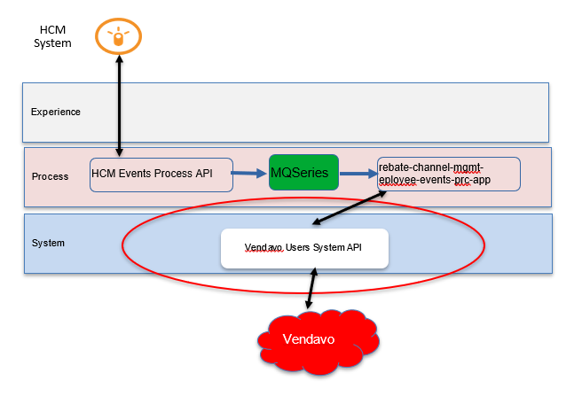
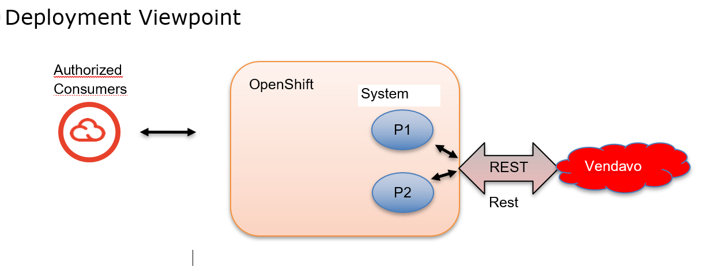

# History Of Changes:

| **Version** | **Author** | **Reason for change** | **Date**   |
| ----------- | ---------- | --------------------- | ---------- |
| 1.0         | J Sack     | Initial               | 03/27/2024 |
|             |            |                       |            |
|             |            |                       |            |
|             |            |                       |            |
|             |            |                       |            |
|             |            |                       |            |
|             |            |                       |            |
|             |            |                       |            |

# Purpose 

This document provides specifics describing the API application that is
to support interactions with the Vendavo Rebate and Channel Management
cloud application.

# Taxonomy

**Vendavo**: A cloud-based solution providing software for margin and
profit optimization to help drive corporate performance through big data
analytics.

# Solution Overview

Accurate delivery arrival time is very important to customers as they
prepare to efficiently accept the shipment. It also helps McLane in that
the more prepared the customer is to accept the delivery, the better
chance that the stop time will be manageable, and thus keep the
remaining deliveries on schedule.

## Process Context



## Logical Viewpoint

TBC

## Deployment Viewpoint



# System API

## Vendavo

Vendavo provides configure, price, and quote capabilities for channel
customers via their cloud-based applications. This system API will focus
on the specific nuances associated with the Vendavo API’s related to
McLane users of their cloud based system.

## Functional Design

### Resources

#### Users

The Vendavo cloud based application provides enhanced capability to
institute a pricing strategy that can be customized to a customer or
channel. This application will focus on managing McLane users of the
Vendavo cloud based system.

##### Project Names:

OAS Model Project: vendavo-users-sys-api

Development Project: vendavo-users-sys-api

##### Policies

- Client Id Enforcement

##### Update a user

###### Resource Locators

- Update a user

PUT {BASE_URI}/v1/users/{userId}

- Type of Data Consumed:

application/json

###### Path Parameters: 

| Name   | Assignment/Description | Example |
| :----- | :--------------------- | :------ |
| userId | Employee user id       | msmith  |

###### Query Parameters: Does Not Apply

| Name | Assignment/Description | Example |
| :--- | :--------------------- | :------ |
|      |                        |         |

###### Http Header Parameters: 

| Name             | Assignment/Description                                                                                                 | Example                              |
| :--------------- | :--------------------------------------------------------------------------------------------------------------------- | :----------------------------------- |
| tracing_id       | Optionally sent in on request                                                                                          | ASY7748901                           |
| X-Correlation-Id | If this element is present, assign it to correlationId variable, otherwise create a uuid and assign it to correlationId | 23d10540-e316-11ed-8a7a-0205dd115db9 |

###### Request Payload: 

| Element Name    | Required | Notes                    |
| --------------- | -------- | ------------------------ |
| employeeId      | Y        | string<br>Ex. 000157077  |
| terminationDate | Y        | string<br>Ex. 2023-12-31 |

Example:

PUT https://\<server\>:\<port\>/vendavo-users-sys-api/v1/users/msmith

Example request:

```json
{
  "employeeId": "000157077",
  "terminationDate": "2023-04-25"
}
```

###### Processing Summary

- Validate the input request

<!-- -->

- Interact with Vendavo services via REST calls to terminate a user

- Prepare Response

###### Processing:

####### Validation

Use the model to insure the presence of required fields and valid values

####### Update a user in Vendavo

####### Interact with Vendavo

######## Step 1: Create a Vendavo session

- To create a session in Vendavo:

POST https://\<host\>//createSession?user_name=xxxx&password=yyyy

- Type of Data Consumed by:

application/json

######## Path Parameters: Does Not Apply

| Name | Assignment/Description | Example |
| :--- | :--------------------- | :------ |
|      |                        |         |

######## Query Parameters: 

| Name      | Assignment/Description                             | Example         |
| :-------- | :------------------------------------------------- | :-------------- |
| user_name | User name to create the session with               | myIntegrationId |
| password  | Password of the user for which to create a session | myPassword      |

######## Http Header Parameters: 

| Name         |                  | Example          |
| :----------- | :--------------- | :--------------- |
| content-type | application/json | application/json |

######## Request Payload: Does Not Apply

| Name | Assignment/Description | Example |
| :--- | :--------------------- | :------ |
|      |                        |         |

**Example Request:**

POST
https://mclanetest.marketmedium.net/createSession?user_name=myusername&password=password123

***Request Connector Configuration**: (externalize into a property
file)*

- *Response Timeout(ms): 15000 (responseTimeOut)*

**Example successful Vendavo response:**

**User authenticated.**

**When successful in creating a session, the Vendavo response will
contain the text ”User authenticated.” If the call is successful then go
onto Step \#2:**

**If unsuccessful then return a 500 error message**

**Example 500 response:**

status = 500

context.type=Error

context.message=Could not create a Vendavo session

Example:

```json
{  
  "correlationId": "979f3d3b-a04a-43d7-b55f-8d5609b48783",  
  "tracingId": "abc55247",  
  "title": "Unknown Error",  
  "status": 400,  
  "instance": "https://apim.mclaneco.com/vendavo-users-sys-api/v1/users/psmith",  
  "requestId": "979f3d3b-a04a-43d7-b55f-8d5609b48783",  
  "context": [  
    {  
      "type": "Error",  
      "severity": "1",  
      "component": "vendavo-users-sys-api",  
      "timeStamp": "2023-04-20T14:46:59.131Z",  
      "message": "Could not create a Vendavo session"  
    }  
  ]  
}
```

######## **Step 2: Get user Details**

- To get user details in Vendavo:

GET https://\<host\>//userprofiles?filter=xxxx

- Type of Data Consumed by:

application/json

######## Path Parameters: Does Not Apply

| Name | Assignment/Description | Example |
| :--- | :--------------------- | :------ |
|      |                        |         |

######## Query Parameters: 

| Name   | Assignment/Description                                                                               | Example                                                                                                    |
| ------ | ---------------------------------------------------------------------------------------------------- | ---------------------------------------------------------------------------------------------------------- |
| filter | Url encoded json structure containing the user name which is assigned from the userId path parameter | Example json:<br>{"user_name":"mkelias"}<br>Example encoded json:<br>%7B%22user_name%22%3A%22mkelias%22%7D |

######## Http Header Parameters: 

| Name         |                  | Example          |
| :----------- | :--------------- | :--------------- |
| content-type | application/json | application/json |

######## Request Payload: Does Not Apply

| Name | Assignment/Description | Example |
| :--- | :--------------------- | :------ |
|      |                        |         |

**Example Request:**

GET
https://mclanetest.marketmedium.net/userprofiles?filter=%7B%22user_name%22%3A%22mkelias%22%7D

***Request Connector Configuration**: (externalize into a property
file)*

- *Response Timeout(ms): 15000 (responseTimeOut)*

**Example successful Vendavo response:**

```json
{  
  "success": true,  
  "data": [  
    {  
      "id": 135,  
      "user_name": "mkelias",  
      "first_name": "Matthew",  
      "middle_name": null,  
      "last_name": "Elias",  
      "email": "matthew.elias@mclaneco.com.test.test",  
      "role_use_type": "ADMIN",  
      "role_type": "INTERNAL",  
      "broker_org_id": null,  
      "vendor_org_id": null,  
      "customer_org_id": null,  
      "active": true,  
      "phone": null,  
      "invitation_date": "2023-01-24T06:55:04.000Z",  
      "activation_date": "2023-01-24T00:00:00.000Z",  
      "termination_date": "2025-09-30T00:00:00.000Z",  
      "creation_date": "2023-01-24T06:55:04.000Z",  
      "created_by": "asaxen",  
      "last_updated_by": "mkelias",  
      "last_update_date": "2024-03-28T14:43:41.000Z",  
      "last_update_login": null,  
      "language": null,  
      "object_version_number": null,  
      "password": "$2a$08$Mk1srg1C8CUWiFIrVqBhHu.Y0C0Wtqye.90vT6RK2ezgn55s16Ziq",  
      "activation_code": "72504707e4ac3c5bbe6c22a4d31f4867fd9dd5d2",  
      "external_user_role_use_type_id": null,  
      "manager_user_name": null,  
      "user_number": null,  
      "userRoles": [  
        {  
          "id": 1101,  
          "user_profile_id": 135,  
          "role_id": 365  
        },  
        {  
          "id": 1271,  
          "user_profile_id": 135,  
          "role_id": 352  
        },  
        {  
          "id": 1270,  
          "user_profile_id": 135,  
          "role_id": 373  
        },  
        {  
          "id": 1269,  
          "user_profile_id": 135,  
          "role_id": 358  
        },  
        {  
          "id": 1268,  
          "user_profile_id": 135,  
          "role_id": 349  
        },  
        {  
          "id": 1267,  
          "user_profile_id": 135,  
          "role_id": 337  
        },  
        {  
          "id": 1266,  
          "user_profile_id": 135,  
          "role_id": 343  
        },  
        {  
          "id": 1265,  
          "user_profile_id": 135,  
          "role_id": 355  
        },  
        {  
          "id": 1264,  
          "user_profile_id": 135,  
          "role_id": 346  
        }  
      ],  
      "externalOrg": null,  
      "userOrganizations": []  
    }  
  ],  
  "count": "1"  
}
```

If the user is not found, Vendavo returns a 200 status code with a
response that looks like so:

```json
{  
  "success": true,  
  "message": "No records present for the user 73",  
  "data": [],  
  "count": 0  
}
```

So to determine success we need to evaluate the count element in the
response to insure it is present, not null, and not equal to “0”

If the Vendavo response has a count = 0, then this indicates the user is
not a Vendavo user, so return a 404 response to the caller, and end
processing. This is expected behavior.

**Example 404 response:**

status = 404

context.type=Error

context.message=No user found for user Id = {userId}

Example:

```json
{  
  "correlationId": "979f3d3b-a04a-43d7-b55f-8d5609b48783",  
  "tracingId": "abc55247",  
  "title": "Not Found",  
  "status": 404,  
  "instance": "https://apim.mclaneco.com/vendavo-users-sys-api/v1/users/psmith",  
  "requestId": "979f3d3b-a04a-43d7-b55f-8d5609b48783",  
  "context": [  
    {  
      "type": "Error",  
      "severity": "1",  
      "component": "vendavo-users-sys-api",  
      "timeStamp": "2023-04-20T14:46:59.131Z",  
      "message": "No user found for userId = melias"  
    }  
  ]  
}
```

**If successful then go onto Step \#3:**

######## **Step 3: Update the user in Vendavo**

- To update user details in Vendavo:

PUT https://\<host\>//userprofiles?filter=xxxx

- Type of Data Consumed by:

application/json

######## Path Parameters: 

| Name | Assignment/Description                        | Example |
| :--- | :-------------------------------------------- | :------ |
| id   | data.id from the Vendavo response from Step#2 | 135     |

######## Query Parameters: Does Not Apply

| Name | Assignment/Description | Example |
| :--- | :--------------------- | :------ |
|      |                        |         |

######## Http Header Parameters: 

| Name         |                  | Example          |
| :----------- | :--------------- | :--------------- |
| content-type | application/json | application/json |

######## Request Payload: 

| Name             | Assignment/Description                        | Example    |
| ---------------- | :-------------------------------------------- | :--------- |
| termination_date | terminationDate from the request              | 2024-12-31 |
| id               | data.id from the Vendavo response from Step#2 | 135        |

**Example Request:**

PUT https://mclanetest.marketmedium.net/userprofiles/135
```json
{
  "termination_date": "2025-04-30",
  "id": 135
}
```

***Request Connector Configuration**: (externalize into a property
file)*

- *Response Timeout(ms): 15000 (responseTimeOut)*

**Example successful Vendavo response:**

```json
{  
  "success": true,  
  "data": [  
    {  
      "id": 135,  
      "user_name": "mkelias",  
      "first_name": "Matthew",  
      "middle_name": null,  
      "last_name": "Elias",  
      "email": "matthew.elias@mclaneco.com.test.test",  
      "role_use_type": "ADMIN",  
      "role_type": "INTERNAL",  
      "broker_org_id": null,  
      "vendor_org_id": null,  
      "customer_org_id": null,  
      "active": true,  
      "phone": null,  
      "invitation_date": "2023-01-24T06:55:04.000Z",  
      "activation_date": "2023-01-24T00:00:00.000Z",  
      "termination_date": "2025-04-30T00:00:00.000Z",  
      "creation_date": "2023-01-24T06:55:04.000Z",  
      "created_by": "asaxen",  
      "last_updated_by": "mmIntegration",  
      "last_update_date": "2024-04-09T21:01:54.000Z",  
      "last_update_login": null,  
      "language": null,  
      "object_version_number": null,  
      "password": "$2a$08$Mk1srg1C8CUWiFIrVqBhHu.Y0C0Wtqye.90vT6RK2ezgn55s16Ziq",  
      "activation_code": "72504707e4ac3c5bbe6c22a4d31f4867fd9dd5d2",  
      "external_user_role_use_type_id": null,  
      "manager_user_name": null,  
      "user_number": null,  
      "userRoles": [  
        {  
          "id": 1266,  
          "user_profile_id": 135,  
          "role_id": 343  
        },  
        {  
          "id": 1265,  
          "user_profile_id": 135,  
          "role_id": 355  
        },  
        {  
          "id": 1264,  
          "user_profile_id": 135,  
          "role_id": 346  
        },  
        {  
          "id": 1101,  
          "user_profile_id": 135,  
          "role_id": 365  
        },  
        {  
          "id": 1271,  
          "user_profile_id": 135,  
          "role_id": 352  
        },  
        {  
          "id": 1270,  
          "user_profile_id": 135,  
          "role_id": 373  
        },  
        {  
          "id": 1269,  
          "user_profile_id": 135,  
          "role_id": 358  
        },  
        {  
          "id": 1268,  
          "user_profile_id": 135,  
          "role_id": 349  
        },  
        {  
          "id": 1267,  
          "user_profile_id": 135,  
          "role_id": 337  
        }  
      ],  
      "externalOrg": null,  
      "userOrganizations": []  
    }  
  ],  
  "count": "1"  
}
```

If the user is not found, Vendavo returns a 200 status code with a
response that looks like so:

```json
{
  "success": true,
  "data": []
}
```

So to determine success we need to evaluate the data.id element in the
response to insure it is present, not null, and not equal to “0”

If the Vendavo response does not contain the data.id element, then this
indicates the user was not found, so return a 500 response to the
caller, and end processing

**Example 500 response:**

status = 500

context.type=Error

context.message=No user found when expected for user id = {userId) and
id = {id}

Example:

```json
{  
  "correlationId": "979f3d3b-a04a-43d7-b55f-8d5609b48783",  
  "tracingId": "abc55247",  
  "title": "Unexpected Error",  
  "status": 500,  
  "instance": "https://apim.mclaneco.com/vendavo-users-sys-api/v1/users/psmith",  
  "requestId": "979f3d3b-a04a-43d7-b55f-8d5609b48783",  
  "context": [  
    {  
      "type": "Error",  
      "severity": "1",  
      "component": "vendavo-users-sys-api",  
      "timeStamp": "2023-04-20T14:46:59.131Z",  
      "message": "No user found for user Id = melias and id = 135"  
    }  
  ]  
}
```

**If successful then go onto Step \#4:**

######## Step 4: Delete/End a Vendavo session

- To end/remove a session in Vendavo:

GET https://\<host\>//deleteSession

- Type of Data Consumed by:

application/json

######## Path Parameters: Does Not Apply

| Name | Assignment/Description | Example |
| :--- | :--------------------- | :------ |
|      |                        |         |

######## Query Parameters: Does Not Apply

| Name | Assignment/Description | Example |
| :--- | :--------------------- | :------ |
|      |                        |         |

######## Http Header Parameters: 

| Name         |                  | Example          |
| :----------- | :--------------- | :--------------- |
| content-type | application/json | application/json |

######## Request Payload: Does Not Apply

| Name | Assignment/Description | Example |
| :--- | :--------------------- | :------ |
|      |                        |         |

**Example Request:**

GET https://mclanetest.marketmedium.net/deleteSession

***Request Connector Configuration**: (externalize into a property
file)*

- *Response Timeout(ms): 15000 (responseTimeOut)*

**Example successful Vendavo response:**

**User session deleted.**

###### Prepare Response 

####### Response Payload: 

\*\*See OAS model in model repository for more details

| Element Name  | Assignment                                               | Notes                                              |
| ------------- | -------------------------------------------------------- | -------------------------------------------------- |
| correlationId | X-Correlation-Id if present, otherwise create a new uuid | string<br>Ex. ae8c5b85-97e0-4f55-80e7-6161d67220ae |
| tracingId     | tracingId from the request, if present                   | string<br>Ex. A19283745                            |

Example:

```json
{
  "correlationId": "1ea52c41-98d5-11ec-9852-000c29356fc3",
  "tracingId": "A19283745"
}
```

###### Logging Events:

\- At the start of the application

flowStep: "Flow Start"

\- Right before the Create Session call:

flowStep: "Create Session Request"

-Right after the return of the Create Session call:

flowStep: "Create Session Response"

\- Right before the Get User call:

flowStep: "Get User Request"

-Right after the return of the Get User call:

flowStep: "Get User Response"

\- Right before the Update User call:

flowStep: "Update User Request"

-Right after the return of the Update User call:

flowStep: "Update User Response"

\- Right before the Delete Session call:

flowStep: "Delete Session Request"

-Right after the return of the Delete Session call:

flowStep: "Delete Session Response"

-At the End of the application

flowStep: "Flow End"

###### Error Processing

If an issue/error is encountered, the specifics related to the error are
to be reported back on the response via our common error structure along
with the correlation Id and the tracing Id if provided.

if the Vendavo response has a http status not equal to 200 then create
an error response and sent back to the caller.

-Set the following status elements in the response

status = http status code

context.type = “Error”

> context.message = errors detail from the response

Example System API response

```json
{
  "correlationId": "d5f6fbf8-6774-4a95-9b59-15348943abd4",
  "tracingId": "A19283745",
  "status": {
    "code": "500",
    "messages": [
      {
        "type": "Error",
        "reasonCode": "ch4n3us6o9mtgrijf7g0",
        "message": "Vendavo API is not available",
        "context": "vendavo-users-sys-api",
        "timeStamp": "2022-04-30T15:27:49.274Z"
      }
    ]
  }
}
```

###### Non Functional Requirements

####### Security

####### Data

- System client id and secret

- Masking elements: Does Not apply

####### Transport

- https

####### Availability

- *99.99% uptime 24x7*

####### Reliability

- High availability via multiple pods

####### Traceability

- Transaction tracing via log data to Splunk

- Specific Auditing requirements: Does Not Apply

####### Throughput

- Current Peak Metric:

  - <span class="mark">xx</span> Concurrent transactions per second

  - <span class="mark">xx</span> Minutes - specified duration(s)

  - M T W T F S S Note any applicable days in the week

- Seasonal dimension: Does Not Apply

- Estimated Peak metric over the next 9-12 months:

  - <span class="mark">xx</span> Concurrent transactions per second

  - <span class="mark">xx</span> minutes - specified duration(s)

  - M T W T F S S Note any applicable days in the week

####### Response Time

- Target times for average or maximum response times, expressed as a
  percentile: 95% within 5 second(s).

##### Vendavo Users Health Check 

This endpoint enables a health check ping to ensure the application, and
the dependent API is up and running

###### Resource Locators

1)  To get a heartbeat response

GET {BASE_URI}/v1/health

2)  Type of Data Consumed:

###### Path Parameters: Does Not Apply

| Name | Assignment/Description | Example |
| :--- | :--------------------- | :------ |
|      |                        |         |

###### Query Parameters: Does Not Apply

| Name | Assignment/Description | Example |
| :--- | :--------------------- | :------ |
|      |                        |         |

###### Http Request Parameters: 

| Name             | Assignment/Description                                                                                                 | Example                              |
| :--------------- | :--------------------------------------------------------------------------------------------------------------------- | :----------------------------------- |
| tracing_id       | Optional                                                                                                               | Z987yy54r3                           |
| X-Correlation-Id | If this element is present, assign it to correlationId variable, otherwise create a uuid and assign it to correlationId | 23d10540-e316-11ed-8a7a-0205dd115db9 |

###### Request Payload: Does Not Apply

| Element Name | Assignment | Notes |      |
| :----------- | :--------- | :---- | :--- |
|              |            |       |      |

Example:

GET /v1/health

###### Processing

To check the if the Vendavo API is available, make the following API
call:

GET {BASE_URI}/deleteSession

####### Path Parameters: Does Not Apply

| Name | Assignment/Description | Example |
| :--- | :--------------------- | :------ |
|      |                        |         |

####### Query Parameters: Does Not Apply

| Name | Assignment/Description | Example |
| :--- | :--------------------- | :------ |
|      |                        |         |

####### Http Header Parameters: 

| Name         | Assignment/Description | Example          |
| :----------- | :--------------------- | :--------------- |
| content-type | application/json       | application/json |

####### Request Payload: Does Not Apply

| Element Name | Assignment | Notes |      |
| :----------- | :--------- | :---- | :--- |
|              |            |       |      |

Example:

GET https://mclanetest.marketmedium.net/deleteSession

-Return a 200 upon successful completion with payload if the above
interaction is successful

####### Response Payload: For Successful responses

| Element Name  | Assignment                                                         | Notes                                              |
| ------------- | ------------------------------------------------------------------ | -------------------------------------------------- |
| correlationId | X-Correlation-Id if present, otherwise create a new uuid           | string<br>Ex. d5f6fbf8-6774-4a95-9b59-15348943abd4 |
| tracingId     | Optional tracing_id from the system API request header, if present | string<br>Ex. A3345732                             |
| status        | Constant “OK”                                                      | string<br>Ex. OK                                   |
| apiName       | Application name                                                   | string<br>Ex. vendavo-users-sys-api                |
| apiVersion    |                                                                    | string<br>Ex. v1                                   |
| timestamp     | now                                                                | string<br>Ex. 2023-07-18T16:55:46.678-05:00        |
| dependencies  | Object that contains the status                                    |                                                    |
| name          | Assign the constant “Vendavo Users”                                | string<br>Ex. Vendavo Users                        |
| status        | If successful assign the constant “UP”                             | string<br>Ex. UP                                   |

Example:

```json
{
  "correlationId": "d5f6fbf8-6774-4a95-9b59-15348943abd4",
  "tracingId": "A3345732",
  "status": "OK",
  "apiName": "vendavo-users-sys-api",
  "apiVersion": "v1",
  "timestamp": "2024-03-18T16:55:46.678-05:00",
  "dependencies": [
    {
      "name": "Vendavo Users",
      "status": "UP"
    }
  ]
}
```

-Return a 500 if any issue(s) are encountered interacting with Vendavo

###### Response Payload: For failures only

| Element Name  | Assignment                                           | Notes                                              |
|---------------|------------------------------------------------------|----------------------------------------------------|
| correlationId | correlationId                                        | string<br>Ex. d5f6fbf8-6774-4a95-9b59-15348943abd4 |
| tracingId     | tracing_id from the system API request header, if present | string<br>Ex. A3345732                             |
| status        | Http status code                                     | Object that holds processing status context        |
| **context**   |                                                      | Object that holds the collection of diagnostic information |
| type          | “Error”                                              | string                                             |
| severity      |                                                      | string                                             |
| reasonCode    | Sql code if available                                | string                                             |
| message       | Error message text                                   | string                                             |
| component     | app.name                                             | string                                             |
| timeStamp     | Current date & time                                  | string                                             |

Example:

```json
{
  "correlationId": "d5f6fbf8-6774-4a95-9b59-15348943abd4",
  "tracingId": "A19283745",
  "status": 500,
  "context": [
    {
      "type": "Error",
      "severity": "1",
      "reasonCode": "40613",
      "message": "Database mydb on server mydbserver is not currently available",
      "component": "ebs-employees-sys-api",
      "timeStamp": "2022-09-30T15:27:49.274Z"
    }
  ]
}
```

####### HTTP Status Codes

Possible HTTP status codes for the response include:

- 200 Request accepted

- 401 Unauthorized - for errors in API authentication

- 403 Forbidden - for errors in API authorization

- 500 Internal Server Error - for unexpected failures

# Appendix

## Vendavo Environments:

| Environment | Host                        |      |
| :---------- | :-------------------------- | :--- |
| Test        | mclanetest.marketmedium.net |      |
| Production  |                             |      |

## Error Structure

| Element Name | Assignment | Notes |
|--------------|------------|-------|
| correlationId | correlationId | string<br>Ex. d5f6fbf8-6774-4a95-9b59-15348943abd4 |
| tracingId | tracing_id from the system API request header, if present | string<br>Ex. A3345732 |
| title | If http status is:<br>400=Bad Request<br>401=Unauthorized<br>403=Forbidden<br>404=Resource Not Found<br>405=Method Not Allowed<br>406=Not Acceptable<br>429=Too Many Requests<br>3xx: Redirection<br>5xx: Unexpected error | Short human-readable title of the error that occurred |
| status | Http status code | holds processing status code |
| instance | The called url that experienced the issue | Ex. https://apim.mclaneco.com/ebs-customers-sys-api/v1/customers/sites?phoneNumber=5857732431 |
| requestId | correlationId | Id that correlates original request to response and other events in the API |
| **context** | | Object that holds the collection of diagnostic information |
| type | “Error” | string |
| severity | Optional designation of the criticality of the error | 1=High<br>2=Medium<br>3=Low |
| reasonCode | Application return code if available | string, Ex. 422 |
| message | Error message text | string |
| component | Application name | string, Ex. trimble-shipments-sys-api |
| timeStamp | Current date & time | string |

Example:

```json
{  
  "correlationId": "979f3d3b-a04a-43d7-b55f-8d5609b48783",  
  "tracingId": "abc55247",  
  "title": "Bad Data",  
  "status": 400,  
  "instance": "https://apim.mclaneco.com/prc/tracking-shipments/v1/shipments/MC0109MS20230731/positions",  
  "requestId": "979f3d3b-a04a-43d7-b55f-8d5609b48783",  
  "context": [  
    {  
      "type": "Error",  
      "severity": "1",  
      "reasonCode": "422",  
      "component": "trimble-shipments-sys-api",  
      "timeStamp": "2023-04-20T14:46:59.131Z",  
      "message": "HTTP POST on resource 'https://apim.mclaneco.com:443/prc/tracking-shipments/v1/shipments/MC0109MS20230731/positions' failed: bad request (400)."  
    }  
  ]  
}
```

## Log Event Structure

| Element Name  | Assignment                                                   | Notes                                              |
|---------------|--------------------------------------------------------------|----------------------------------------------------|
| correlationId | correlationId                                                | string<br>Ex. d5f6fbf8-6774-4a95-9b59-15348943abd4 |
| tracingId     | tracing_id from the system API request header, if present    | Ex. A3345732                                       |
| clientId      |                                                              | Ex. c9feb3160f0b4ea785875ad678e00c1c               |
| appName       |                                                              | Ex. mfdb2-sales-sys-api-1                          |
| flowName      |                                                              | Ex. mfdb2-sales-sys-api-main                       |
| flowStep      |                                                              | Ex. Flow End                                       |
| timestamp     | Current date & time                                          | Ex. 2023-04-25T03:06:16.405Z                       |
| environment   | DEV, TEST, PROD                                              | Based on the environment we are running in         |
| payload       | If log level is DEBUG add the payload                        |                                                    |

Example:

```json
{  
  "appName": "mcl-b2bi-files-sys-api-1",  
  "clientId": "c9feb3160f0b4ea785875ad678e00c1c",  
  "correlationId": "23d10540-e316-11ed-8a7a-0205dd115db9",  
  "tracingId": "A23778-01",  
  "flowName": "ebs-employees-sys-api-main",  
  "flowStep": "Flow End",  
  "timestamp": "2023-05-25T03:06:16.405Z",  
  "environment": "PROD",  
  "payload": {  
    "correlationId": "23d10540-e316-11ed-8a7a-0205dd115db9",  
    "tracingId": "",  
    "status": {  
      "code": "200",  
      "messages": [  
        {  
          "type": "Diagnostic",  
          "message": "BuyerQuestTerm Data has been queued for processing",  
          "timeStamp": "2023-04-25T03:06:16.403Z"  
        }  
      ]  
    }  
  }  
}
```
