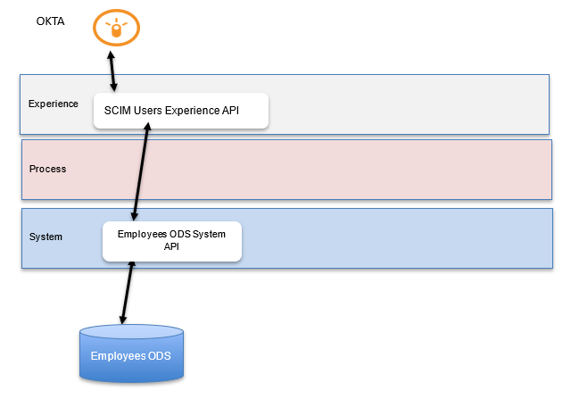
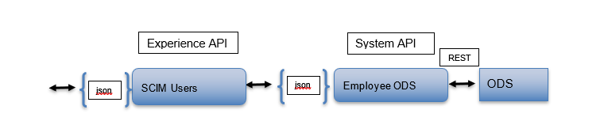
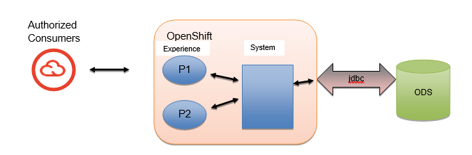

# History Of Changes

| **Version** | **Author** | **Reason for change**                                                       | **Date**   |
| ----------- | ---------- | --------------------------------------------------------------------------- | ---------- |
| 1.0         | J Sack     | Initial                                                                     | 05/16/2024 |
|             |            | Add Put endpoint                                                            | 05/29/2024 |
|             |            | Add Patch endpoint                                                          | 06/05/2024 |
|             |            | Add Post endpoint                                                           | 06/05/2024 |
|             |            | Update Patch and Put endpoint to use Stored procedure                       | 06/27/2024 |
|             |            | Update Get by user id to endpoint to use Stored procedure                   | 07/03/2204 |
|             |            | Update Get (Search) by user id to endpoint to use Stored procedure          | 07/16/2204 |
| 1.1         |            | Update the Get by user id to use the search employees stored procedure      | 07/17/2024 |
|             |            | Changed flsaRegionalCode to flsaCode Changed status to employmentStatusCode | 07/23/2024 |
|             |            | Change to handle different date formats DD-MON-YYYY and YYYY-MM-DD          | 07/31/2024 |
|             |            | URL decode of the filter parameter value                                    | 08/06/2024 |
|             |            | Add last modified date to the get response Add userId to Get/Put/Post       | 08/19/2024 |

# Purpose 

This document provides specifics that describes the API that is to be
built to support a database tables and views of synchronized employee
data. Certain applications would then make use of this data to support
their employee based data needs.

# Taxonomy

OKTA: An application that distributes updated employee data

Workday: McLane’s HCM system of record

# Solution Overview

This document will outline the interaction details required to support
an operational data store containing employee data. This system API will
expose employee data contained in the ODS which is constantly kept up to
data from the system of record via the OKTA application.

## Process Context



## Logical Viewpoint



## Deployment Viewpoint



# System API

## Employee ODS

A set of tables and views were built to support an Employee operational
data store. Applications that pull employee based data as part of their
processing would access these ODS tables/views. The employee ODS is
constantly updated to keep in sync with employee system of record.

This system API will focus on the specific nuances associated with
maintaining the database tables associated with the Oracle based
employee ODS.

## Functional Design

### Resources

#### Employee

Employee data is consumed by many systems in the McLane application
landscape, and having accurate employee data is imperative for the
successful operation of those applications. This ODS is sourced from the
HCM system via OKTA, will seek to synchronize employee data in a timely
manner

The ODS is underpinned with an Oracle database that this system API will
expose for real time access.

##### Project Names:

OAS Model Project: employee-ods-sys-api

Development Project: employee-ods-sys-api

OpenShift Project: employee-events-dev, employee-events-test,
employee-events

##### Policies

- Client Id Enforcement

##### Get employee data via an employee Id

Get employee information using an employee Id

###### Resource Locators

- To retrieve details on an employee:

GET {BASE_URI}/v1/employees/{employeeId}

Type of Data Consumed:

application/json

###### Path Parameters: 

| Name       | Assignment/Description     | Example   |
| :--------- | :------------------------- | :-------- |
| employeeId | Unique employee identifier | 000061149 |

###### Query Parameters: Does Not Apply

| Name | Assignment/Description | Example |
| :--- | :--------------------- | :------ |
|      |                        |         |

###### Http Header Parameters: 

| Name             | Assignment/Description                                                                                                  | Example                              |
| :--------------- | :---------------------------------------------------------------------------------------------------------------------- | :----------------------------------- |
| tracing_id       | Optionally sent in on request                                                                                           | ASY7748901                           |
| X-Correlation-Id | If this element is present, assign it to correlationId variable, otherwise create a uuid and assign it to correlationId | 23d10540-e316-11ed-8a7a-0205dd115db9 |

###### Request Payload: Does Not Apply

| Element Name | Required | Notes |
| :----------- | :------: | :---- |
|              |          |       |

Example:

GET https://\<hostName\>/employees-ods-sys-api/v1/employees/000061149

Example request:

Does Not Apply

###### Processing Summary

- Validation

- Interact with Employee ODS Oracle DB via SQL statements

- Prepare Response

###### Processing

####### Validation

- Validate using the API model to insure the presence of required fields
  and valid values

####### Interact with Employee ODS database

~~Select \* from INTERIM.MCL_ONBOARDING_AND_EMPL Where EMPLID =
\<**employeeId**\>~~

Invoke the stored procedure in the \<schema\>. GETUSERS_SP

Where \<schema\> value is INTERIM_CODE externalized in a property file

**CALL** INTERIM_CODE.GETUSERS_SP(resultsSet,:OFFSET,:LIMIT,:EMPLID);

| Stored Procedure Parameter | Parameter | Assignment/Description                  | Example   |
| -------------------------- | --------- | --------------------------------------- | --------- |
| resultsSet                 |           | Cursor containing the rows returned     |           |
| OFFSET                     |           | offset query parameter, default to zero | 5         |
| LIMIT                      |           | limit query parameter, default to 20    | 20        |
| EMPLID                     |           | employeeId query parameter              | 000014527 |

Example:

CALL INTERIM_CODE.GETUSERS_SP (resultsSet,5,20,000014527);

~~**CALL**
INTERIM_CODE.GETUSERBYID_SP(:EMPLID,?,?,?,?,?,?,?,?,?,?,?,?,?,?,?,?,?,?,?,?,?,?,?,?,?,?,?,?,?,?);~~

~~Example:~~

~~CALL
INTERIM_CODE.GETUSERBYID_SP(:EMPLID,?,?,?,?,?,?,?,?,?,?,?,?,?,?,?,?,?,?,?,?,?,?,?,?,?,?,?,?,?,?);~~

~~FIRST_NM~~

~~MIDDLE_NM~~

~~LAST_NM~~

~~BIRTHDATE~~

~~SSN~~

~~DEPT_ID,~~

~~DEPT_NM~~

~~JOB_CD~~

~~JOB_NM~~

~~JOB_FAM_CD~~

~~JOB_FAM_NM~~

~~POSITION_CD~~

~~DIV_CD~~

~~DIV_NM~~

~~COMPANY_CD~~

~~COMPANY_NM~~

~~GRADE~~

~~SUPERVISOR_ID~~

~~EMPL_STATUS~~

~~EMPL_TYPE~~

~~BUSINESS_UNIT~~

~~TERM_DT~~

~~LOCATION~~

~~ADDRESS~~

~~CITY~~

~~STATE~~

~~ZIP~~

~~LEAVE_EFF_DT~~

~~FLSA_STATUS~~

~~START_DT~~

Externalize the schemaName in a property file used in the query by
placing the schema value in a property named: schemaName

The schemaName value can be found at: [EBS Oracle
Environments:](#_EBS_Oracle_Environments:)

**Extension Configuration**: *(externalize into a property file)*

- Query Timeout: 15 *(queryTimeout)*

- Query Timeout Unit: Seconds *(queryTimeoutUnit)*

####### Prepare Response 

###### Response Payload: [\#Employee Detail Response Structure\|outline](#employee-detail-response-structure)

Use the definition in the Appendix to prepare the response.

###### Logging Events:

\- At the start of the application

flowStep: "Flow Start"

\- Right before the Getting an Employee Row call

flowStep: " Get an Employee Row Request"

\- Right after the return of Getting an Employee Row call:

flowStep: " Get an Employee Row Response"

-At the End of the application

flowStep: "Flow End"

###### Error Processing

If the results set is empty (employee not found) then create an error
response and sent back to the caller.

-Set the following status elements in the response

status = 404

context.type = “Error”

> context.message = Employee not found for employee Id = {employeeId}
> from the path parameter}

Example:

```json
{  
  "correlationId": "979f3d3b-a04a-43d7-b55f-8d5609b48783",  
  "tracingId": "abc55247",  
  "title": "Resource Not Found",  
  "status": 404,  
  "instance": "https://apim.mclaneco.com/employees-ods-sys-api/v1/employees/000136222",  
  "requestId": "979f3d3b-a04a-43d7-b55f-8d5609b48783",  
  "context": [  
    {  
      "type": "Error",  
      "severity": "1",  
      "reasonCode": "422",  
      "component": "employees-ods-sys-api",  
      "timeStamp": "2023-04-20T14:46:59.131Z",  
      "message": "Employee not found for employee Id = 000136222"  
    }  
  ]  
}
```

If an issue/error are encountered, the specifics related to the error
are to be reported back on the response via our common error structure
along with the correlation Id and the tracing Id if provided. See [Error
Structure](#_Error_Structure)

Example:

```json
{  
  "correlationId": "979f3d3b-a04a-43d7-b55f-8d5609b48783",  
  "tracingId": "abc55247",  
  "title": "Resource Not Found",  
  "status": 404,  
  "instance": "https://apim.mclaneco.com/employees-ods-sys-api/v1/employees/000136222",  
  "requestId": "979f3d3b-a04a-43d7-b55f-8d5609b48783",  
  "context": [  
    {  
      "type": "Error",  
      "severity": "1",  
      "reasonCode": "422",  
      "component": "employees-ods-sys-api",  
      "timeStamp": "2023-04-20T14:46:59.131Z",  
      "message": "Employee not found for employee Id = 000136222"  
    }  
  ]  
}
```

###### HTTP Status Codes

Possible HTTP status codes for the response include:

- 200 OK - for success

- 400 Bad Request – for errors in the request data

- 401 Unauthorized - for errors in API authentication

- 403 Forbidden - for errors in API authorization

- 404 Resource Not found - for errors in API resource not found

- 500 Internal Server Error - for any unexpected resource failures

###### Non Functional Requirements

####### Security

####### Data

- System client id and secret

- Masking elements: Does Not apply

####### Transport

- http

####### Availability

- *99.99% uptime 24x7*

####### Reliability

- High availability via multiple workers

####### Traceability

- Transaction tracing via log data to Splunk

- Specific Auditing requirements: Does Not Apply

####### Throughput

- Current Peak Metric:

  - <span class="mark">xx</span> Concurrent transactions per second

  - <span class="mark">xx</span> Minutes - specified duration(s)

  - M T W T F S S Note any applicable days in the week

- Seasonal dimension: Does Not Apply

- Estimated Peak metric over the next 9-12 months:

  - <span class="mark">xx</span> Concurrent transactions per second

  - <span class="mark">xx</span> minutes - specified duration(s)

  - M T W T F S S Note any applicable days in the week

####### Response Time

- Target times for average or maximum response times, expressed as a
  percentile: 95% within 3 second(s).

##### Update employee data via an employee Id

Update employee information using an employee Id

###### Resource Locators

- To update details on an employee:

PUT {BASE_URI}/v1/employees/{employeeId}

Type of Data Consumed:

application/json

###### Path Parameters: 

| Name       | Assignment/Description     | Example   |
| :--------- | :------------------------- | :-------- |
| employeeId | Unique employee identifier | 000061149 |

###### Query Parameters: Does Not Apply

| Name | Assignment/Description | Example |
| :--- | :--------------------- | :------ |
|      |                        |         |

###### Http Header Parameters: 

| Name             | Assignment/Description                                                                                                  | Example                              |
| :--------------- | :---------------------------------------------------------------------------------------------------------------------- | :----------------------------------- |
| tracing_id       | Optionally sent in on request                                                                                           | ASY7748901                           |
| X-Correlation-Id | If this element is present, assign it to correlationId variable, otherwise create a uuid and assign it to correlationId | 23d10540-e316-11ed-8a7a-0205dd115db9 |

###### Request Payload: See the model repo for details

| Element Name                 | Required | Notes   | Example                       |
| ---------------------------- | -------- | ------- | ----------------------------- |
| employee                     | Y        |         |                               |
| userId                       | N        | string  | psmith                        |
| isActive                     | N        | boolean | true                          |
| employmentStatusCode         | N        | string  | A                             |
| birthDate                    | N        | date    | 2000-09-08                    |
| ssnLastFour                  | N        | string  | 1124                          |
| distributionCenterDivisionId | N        | string  | GR260                         |
| division                     | N        | string  | McLane Business Info Services |
| costCenter                   | N        | string  | 20020                         |
| department                   | N        | string  | Platform Administration       |
| managerId                    | N        | string  | 000028632                     |
| locationId                   | N        | string  | 999                           |
| companyName                  | N        | string  | McLane Company, Inc.          |
| companyCode                  | N        | string  | 001                           |
| businessUnit                 | N        | string  | GR360                         |
| terminationDate              | N        | date    | 2024-01-31                    |
| startDate                    | N        | date    | 2024-01-31                    |
| payGrade                     | N        | string  | L                             |
| flsaCode                     | N        | string  | V                             |
| compensationTypeCode         | Y        | string  | S                             |
| extendedTimeOff              | N        |         |                               |
| startDate                    | N        | date    | 2024-03-31                    |
| name                         |          |         |                               |
| first                        | Y        | string  | Mary                          |
| middle                       | N        | string  | Sue                           |
| last                         | Y        | string  | Eliassen                      |
| job                          | N        |         |                               |
| code                         | N        | string  | 1067                          |
| title                        | N        | string  | Stocker                       |
| familyCode                   | N        | string  | D                             |
| family                       | N        | string  | IT Platform                   |
| positionId                   | N        | string  | P001537                       |
| workAddress                  | N        |         |                               |
| address1                     | N        | string  | 4747 McLane Parkway           |
| city                         | N        | string  | Temple                        |
| state                        | N        | string  | TX                            |
| postalCode                   | N        | string  | 76504                         |

Example:

PUT https://\<hostName\>/employees-ods-sys-api/v1/employees/000061149

Example request:

{  
"employee": {

"userId": "zernest",  
"activeCode": 1,  
"employmentStatusCode": "A",  
"birthDate": "2000-06-08",  
"ssnLastFour": "1123",  
"department": "Platform Administration",  
"distributionCenterDivisionId": "GR260",  
"division": "GR260 GR Concord",  
"costCenter": "20020",  
"managerId": "000028632",  
"locationId": "999",  
"companyCode": "001",  
"companyName": "McLane Company, Inc.",  
"businessUnit": "GR260",  
"terminationDate": null,

"startDate": "1997-06-08",  
"payGrade": "L",  
"flsaCode": "N",  
"compensationTypeCode": "S",  
"extendedTimeOff": {  
"startDate": ""  
},  
"name": {  
"first": "Zachary",  
"middle": "Ernest",  
"last": "Hines"  
},  
"job": {  
"code": "1067",  
"title": "Stocker",  
"familyCode": "D",  
"family": "IT Platform",  
"positionId": "P001537"  
},  
"workAddress": {  
"address1": "4747 McLane Parkway",  
"city": "Temple",  
"state": "TX",  
"postalCode": "76504"  
}  
}  
}

###### Processing Summary

- Validation

- Interact with Employee ODS Oracle DB via SQL statements

- Prepare Response

###### Processing

####### Validation

- Validate using the API model to insure the presence of required fields
  and valid values

####### Interact with Employee ODS database

Invoke the stored procedure in the \<schema\>.UPDATEUSERBYID_SP

Where \<schema\> value is INTERIM_CODE externalized in a property file

**CALL**
INTERIM_CODE.UPDATEUSERBYID_SP(:EMPLID,:FIRST_NM,:MIDDLE_NM,:LAST_NM,:BIRTHDATE,:SSN,:DEPT_ID,:DEPT_NM,:JOB_CD,:JOB_NM,:JOB_FAM_CD,:JOB_FAM_NM,:POSITION_CD,:DIV_CD,:DIV_NM,:COMPANY_CD,:COMPANY_NM,:GRADE,:SUPERVISOR_ID,:EMPL_STATUS,:EMPL_TYPE,:BUSINESS_UNIT,:TERM_DT,:LOCATION,:ADDRESS,:CITY,:STATE,:ZIP,:LEAVE_EFF_DT,:FLSA_STATUS,:START_DT,:ACTIVE,:USER_ID);

| Parameter Name | Parameter Type | Assignment/Description                                                                                                                                                                                 | Example                  |
| -------------- | -------------- | ------------------------------------------------------------------------------------------------------------------------------------------------------------------------------------------------------ | ------------------------ |
| EMPLID         | IN             | employee.employeeId                                                                                                                                                                                    | 000132731                |
| FIRST_NM       | IN             | employee.name.first                                                                                                                                                                                    | Pete                     |
| MIDDLE_NM      | IN             | employee.name.middle                                                                                                                                                                                   | James                    |
| LAST_NM        | IN             | employee.name.last                                                                                                                                                                                     | Lawler                   |
| BIRTHDATE      | IN             | employee.birthDate The date format can come in as in format DD-MON-YYYY or YYYY-MM-DD. If the date format comes in as YYYY-MM-DD, convert it to DD-MON-YYYY format when assigning for the update       | 30-Jul-1980              |
| SSN            | IN             | employee.ssnLastFour                                                                                                                                                                                   | 3321                     |
| DEPT_ID        | IN             | employee.costCenter                                                                                                                                                                                    | 20014                    |
| DEPT_NM        | IN             | employee.department                                                                                                                                                                                    | Perishable/Refrigeration |
| JOB_CD         | IN             | employee.job.code                                                                                                                                                                                      | 1002                     |
| JOB_NM         | IN             | employee.job.title                                                                                                                                                                                     | Checker/Loader IV        |
| JOB_FAM_CD     | IN             | employee.job.familyCode                                                                                                                                                                                | Loaders                  |
| JOB_FAM_NM     | IN             | employee.job.family                                                                                                                                                                                    | Loaders                  |
| POSITION_CD    | IN             | employee.job.positionId                                                                                                                                                                                | P016064                  |
| DIV_CD         | IN             | employee.distributionCenterDivisionId                                                                                                                                                                  | GR250                    |
| DIV_NM         | IN             | employee.division                                                                                                                                                                                      | GR Suneast               |
| COMPANY_CD     | IN             | employee.companyCode                                                                                                                                                                                   | 007                      |
| COMPANY_NM     | IN             | employee.companyName                                                                                                                                                                                   | McLane Suneast, Inc.     |
| GRADE          | IN             | employee.payGrade                                                                                                                                                                                      | 4                        |
| SUPERVISOR_ID  | IN             | employee.managerId                                                                                                                                                                                     | 000030137                |
| EMPL_STATUS    | IN             | employee.employmentStatusCode                                                                                                                                                                          | A                        |
| EMPL_TYPE      | IN             | employee.compensationTypeCode                                                                                                                                                                          | H                        |
| BUSINESS_UNIT  | IN             | employee.businessUnit                                                                                                                                                                                  | GR250                    |
| TERM_DT        | IN             | employee.terminationDate The date format can come in as in format DD-MON-YYYY or YYYY-MM-DD. If the date format comes in as YYYY-MM-DD, convert it to DD-MON-YYYY format when assigning for the update | 30-Jul-2003              |
| LOCATION       | IN             | employee.locationId                                                                                                                                                                                    | 250                      |
| ADDRESS        | IN             | employee.workAddress.address1                                                                                                                                                                          | 1818 Poinciana Blvd      |
| CITY           | IN             | employee.workAddress.city                                                                                                                                                                              | Kissimmee                |
| STATE          | IN             | employee.workAddress.state                                                                                                                                                                             | FL                       |
| ZIP            | IN             | employee.workAddress.postalCode                                                                                                                                                                        | 34758                    |
| LEAVE_EFF_DT   | IN             | employee.extendedTimeOff.startDate                                                                                                                                                                     | 30-Jul-2024              |
| FLSA_STATUS    | IN             | employee.flsaCode                                                                                                                                                                                      | N                        |
| START_DT       | IN             | employee.startDate The date format can come in as in format DD-MON-YYYY or YYYY-MM-DD. If the date format comes in as YYYY-MM-DD, convert it to DD-MON-YYYY format when assigning for the update       | 30-Jan-2000              |
| ACTIVE         | IN             | If employee.isActive = true then 1 else 0                                                                                                                                                              | true                     |
| USER_ID        | IN             | employee.userId                                                                                                                                                                                        | psmith                   |


Example:

  CALL INTERIM_CODE.UPDATEUSERBYID_SP(

  employee.employeeId,

  employee.name.first,

  employee.name.middle,

  employee.name.last,

  employee.birthDate, --in format DD-MON-YYYY

  employee.ssnLastFour,

  employee.costCenter,

  employee.department,

  employee.job.code,

  employee.job.title,

  employee.job.familyCode,

  employee.job.family,

  employee.job.positionId,

  employee.distributionCenterDivisionId,

  employee.division,

  employee.companyCode,

  employee.companyName,

  employee.payGrade,

  employee.managerId,

  employee.employmentStatusCode,

  employee.compensationTypeCode,

  employee.businessUnit,

  employee.terminationDate, --in format DD-MON-YYYY

  employee.locationId,

  employee.workAddress.address1,

  employee.workAddress.city,

  employee.workAddress.state,

  employee.workAddress.postalCode,

  employee.extendedTimeOff.startDate, --in format DD-MON-YYYY

  employee.flsaCode,

  employee.startDate, --in format DD-MON-YYYY

  1, --If employee.isActive = true then 1 else 0

  employee.userId);

~~UPDATE INTERIM.MCL_ONBOARDING_AND_EMPL~~

~~SET FIRST_NM=employee.name.first~~

~~MIDDLE_NM=employee.name.middle~~

~~LAST_NM=employee.name.last~~

~~BIRTHDATE=employee.birthDate~~

~~SSN=employee.ssnLastFour~~

~~DEPT_ID=employee.costCenter~~

~~DEPT_NM=employee.department~~

~~JOB_CD=employee.job.code~~

~~JOB_NM=employee.job.title~~

~~JOB_FAM_CD=employee.job.familyCode~~

~~JOB_FAM_NM=employee.job.family~~

~~POSITION_CD=employee.job.positionId~~

~~DIV_CD=employee.distributionCenterDivisionId~~

~~DIV_NM=employee.division~~

~~COMPANY_CD=employee.companyCode~~

~~COMPANY_NM=employee.companyName~~

~~GRADE=employee.payGrade~~

~~SUPERVISOR_ID=employee.managerId~~

~~EMPL_STATUS=employee.status~~

~~EMPL_TYPE=employee.compensationType~~

~~BUSINESS_UNIT=employee.businessUnit~~

~~START_DT=employee.startDate~~

~~TERM_DT=employee.terminationDate~~

~~LOCATION=employee.locationId~~

~~ADDRESS=employee.workAddress.address1~~

~~CITY=employee.workAddress.city~~

~~STATE=employee.workAddress.state~~

~~ZIP=employee.workAddress.postalCode~~

~~LEAVE_EFF_DT=employee.extendedTimeOff.startDate~~

~~FLSA_STATUS=employee.flsaRegionalCode~~

~~WHERE EMPLID = \<employeeId\>~~

**Note**: If any of the incoming fields are null, or are not present in
the request, then exclude those elements from the update statement. If
the field is to be blanked out, it should arrive on the request as “”.

Externalize the schemaName in a property file used in the query by
placing the schema value in a property named: schemaName

The schemaName value can be found at: [\#Employee ODS Oracle
Environments:\|outline](#employee-ods-oracle-environments)

**Extension Configuration**: *(externalize into a property file)*

- Query Timeout: 15 *(queryTimeout)*

- Query Timeout Unit: Seconds *(queryTimeoutUnit)*

####### Prepare Response 

###### The Response requires the endpoint to return an image of the employee after the update was made

###### Response Payload: [\#Employee Detail Response Structure\|outline](#employee-detail-response-structure)

###### Logging Events:

\- At the start of the application

flowStep: "Flow Start"

\- Right before the Updating an Employee Row call

flowStep: " Update an Employee Row Request"

\- Right after the return of Updating an Employee Row call:

flowStep: " Update an Employee Row Response"

-At the End of the application

flowStep: "Flow End"

###### Error Processing

If the results set is empty (employee not found) then create an error
response and sent back to the caller.

-Set the following status elements in the response

status = 404

context.type = “Error”

> context.message = Employee not found for employee Id = {employeeId}
> from the path parameter}

Example:

```json
{
  "correlationId": "979f3d3b-a04a-43d7-b55f-8d5609b48783",
  "tracingId": "abc55247",
  "title": "Resource Not Found",
  "status": 404,
  "instance": "https://apim.mclaneco.com/employees-ods-sys-api/v1/employees/000136222",
  "requestId": "979f3d3b-a04a-43d7-b55f-8d5609b48783",
  "context": [
    {
      "type": "Error",
      "severity": "1",
      "reasonCode": "422",
      "component": "employees-ods-sys-api",
      "timeStamp": "2024-04-20T14:46:59.131Z",
      "message": "Employee not found for employee Id = 000136222"
    }
  ]
}
```

If an issue/error are encountered, the specifics related to the error
are to be reported back on the response via our common error structure
along with the correlation Id and the tracing Id if provided. See [Error
Structure](#_Error_Structure)

Example:

```json
{  
  "correlationId": "979f3d3b-a04a-43d7-b55f-8d5609b48783",  
  "tracingId": "abc55247",  
  "title": "Resource Not Found",  
  "status": 404,  
  "instance": "https://apim.mclaneco.com/employees-ods-sys-api/v1/employees/000136222",  
  "requestId": "979f3d3b-a04a-43d7-b55f-8d5609b48783",  
  "context": [  
    {  
      "type": "Error",  
      "severity": "1",  
      "reasonCode": "422",  
      "component": "employees-ods-sys-api",  
      "timeStamp": "2024-04-20T14:46:59.131Z",  
      "message": "Employee not found for employee Id = 000136222"  
    }  
  ]  
}
```

###### HTTP Status Codes

Possible HTTP status codes for the response include:

- 200 OK - for success

- 400 Bad Request – for errors in the request data

- 401 Unauthorized - for errors in API authentication

- 403 Forbidden - for errors in API authorization

- 404 Resource Not found - for errors in API resource not found

- 500 Internal Server Error - for any unexpected resource failures

###### Non Functional Requirements

####### Security

####### Data

- System client id and secret

- Masking elements: Does Not apply

####### Transport

- http

####### Availability

- *99.99% uptime 24x7*

####### Reliability

- High availability via multiple workers

####### Traceability

- Transaction tracing via log data to Splunk

- Specific Auditing requirements: Does Not Apply

####### Throughput

- Current Peak Metric:

  - <span class="mark">xx</span> Concurrent transactions per second

  - <span class="mark">xx</span> Minutes - specified duration(s)

  - M T W T F S S Note any applicable days in the week

- Seasonal dimension: Does Not Apply

- Estimated Peak metric over the next 9-12 months:

  - <span class="mark">xx</span> Concurrent transactions per second

  - <span class="mark">xx</span> minutes - specified duration(s)

  - M T W T F S S Note any applicable days in the week

####### Response Time

- Target times for average or maximum response times, expressed as a
  percentile: 95% within 3 second(s).

##### Patch an employee for a given employee Id

Activate/deactivate an employee for an employee Id

###### Resource Locators

- To update the status of an employee:

PATCH {BASE_URI}/v1/employees/{employeeId}

Type of Data Consumed:

application/json

###### Path Parameters: 

| Name       | Assignment/Description     | Example   |
| :--------- | :------------------------- | :-------- |
| employeeId | Unique employee identifier | 000061149 |

###### Query Parameters: Does Not Apply

| Name | Assignment/Description | Example |
| :--- | :--------------------- | :------ |
|      |                        |         |

###### Http Header Parameters: 

| Name             | Assignment/Description                                                                                                  | Example                              |
| :--------------- | :---------------------------------------------------------------------------------------------------------------------- | :----------------------------------- |
| tracing_id       | Optionally sent in on request                                                                                           | ASY7748901                           |
| X-Correlation-Id | If this element is present, assign it to correlationId variable, otherwise create a uuid and assign it to correlationId | 23d10540-e316-11ed-8a7a-0205dd115db9 |

###### Request Payload: See the model repo for details

| Element Name | Required | Notes  | Example    |
| ------------ | -------- | ------ | ---------- |
| employee     | Y        |        |            |
| status       | Y        | string | Terminated |


Example:

PATCH https://\<hostName\>/employees-ods-sys-api/v1/employees/000061149

Example request:

{  
"employee": {  
"status": "Terminated"  
}  
}

###### Processing Summary

- Validation

- Interact with Employee ODS Oracle DB via SQL statements

- Prepare Response

###### Processing

####### Validation

- Validate using the API model to insure the presence of required fields
  and valid values

####### Interact with Employee Sync ODS database

~~UPDATE INTERIM.MCL_ONBOARDING_AND_EMPL~~

~~SET EMPL_STATUS=employee.status~~

~~WHERE EMPLID = \<employeeId\>~~

Invoke the stored procedure in the \<schema\>.UPDATEUSERSTATUSBYID_SP

Where \<schema\> value is INTERIM_CODE externalized in a property file

**CALL** INTERIM_CODE.UPDATEUSERSTATUSBYID_SP(**:EMPLID**,**:ACTIVE**);

| Parameter Name | Parameter Type | Assignment/Description                   | Example   |
| :------------- | :------------: | ---------------------------------------- | :-------- |
| **EMPLID**     |       IN       | employee.employeeId                      | 000132731 |
| **ACTIVE**     |       IN       | If employee.status= Active then 1 else 0 | 1         |

Example:

**CALL** INTERIM_CODE.UPDATEUSERSTATUSBYID_SP('000000333',0)

Externalize the schemaName in a property file used in the query by
placing the schema value in a property named: schemaName

The schemaName value can be found at: [\#Employee ODS Oracle
Environments:\|outline](#employee-ods-oracle-environments)

**Extension Configuration**: *(externalize into a property file)*

- Query Timeout: 15 *(queryTimeout)*

- Query Timeout Unit: Seconds *(queryTimeoutUnit)*

####### Prepare Response 

###### The Response requires the endpoint to return an image of the employee after the update was made

###### Response Payload: [\#Employee Detail Response Structure\|outline](#employee-detail-response-structure)

###### 

###### Logging Events:

\- At the start of the application

flowStep: "Flow Start"

\- Right before the Patching an Employee Row call

flowStep: " Patch an Employee Row Request"

\- Right after the return of Patching an Employee Row call:

flowStep: " Patch an Employee Row Response"

-At the End of the application

flowStep: "Flow End"

###### Error Processing

If the results set is empty (employee not found) then create an error
response and sent back to the caller.

-Set the following status elements in the response

status = 404

context.type = “Error”

> context.message = Employee not found for employee Id = {employeeId}
> from the path parameter}

Example:

```json
{
  "correlationId": "979f3d3b-a04a-43d7-b55f-8d5609b48783",
  "tracingId": "abc55247",
  "title": "Resource Not Found",
  "status": 404,
  "instance": "https://apim.mclaneco.com/employees-ods-sys-api/v1/employees/000136222",
  "requestId": "979f3d3b-a04a-43d7-b55f-8d5609b48783",
  "context": [
    {
      "type": "Error",
      "severity": "1",
      "reasonCode": "422",
      "component": "employees-ods-sys-api",
      "timeStamp": "2023-04-20T14:46:59.131Z",
      "message": "Employee not found for employee Id = 000136222"
    }
  ]
}
```

Example:

```json
{
  "correlationId": "979f3d3b-a04a-43d7-b55f-8d5609b48783",
  "tracingId": "abc55247",
  "title": "Resource Not Found",
  "status": 404,
  "instance": "https://apim.mclaneco.com/employees-ods-sys-api/v1/employees/000136222",
  "requestId": "979f3d3b-a04a-43d7-b55f-8d5609b48783",
  "context": [
    {
      "type": "Error",
      "severity": "1",
      "reasonCode": "422",
      "component": "employees-ods-sys-api",
      "timeStamp": "2023-04-20T14:46:59.131Z",
      "message": "Employee not found for employee Id = 000136222"
    }
  ]
}
```

###### HTTP Status Codes

Possible HTTP status codes for the response include:

- 200 OK - for success

- 400 Bad Request – for errors in the request data

- 401 Unauthorized - for errors in API authentication

- 403 Forbidden - for errors in API authorization

- 404 Resource Not found - for errors in API resource not found

- 500 Internal Server Error - for any unexpected resource failures

###### Non Functional Requirements

####### Security

####### Data

- System client id and secret

- Masking elements: Does Not apply

####### Transport

- http

####### Availability

- *99.99% uptime 24x7*

####### Reliability

- High availability via multiple workers

####### Traceability

- Transaction tracing via log data to Splunk

- Specific Auditing requirements: Does Not Apply

####### Throughput

- Current Peak Metric:

  - <span class="mark">xx</span> Concurrent transactions per second

  - <span class="mark">xx</span> Minutes - specified duration(s)

  - M T W T F S S Note any applicable days in the week

- Seasonal dimension: Does Not Apply

- Estimated Peak metric over the next 9-12 months:

  - <span class="mark">xx</span> Concurrent transactions per second

  - <span class="mark">xx</span> minutes - specified duration(s)

  - M T W T F S S Note any applicable days in the week

####### Response Time

- Target times for average or maximum response times, expressed as a
  percentile: 95% within 3 second(s).

##### Add a new employee

Add employee information

###### Resource Locators

- To add details on a new employee:

POST {BASE_URI}/v1/employees

Type of Data Consumed:

application/json

###### Path Parameters: Does Not Apply

| Name | Assignment/Description | Example |
| :--- | :--------------------- | :------ |
|      |                        |         |

###### Query Parameters: Does Not Apply

| Name | Assignment/Description | Example |
| :--- | :--------------------- | :------ |
|      |                        |         |

###### Http Header Parameters: 

| Name             | Assignment/Description                                                                                                  | Example                              |
| :--------------- | :---------------------------------------------------------------------------------------------------------------------- | :----------------------------------- |
| tracing_id       | Optionally sent in on request                                                                                           | ASY7748901                           |
| X-Correlation-Id | If this element is present, assign it to correlationId variable, otherwise create a uuid and assign it to correlationId | 23d10540-e316-11ed-8a7a-0205dd115db9 |

###### Request Payload: See the model repo for details

| Element Name                 | Required | Notes   | Example                       |
| ---------------------------- | -------- | ------- | ----------------------------- |
| employee                     | Y        |         |                               |
| employeeId                   | Y        | string  | 000061149                     |
| userId                       | N        | string  | psmith                        |
| employmentStatusCode         | Y        | string  | A                             |
| isActive                     | N        | boolean | true                          |
| birthDate                    | N        | date    | 2000-09-08                    |
| ssnLastFour                  | N        | string  | 1124                          |
| distributionCenterDivisionId | Y        | string  | GR260                         |
| division                     | Y        | string  | McLane Business Info Services |
| costCenter                   | Y        | string  | 20020                         |
| department                   | N        | string  | "Platform Administration      |
| managerId                    | N        | string  | 000028632                     |
| locationId                   | N        | string  | 999                           |
| companyCode                  | N        | string  | 001                           |
| companyName                  | N        | string  | McLane Company, Inc.          |
| businessUnit                 | N        | string  | GR360                         |
| terminationDate              | N        | date    | 2024-01-31                    |
| startDate                    | N        | date    | 2000-03-31                    |
| payGrade                     | N        | string  | L                             |
| flsaCode                     | N        | string  | N                             |
| compensationType             | Y        | string  | Salary                        |
| extendedTimeOff              | N        |         |                               |
| startDate                    | N        | date    | 2024-03-31                    |
| name                         |          |         |                               |
| first                        | Y        | string  | Mary                          |
| middle                       | N        | string  | Sue                           |
| last                         | Y        | string  | Eliassen                      |
| job                          | N        |         |                               |
| code                         | N        | string  | 1067                          |
| title                        | N        | string  | Driver                        |
| familyCode                   | N        | string  | D                             |
| family                       | N        | string  | IT Platform                   |
| positionId                   | N        | string  | P001537                       |
| workAddress                  | N        |         |                               |
| address1                     | N        | string  | 4747 McLane Parkway           |
| city                         | N        | string  | Temple                        |
| state                        | N        | string  | TX                            |
| postalCode                   | N        | string  | 76504                         |


Example:

POST https://\<hostName\>/employees-ods-sys-api/v1/employees

Example request:

{  
"employee": {  
"employeeId": "000136214",

"userId": "zernest",  
"isActive": true,  
"employmentStatusCode": "A",  
"birthDate": "2000-06-08",  
"ssnLastFour": "1123",  
"distributionCenterDivisionId": "GR260",  
"division": "GR260 GR Concord",  
"costCenter": "20020",  
"managerId": "000028632",  
"locationId": "999",  
"companyCode": "001",  
"companyName": "McLane Company, Inc.",

"businessUnit": "GR260",  
"terminationDate": null,

"startDate": "1997-06-08",  
"payGrade": "L",  
"flsaCode": "N",  
"compensationType\\": "Salary",  
"extendedTimeOff": {  
"startDate": ""  
},  
"name": {  
"first": "Zachary",  
"middle": "Ernest",  
"last": "Hines"  
},  
"job": {  
"code": "1067",  
"title": "Stocker",  
"familyCode": "D",  
"family": "IT Platform",  
"positionId": "P001537"  
},  
"workAddress": {  
"address1": "4747 McLane Parkway",  
"city": "Temple",  
"state": "TX",  
"postalCode": "76504"  
}  
}  
}

###### Processing Summary

- Validation

- Interact with Employee ODS Oracle DB via SQL statements

- Prepare Response

###### Processing

####### Validation

- Validate using the API model to insure the presence of required fields
  and valid values

####### Interact with Employee ODS database

Insert into the MCL_ONBOARDING_AND_EMPL table using the stored procedure
\<schema\>. AddUser_SP

Where \<schema\> value is INTERIM_CODE externalized in a property file

**CALL**
INTERIM_CODE.AddUser_SP(**:EMPLID**,**:FIRST_NM**,**:MIDDLE_NM**,**:LAST_NM**,**:BIRTHDATE**,**:SSN**,**:DEPT_ID**,**:DEPT_NM**,**:JOB_CD**,**:JOB_NM**,**:JOB_FAM_CD**,**:JOB_FAM_NM**,**:POSITION_CD**,**:DIV_CD**,**:DIV_NM**,**:COMPANY_CD**,**:COMPANY_NM**,**:GRADE**,**:SUPERVISOR_ID**,**:EMPL_STATUS**,**:EMPL_TYPE**,**:BUSINESS_UNIT**,**:TERM_DT**,**:LOCATION**,**:ADDRESS**,**:CITY**,**:STATE**,**:ZIP**,**:LEAVE_EFF_DT**,**:FLSA_STATUS**,**:START_DT,:ACTIVE,:USER_ID.**);

| DB Column Name/SP Parm | Assignment/Description                                                                                                                                                                                 | Example                       |
| ---------------------- | ------------------------------------------------------------------------------------------------------------------------------------------------------------------------------------------------------ | ----------------------------- |
| EMPLID                 | employee.employeeId                                                                                                                                                                                    | 000000333                     |
| FIRST_NM               | employee.name.first                                                                                                                                                                                    | Mary                          |
| MIDDLE_NM              | employee.name.middle                                                                                                                                                                                   | Tammy                         |
| LAST_NM                | employee.name.last                                                                                                                                                                                     | Schmidt                       |
| BIRTHDATE              | employee.birthDate The date format can come in as in format DD-MON-YYYY or YYYY-MM-DD. If the date format comes in as YYYY-MM-DD, convert it to DD-MON-YYYY format when assigning for the insert       | 01-Sep-2001                   |
| SSN                    | employee.ssnLastFour                                                                                                                                                                                   | 1123                          |
| DEPT_ID                | employee.costCenter                                                                                                                                                                                    | 20020                         |
| DEPT_NM                | employee.department                                                                                                                                                                                    | McLane Business Info Services |
| JOB_CD                 | employee.job.code                                                                                                                                                                                      | 1067                          |
| JOB_NM                 | employee.job.title                                                                                                                                                                                     | Stocker                       |
| JOB_FAM_CD             | employee.job.familyCode                                                                                                                                                                                | D                             |
| JOB_FAM_NM             | employee.job.family                                                                                                                                                                                    | IT Platform                   |
| POSITION_CD            | employee.job.positionId                                                                                                                                                                                | P001537                       |
| DIV_CD                 | employee.distributionCenterDivisionId                                                                                                                                                                  | GR260                         |
| DIV_NM                 | employee.division                                                                                                                                                                                      | GR260 GR Concord              |
| COMPANY_CD             | employee.companyCode                                                                                                                                                                                   | 001                           |
| COMPANY_NM             | employee.companyName                                                                                                                                                                                   | McLane Company, Inc           |
| GRADE                  | employee.payGrade                                                                                                                                                                                      |                               |
| SUPERVISOR_ID          | employee.managerId                                                                                                                                                                                     | 000000111                     |
| EMPL_STATUS            | employee.employmentStatusCode                                                                                                                                                                          | A                             |
| EMPL_TYPE              | employee.compensationTypeCode                                                                                                                                                                          | Salary                        |
| BUSINESS_UNIT          | employee.distributionCenterDivisionId                                                                                                                                                                  |                               |
| TERM_DT                | employee.terminationDate The date format can come in as in format DD-MON-YYYY or YYYY-MM-DD. If the date format comes in as YYYY-MM-DD, convert it to DD-MON-YYYY format when assigning for the insert | 01-Sep-2001                   |
| LOCATION               | employee.locationId                                                                                                                                                                                    | 999                           |
| ADDRESS                | employee.workAddress.address1                                                                                                                                                                          | 123 Center Street             |
| CITY                   | employee.workAddress.city                                                                                                                                                                              | Derby                         |
| STATE                  | employee.state                                                                                                                                                                                         | NY                            |
| ZIP                    | employee.postalCode                                                                                                                                                                                    | 14126                         |
| LEAVE_EFF_DT           | employee.extendedTimeOff.startDate                                                                                                                                                                     | 01-Sep-2001                   |
| FLSA_STATUS            | employee.flsaCode                                                                                                                                                                                      | N                             |
| START_DT               | employee.​​​​startDate The date format can come in as in format DD-MON-YYYY or YYYY-MM-DD. If the date format comes in as YYYY-MM-DD, convert it to DD-MON-YYYY format when assigning for the insert   | 01-Sep-2001                   |
| ACTIVE                 | employee.​​​​isActive = true then 1 else 0                                                                                                                                                             | 1                             |
| USER_ID                | employee.userId                                                                                                                                                                                        | psmith                        |

Example:

**CALL** INTERIM_CODE.ADDUSER_SP('000000333', 'Skip', 'Terry', 'Julip',
'08-Jun-2000', '1234', '20200', 'Platform Administration', '1067',
'Stocker', 'D', 'IT PLATFORM', 'P001537', 'GR260', 'GR260 GR Concord',
'001', 'McLane Company, Inc.', 'L', '000028632', '000000333', 'A', 'S',
'GR260', null, '999', '122 Center Street', 'Angola', 'NY', '14006',
'01-May-2024', 'N',null, 1, 'sjulip');

Example:

~~INSERT INTO INTERIM.MCL_ONBOARDING_AND_EMPL~~

~~(EMPLID, ALTER_EMPLID, SM_OB_INVITN_ID, FIRST_NM, MIDDLE_NM, LAST_NM,
BIRTHDATE, SSN, DEPT_ID, DEPT_NM, JOB_CD, JOB_NM, DIV_CD, DIV_NM, DIV,
COMPANY_CD, COMPANY_NM, GRADE, RK, SUPERVISOR_ID, BADGE_NBR,
EMPL_STATUS, EMPL_TYPE, BUSINESS_UNIT, LAST_CHG_JOB_DT, TERM_DT,
LOCATION, ADDRESS, CITY, STATE, ZIP, LEAVE_EFF_DT, FLSA_STATUS)~~

~~VALUES('000000333', '000000333', 'SM_OB_INVITN_ID', 'Skip', 'Terry',
'Julip', '2000-06-08', '1234', 'DEPT_ID', '20020', '1067', 'Stocker',
'DIV_CD', 'GR260 GR Concord', 'DIV', 'COMPANYCD', 'McLane Company,
Inc.', 'L', 'RK', '000028632', '000000333', 'A', 'SAL', 'BUSINESS_UNIT',
'LAST_CHG_JOB_DT', null, '999', '122 Center Street', 'Angola', 'NY',
'14006', TIMESTAMP '2024-09-19 00:00:00.000000', 'A');~~

Externalize the schemaName in a property file used in the query by
placing the schema value in a property named: schemaName

The schemaName value can be found at: [\#Employee ODS Oracle
Environments:\|outline](#employee-ods-oracle-environments)

**Extension Configuration**: *(externalize into a property file)*

- Query Timeout: 15 *(queryTimeout)*

- Query Timeout Unit: Seconds *(queryTimeoutUnit)*

####### Prepare Response 

###### The Response requires the endpoint to return an image of the employee after the update was made

###### Response Payload: [\#Employee Detail Response Structure\|outline](#employee-detail-response-structure)

###### Logging Events:

\- At the start of the application

flowStep: "Flow Start"

\- Right before the Adding an Employee Row call

flowStep: "Add an Employee Row Request"

\- Right after the return of Adding an Employee Row call:

flowStep: " Add an Employee Row Response"

-At the End of the application

flowStep: "Flow End"

###### Error Processing

If an issue/error are encountered, the specifics related to the error
are to be reported back on the response via our common error structure
along with the correlation Id and the tracing Id if provided. See [Error
Structure](#_Error_Structure)

Example:

```json
{
  "correlationId": "979f3d3b-a04a-43d7-b55f-8d5609b48783",
  "tracingId": "abc55247",
  "title": "Resource Not Found",
  "status": 404,
  "instance": "https://apim.mclaneco.com/employees-ods-sys-api/v1/employees/000136222",
  "requestId": "979f3d3b-a04a-43d7-b55f-8d5609b48783",
  "context": [
    {
      "type": "Error",
      "severity": "1",
      "reasonCode": "422",
      "component": "employees-ods-sys-api",
      "timeStamp": "2023-04-20T14:46:59.131Z",
      "message": "Employee not found for employee Id = 000136222"
    }
  ]
}
```

###### HTTP Status Codes

Possible HTTP status codes for the response include:

- 200 OK - for success

- 400 Bad Request – for errors in the request data

- 401 Unauthorized - for errors in API authentication

- 403 Forbidden - for errors in API authorization

- 404 Resource Not found - for errors in API resource not found

- 500 Internal Server Error - for any unexpected resource failures

###### Non Functional Requirements

####### Security

####### Data

- System client id and secret

- Masking elements: Does Not apply

####### Transport

- http

####### Availability

- *99.99% uptime 24x7*

####### Reliability

- High availability via multiple workers

####### Traceability

- Transaction tracing via log data to Splunk

- Specific Auditing requirements: Does Not Apply

####### Throughput

- Current Peak Metric:

  - <span class="mark">xx</span> Concurrent transactions per second

  - <span class="mark">xx</span> Minutes - specified duration(s)

  - M T W T F S S Note any applicable days in the week

- Seasonal dimension: Does Not Apply

- Estimated Peak metric over the next 9-12 months:

  - <span class="mark">xx</span> Concurrent transactions per second

  - <span class="mark">xx</span> minutes - specified duration(s)

  - M T W T F S S Note any applicable days in the week

####### Response Time

- Target times for average or maximum response times, expressed as a
  percentile: 95% within 3 second(s).

##### Get employees(Search)

Get employee list

###### Resource Locators

- To retrieve details for a collection of employees:

GET {BASE_URI}/v1/employees

Type of Data Consumed:

application/json

###### Path Parameters: Does Not Apply

| Name | Assignment/Description | Example |
| :--- | :--------------------- | :------ |
|      |                        |         |

###### Query Parameters: 

| Name   | Assignment/Description                                                                                                       | Example                                                                      |
| ------ | ---------------------------------------------------------------------------------------------------------------------------- | ---------------------------------------------------------------------------- |
| offset | Optional, default is 0                                                                                                       | 0                                                                            |
| limit  | Value between 1 and 100, optional default is 50                                                                              | 75                                                                           |
| filter | URL encoded expression expression that returns a boolean value-using the entity's fields to retrieve a subset of the results | employeeId eq 000013028 url encoded value= employeeId%20eq%20%22000013028%22 |


###### Http Header Parameters: 

| Name             | Assignment/Description                                                                                                  | Example                              |
| :--------------- | :---------------------------------------------------------------------------------------------------------------------- | :----------------------------------- |
| tracing_id       | Optionally sent in on request                                                                                           | ASY7748901                           |
| X-Correlation-Id | If this element is present, assign it to correlationId variable, otherwise create a uuid and assign it to correlationId | 23d10540-e316-11ed-8a7a-0205dd115db9 |

###### Request Payload: Does Not Apply

| Element Name | Required | Notes |
| :----------- | :------: | :---- |
|              |          |       |

Example:

GET
https://\<hostName\>/employees-ods-sys-api/v1/employees?employeeId%20eq%20%22000013028%22&offset=1&limit=100

Example request:

Does Not Apply

###### Processing Summary

- Validation

- Interact with Employee ODS Oracle DB via SQL statements

- Prepare Response

###### Processing

####### Validation

- Validate using the API model to insure the presence of required fields
  and valid values

####### Interact with Employee ODS database

~~Select \* from INTERIM.MCL_ONBOARDING_AND_EMPL OFFSET \<offset\> ROWS
FETCH NEXT \<limit\> ROWS ONLY;~~

If the filter query parameter is present as part of the request, URL
decode the value to get the employeeId that is to be assigned to the
EMPLID stored procedure input parameter. Remember after URL decoding to
remove the double quotes that enclose the employeeId value.

For example: employeeId%20eq%20%22000013028%22 would result in an EMPLID
= 000013028

Invoke the stored procedure in the \<schema\>. GETUSERS_SP

Where \<schema\> value is INTERIM_CODE externalized in a property file

**CALL** INTERIM_CODE.GETUSERS_SP(resultsSet,:OFFSET,:LIMIT,:EMPLID);

| Stored Procedure Parameter | Parameter | Assignment/Description                                                                                   | Example   |
| -------------------------- | --------- | -------------------------------------------------------------------------------------------------------- | --------- |
| resultsSet                 |           | Cursor containing the rows returned                                                                      |           |
| OFFSET                     |           | offset query parameter, default to zero                                                                  | 5         |
| LIMIT                      |           | limit query parameter, default to 20                                                                     | 20        |
| EMPLID                     |           | employeeId that is passed in as part of the filter query parameter Ex. employeeId%20eq%20%22000013028%22 | 000013028 |

Example:

CALL INTERIM_CODE.GETUSERS_SP (resultsSet,5,10,000013028);

Externalize the schemaName in a property file used in the query by
placing the schema value in a property named: schemaName

The schemaName value can be found at: [EBS Oracle
Environments:](#_EBS_Oracle_Environments:)

**Extension Configuration**: *(externalize into a property file)*

- Query Timeout: 15 *(queryTimeout)*

- Query Timeout Unit: Seconds *(queryTimeoutUnit)*

####### Prepare Response 

###### Response Payload:

The response will be a collection of employees with each item defined
as:[\#Employee Detail Response
Structure\|outline](#employee-detail-response-structure)

Example Response:

{  
"correlationId": "d5ebd3b0-774e-11ed-aa7d-02d22cb5f8e0",  
"tracingId": "XYZ188978-001",  
"employees": \[  
{  
"employeeId": "000136214",

"userId": "zernest",  
"employmentStatusCode": "A",

"isActive": true,  
"birthDate": "2000-06-08",  
"ssnLastFour": "1123",  
"department": "Platform Administration",  
"distributionCenterDivisionId": "GR260",  
"division": "GR260 GR Concord",  
"costCenter": "20020",  
"managerId": "000028632",  
"locationId": "999",  
"companyCode": "001",  
"companyName": "McLane Company, Inc.",  
"businessUnit": "GR260",  
"terminationDate": null,

"startDate": "1997-06-08",  
"payGrade": "L",  
"flsaCode": "N",  
"compensationTypeCode": "S",

"lastModifiedDateTime": "2024-08-16T19:41:53Z",  
"extendedTimeOff": {  
"startDate": ""  
},  
"name": {  
"first": "Zachary",  
"middle": "Ernest",  
"last": "Hines"  
},  
"job": {  
"code": "1067",  
"title": "Stocker",  
"familyCode": "D",  
"family": "Driver",  
"positionId": "P001537"  
},  
"workAddress": {  
"address1": "4747 McLane Parkway",  
"city": "Temple",  
"state": "TX",  
"postalCode": "76504"  
}  
},  
{  
"employeeId": "000136222",  
"employmentStatusCode": "A",

"isActive": true,  
"birthDate": "2000-01-01",  
"ssnLastFour": "3231",  
"distributionCenterDivisionId": "GR370",  
"division": "GR370 GR Concord",  
"costCenter": "50020",  
"managerId": "000019643",  
"locationId": "999",  
"companyCode": "001",  
"companyName": "McLane Company, Inc.",

"businessUnit": "GR260",  
"terminationDate": null,

"startDate": "1997-06-08",  
"payGrade": "L",  
"flsaCode": "N",  
"compensationTypeCode": "S",  
"extendedTimeOff": {  
"startDate": null  
},  
"name": {  
"first": "Oscar",  
"middle": "E",  
"last": "Simpson"  
},  
"job": {  
"code": "1088",  
"title": "Stocker II",  
"familyCode": "D",  
"family": "Driver",  
"positionId": "P001537"  
},  
"workAddress": {  
"address1": "4747 McLane Parkway",  
"city": "Temple",  
"state": "TX",  
"postalCode": "76504"  
}  
}  
\]  
}

###### Logging Events:

\- At the start of the application

flowStep: "Flow Start"

\- Right before the Get Employee Rows call

flowStep: " Get Employee Rows Request"

\- Right after the return of Get Employee Rows call:

flowStep: " Get an Employee Rows Response"

-At the End of the application

flowStep: "Flow End"

###### Error Processing

If the results set is empty due to paging parameters (offset, and limit)
we should send back an empty employees collection with a 200 http status
code

If the results set is empty (employee not found) and the filter query
parameter was used, then create an error response and sent back to the
caller.

-Set the following status elements in the response

status = 400

context.type = “Error”

> context.message = Employee not found for employee Id = {employeeId}
> the path parameter}

Example:

```json
{  
  "correlationId": "979f3d3b-a04a-43d7-b55f-8d5609b48783",  
  "tracingId": "abc55247",  
  "title": "Bad Request",  
  "status": 400,  
  "instance": "https://apim.mclaneco.com/employees-ods-sys-api/v1/employees?filter=userName=000136222",  
  "requestId": "979f3d3b-a04a-43d7-b55f-8d5609b48783",  
  "context": [  
    {  
      "type": "Error",  
      "severity": "1",  
      "reasonCode": "422",  
      "component": "employees-ods-sys-api",  
      "timeStamp": "2023-04-20T14:46:59.131Z",  
      "message": "Employee not found for employee Id = 000136222"  
    }  
  ]  
}
```

If an issue/error are encountered, the specifics related to the error
are to be reported back on the response via our common error structure
along with the correlation Id and the tracing Id if provided. See [Error
Structure](#_Error_Structure)

```json
{
  "correlationId": "979f3d3b-a04a-43d7-b55f-8d5609b48783",
  "tracingId": "abc55247",
  "title": "Resource Not Found",
  "status": 404,
  "instance": "https://apim.mclaneco.com/employees-ods-sys-api/v1/employees/000136222",
  "requestId": "979f3d3b-a04a-43d7-b55f-8d5609b48783",
  "context": [
    {
      "type": "Error",
      "severity": "1",
      "reasonCode": "422",
      "component": "employees-ods-sys-api",
      "timeStamp": "2023-04-20T14:46:59.131Z",
      "message": "Employee not found for employee Id = 000136222"
    }
  ]
}
```

###### HTTP Status Codes

Possible HTTP status codes for the response include:

- 200 OK - for success

- 400 Bad Request – for errors in the request data

- 401 Unauthorized - for errors in API authentication

- 403 Forbidden - for errors in API authorization

- 404 Resource Not found - for errors in API resource not found

- 500 Internal Server Error - for any unexpected resource failures

###### Non Functional Requirements

####### Security

####### Data

- System client id and secret

- Masking elements: Does Not apply

####### Transport

- http

####### Availability

- *99.99% uptime 24x7*

####### Reliability

- High availability via multiple workers

####### Traceability

- Transaction tracing via log data to Splunk

- Specific Auditing requirements: Does Not Apply

####### Throughput

- Current Peak Metric:

  - <span class="mark">xx</span> Concurrent transactions per second

  - <span class="mark">xx</span> Minutes - specified duration(s)

  - M T W T F S S Note any applicable days in the week

- Seasonal dimension: Does Not Apply

- Estimated Peak metric over the next 9-12 months:

  - <span class="mark">xx</span> Concurrent transactions per second

  - <span class="mark">xx</span> minutes - specified duration(s)

  - M T W T F S S Note any applicable days in the week

####### Response Time

- Target times for average or maximum response times, expressed as a
  percentile: 95% within 3 second(s).

##### Employee ODS Health Check 

This endpoint enables a health check ping to ensure the application, and
the database is up and running

###### Resource Locators

- To check on both the application health, as well as the supporting
  system availability

GET {BASE_URI}/v1/health

- Type of Data Consumed:

application/json

###### Path Parameters: Does Not Apply

| Name | Assignment/Description | Example |
| :--- | :--------------------- | :------ |
|      |                        |         |

###### Query Parameters: Does Not Apply

| Name | Assignment/Description | Example |
| :--- | :--------------------- | :------ |
|      |                        |         |

###### Http Request Parameters: 

| Name       | Assignment/Description | Example    |
| :--------- | :--------------------- | :--------- |
| tracing_id | Optional               | Z987yy54r3 |

###### Request Payload: Does Not Apply

| Element Name | Assignment | Notes |      |
| :----------- | :--------- | :---- | :--- |
|              |            |       |      |

Example:

GET https://\<host\>/employees-ods-sys-api/v1/health

###### Processing

Execute the following SQL Statement:

SELECT 1 FROM dual

**Connector Configuration**: *(externalize into a property file)*

- Query Timeout: 5 *(queryTimeout)*

- Query Timeout Unit: Seconds *(queryTimeoutUnit)*

-Return a 200 upon successful completion of the above SQL statement with
payload:

###### Response Payload: For Successful responses

| Element Name  | Assignment                                                         | Notes  | Example                              |
| ------------- | ------------------------------------------------------------------ | ------ | ------------------------------------ |
| correlationId | correlationId                                                      | string | d5f6fbf8-6774-4a95-9b59-15348943abd4 |
| tracingId     | Optional tracing_id from the system API request header, if present | string | A3345732                             |
| status        | Constant “OK”                                                      | string | OK                                   |
| apiName       | app.name                                                           | string | employees-ods-sys-api                |
| apiVersion    |                                                                    | string | v1                                   |
| timestamp     | now                                                                | string | 2022-07-18T16:55:46.678-05:00        |
| dependencies  | Object that contains the status                                    |        |                                      |
| name          | Assign the constant “TMSHUB Delivery Tracking”                     | string | Employee ODS                         |
| status        | If successful assign the constant “UP”                             | string | UP                                   |


Example:

{

"correlationId": "d5f6fbf8-6774-4a95-9b59-15348943abd4",

"tracingId": "A3345732",

"status": "OK",

"apiName": "employees-ods-sys-api",

"apiVersion": "v1",

"timestamp": "2022-07-18T16:55:46.678-05:00",

"dependencies": \[

{

"name": "Employee ODS",

"status": "UP"

}

\]

}

-Return a 500 if any issue(s) are encountered returning the status
object outlining the context of the issue

###### Response Payload: For failures only

| Element Name  | Assignment                                                | Notes                                                      | Example                              |
| ------------- | --------------------------------------------------------- | ---------------------------------------------------------- | ------------------------------------ |
| correlationId | correlationId                                             | string                                                     | d5f6fbf8-6774-4a95-9b59-15348943abd4 |
| tracingId     | tracing_id from the system API request header, if present | string                                                     | A3345732                             |
| status        |                                                           | Object that holds processing status context                |                                      |
| code          | Response code                                             |                                                            |                                      |
| messages      |                                                           | Object that holds the collection of diagnostic information |                                      |
| type          | “Error”                                                   | string                                                     |                                      |
| severity      |                                                           | string                                                     |                                      |
| reasonCode    | Sql code if available                                     | string                                                     |                                      |
| message       | Error message text                                        | string                                                     |                                      |
| context       | app.name                                                  | string                                                     |                                      |
| timeStamp     | Current date &amp; time                                   | string                                                     |                                      |

Example:

{

"correlationId": "d5f6fbf8-6774-4a95-9b59-15348943abd4",

"tracingId": "A19283745",

"status": {

"code": "500",

"messages": \[

{

"type": "Error",

"severity": "1",

"reasonCode": "40613",

"message": "Database mydb on server mydbserver is not currently
available",

"context": "ebs-employees-sys-api-tst,

"timeStamp": "2022-09-30T15:27:49.274Z"

}

\]

}

}

###### HTTP Status Codes

Possible HTTP status codes for the response include:

- 200 Request accepted

- 401 Unauthorized - for errors in API authentication

- 403 Forbidden - for errors in API authorization

- 500 Internal Server Error - for unexpected failures

###### Non Functional Requirements

####### Security – Does Not Apply

####### Availability

- *99.99% uptime 24x7*

####### Reliability

- High availability via multiple workers

####### Traceability

- Transaction tracing via log data to Splunk

- Specific Auditing requirements: Does Not Apply

####### Throughput – Does Not Apply

####### Response Time

- Target times for average or maximum response times, expressed as a
  percentile: 95% within 1 second(s).

# Appendix

## Employee ODS Oracle Environments:

| Environment | Host                       | Schema  | Service Name    | Port |
| :---------- | :------------------------- | :------ | :-------------- | :--- |
| Development | lddscexa-scan.mclaneco.com | INTERIM | WDTOPS_WDTOPST1 | 1521 |
| Test        | lddscexa-scan.mclaneco.com | INTERIM | WDTOPS_WDTOPST1 | 1521 |
| Production  | lpdstexa-scan.mclaneco.com | INTERIM | WDTOPS_WDTOPSP  | 1521 |

## Error Structure

| Element Name | Assignment | Notes | Example |
|---|---|---|---|
| correlationId | correlationId | string | d5f6fbf8-6774-4a95-9b59-15348943abd4 |
| tracingId | tracing_id from the system API request header, if present | string | A3345732 |
| title | If http status is: 400=Bad Request 401=Unauthorized 403=Forbidden 404=Resource Not Found 405=Method Not Allowed 406=Not Acceptable 429=Too Many Requests 3xx: Redirection 5xx: Unexpected error | Short human-readable title of the error that occurred |  |
| status | Http status code | holds processing status code |  |
| instance | The called url that experienced the issue |  | https://apim.mclaneco.com/ebs-customers-sys-api/v1/customers/sites?phoneNumber=5857732431 |
| requestId | correlationId | Id that correlates original request to response and other events in the API |  |
| context |  | Object that holds the collection of diagnostic information |  |
| type | “Error” | string |  |
| severity | Optional designation of the criticality of the error | 1=High 2=Medium 3=Low |  |
| reasonCode | Application return code if available | string | 422 |
| message | Error message text | string |  |
| component | Application name | string | trimble-shipments-sys-api |
| timeStamp | Current date & time | string |  |

Example:

```json
{  
  "correlationId": "979f3d3b-a04a-43d7-b55f-8d5609b48783",  
  "tracingId": "abc55247",  
  "title": "Bad Data",  
  "status": 400,  
  "instance": "https://apim.mclaneco.com/prc/tracking-shipments/v1/shipments/MC0109MS20230731/positions",  
  "requestId": "979f3d3b-a04a-43d7-b55f-8d5609b48783",  
  "context": [  
    {  
      "type": "Error",  
      "severity": "1",  
      "reasonCode": "422",  
      "component": "trimble-shipments-sys-api",  
      "timeStamp": "2023-04-20T14:46:59.131Z",  
      "message": "HTTP POST on resource 'https://apim.mclaneco.com:443/prc/tracking-shipments/v1/shipments/MC0109MS20230731/positions' failed: bad request (400)."  
    }  
  ]  
}
```

## Log Event Structure

| Element Name | Assignment | Notes | Example |
|---|---|---|---|
| correlationId | correlationId | string | d5f6fbf8-6774-4a95-9b59-15348943abd4 |
| tracingId | tracing_id from the system API request header, if present |  | A3345732 |
| clientId |  |  | c9feb3160f0b4ea785875ad678e00c1c |
| appName |  |  | mfdb2-sales-sys-api-1 |
| flowName |  |  | mfdb2-sales-sys-api-main |
| flowStep |  |  | Flow End |
| timestamp | Current date &amp; time |  | 2023-04-25T03:06:16.405Z |
| environment | DEV,TEST, PROD | Based on the environment we are running in |  |
| payload | If log level is DEBUG add the payload |  |  |

Example:

```json
{
  "appName": "mcl-b2bi-files-sys-api-1",
  "clientId": "c9feb3160f0b4ea785875ad678e00c1c",
  "correlationId": "23d10540-e316-11ed-8a7a-0205dd115db9",
  "tracingId": "A23778-01",
  "flowName": "ebs-employees-sys-api-main",
  "flowStep": "Flow End",
  "timestamp": "2023-05-25T03:06:16.405Z",
  "environment": "PROD",
  "payload": {
    "correlationId": "23d10540-e316-11ed-8a7a-0205dd115db9",
    "tracingId": "",
    "status": {
      "code": "200",
      "messages": [
        {
          "type": "Diagnostic",
          "message": "BuyerQuestTerm Data has been queued for processing",
          "timeStamp": "2023-04-25T03:06:16.403Z"
        }
      ]
    }
  }
}
```

## Employee Detail Response Structure

### Interact with Employee ODS database

Invoke the stored procedure in the \<schema\>. GETUSERS_SP

Where \<schema\> value is INTERIM_CODE externalized in a property file

**CALL** INTERIM_CODE.GETUSERS_SP(resultsSet,:OFFSET,:LIMIT,:EMPLID);

| Stored Procedure Parameter | Parameter | Assignment/Description | Example |
|---|---|---|---|
| resultsSet |  | Cursor containing the rows returned |  |
| OFFSET |  | offset query parameter, default to zero | 5 |
| LIMIT |  | limit query parameter, default to 20 | 20 |
| EMPLID |  | employeeId that is passed in as part of the filter query parameter Ex. employeeId eq 000014527 OR the employeeId query parameter | 000014527 |


Example:

CALL INTERIM_CODE.GETUSERS_SP (resultsSet,5,10,000014527);

Results set Cursor Mapping

| Results Set Position | Field           |
| -------------------- | --------------- |
| 1                    | EMPLID          |
| 2                    | FIRST_NM        |
| 3                    | MIDDLE_NM       |
| 4                    | LAST_NM         |
| 5                    | BIRTHDATE       |
| 6                    | SSN             |
| 7                    | DEPT_ID         |
| 8                    | DEPT_NM         |
| 9                    | JOB_CD          |
| 10                   | JOB_NM          |
| 11                   | JOB_FAM_CD      |
| 12                   | JOB_FAM_NM      |
| 13                   | POSITION_CD     |
| 14                   | DIV_CD          |
| 15                   | DIV_NM          |
| 16                   | COMPANY_CD      |
| 17                   | COMPANY_NM      |
| 18                   | GRADE           |
| 19                   | SUPERVISOR_ID   |
| 20                   | EMPL_STATUS     |
| 21                   | EMPL_TYPE       |
| 22                   | BUSINESS_UNIT   |
| 23                   | TERM_DT         |
| 24                   | LOCATION        |
| 25                   | ADDRESS         |
| 26                   | CITY            |
| 27                   | STATE           |
| 28                   | ZIP             |
| 29                   | LEAVE_EFF_DT    |
| 30                   | FLSA_STATUS     |
| 31                   | START_DT        |
| 32                   | ACTIVE          |
| 33                   | USER_ID         |
| 34                   | ROWMODIFIEDDATE |

Externalize the schemaName in a property file used in the query by
placing the schema value in a property named: schemaName

The schemaName value can be found at: [EBS Oracle
Environments:](#_EBS_Oracle_Environments:)

**Extension Configuration**: *(externalize into a property file)*

- Query Timeout: 15 *(queryTimeout)*

- Query Timeout Unit: Seconds *(queryTimeoutUnit)*

### Prepare Response 

### Response Payload: 

\*\*See model repo for more details

| Element Name | Assignment | Notes | Example |
|---|---|---|---|
| correlationId | correlationId | string |  ae8c5b85-97e0-4f55-80e7-6161d67220ae |
| tracingId | Optional tracing_Id from the system API request header | string |  A19283745 |
| employee | Object that holds the employee data |  |  |
| employeeId | EMPLID from the results set | string |  000061149 |
| userId | USER_ID from the results set | string |  tsmith |
| employmentStatusCode | EMPL_STATUS from the results set | string |  A |
| isActive | If ACTIVE from the results set = 1 then true, otherwise false | boolean |  true |
| birthDate | BIRTHDATE from the results set | date |  2000-09-08 |
| ssnLastFour | SSN from the results set | string |  1124 |
| distributionCenterDivisionId | DIV_CD from the results set | string |  GR260 |
| division | DIV_NM from the results set | string |  McLane Business Info Services |
| costCenter | DEPT_ID from the results set | string |  20020 |
| department | DEPT_NM from the results set | string |  Platform Administration |
| managerId | SUPERVISOR_ID from the results set | string |  000028632 |
| locationId | LOCATION from the results set | string |  999 |
| companyName | COMPANY_NM from the results set | string |  McLane Company, Inc. |
| companyCode | COMPANY_CD from the results set | string |  001 |
| businessUnit | BUSINESS_UNIT from the results set | string |  GR360 |
| terminationDate | TERM_DT from the results set | date |  2024-01-31 |
| startDate | START_DT from the results set | date |  2024-03-31 |
| payGrade | GRADE from the results set | string |  L |
| flsaCode | FLSA_STATUS from the results set | string |  N |
| compensationTypeCode | EMPL_TYPE from the results set | string |  S |
| businessUnit | BUSINESS_UNIT from the results set | string |  GR360 |
| lastModifiedDateTime | ROWMODIFIEDDATE from the results set | string |  2024-08-16T19:41:53Z |
| extendedTimeOff | Object that holds the extended leave information |  |  |
| startDate | LEAVE_EFF_DT from the results set | date |  2024-03-31 |
| name | Employee name parent element |  |  |
| first | FIRST_NM from the results set | string |  Mary |
| middle | MIDDLE_NM from the results set | string |  Sue |
| last | LAST_NM from the results set | string |  Eliassen |
| job | Job parent element |  |  |
| code | JOB_CD from the results set | string |  1067 |
| title | JOB_NM from the results set | string |  L |
| familyCode | JOB_FAM_CD from the results set | string |  D |
| family | JOB_FAM_NM from the results set | string |  Driver |
| positionId | POSITION_CD from the results set | string |  P001537 |
| workAddress | Work Address parent element |  |  |
| address1 | ADDRESS from the results set | string |  4747 McLane Parkway |
| city | CITY from the results set | string |  Temple |
| state | STATE from the results set | string |  TX |
| postalCode | ZIP from the results set | string |  76504 |


Example:

```json
{
  "correlationId": "d5ebd3b0-774e-11ed-aa7d-02d22cb5f8e0",
  "tracingId": "XYZ188978-001",
  "employee": {
    "employeeId": "000136214",
    "userId": "zernest",
    "isActive": true,
    "employmentStatusCode": "A",
    "birthDate": "2000-06-08",
    "ssnLastFour": "1123",
    "department": "Platform Administration",
    "distributionCenterDivisionId": "GR260",
    "division": "GR260 GR Concord",
    "costCenter": "20020",
    "managerId": "000028632",
    "locationId": "999",
    "companyCode": "001",
    "companyName": "McLane Company, Inc.",
    "businessUnit": "GR260",
    "terminationDate": null,
    "startDate": "2022-07-08",
    "payGrade": "L",
    "flsaCode": "N",
    "compensationTypeCode": "S",
    "lastModifiedDateTime": "2024-08-16T19:41:53Z",
    "extendedTimeOff": {
      "startDate": ""
    },
    "name": {
      "first": "Zachary",
      "middle": "Ernest",
      "last": "Hines"
    },
    "job": {
      "code": "1067",
      "title": "Stocker",
      "familyCode": "D",
      "family": "Driver",
      "positionId": "P001537"
    },
    "workAddress": {
      "address1": "4747 McLane Parkway",
      "city": "Temple",
      "state": "TX",
      "postalCode": "76504"
    }
  }
}
```